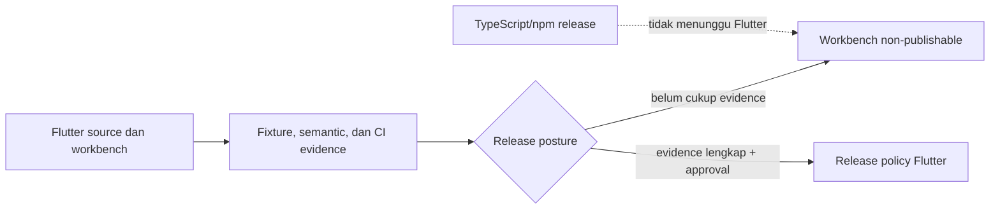

# Decision Record 06 — Flutter Release Posture

**Status:** Proposed — menunggu persetujuan maintainer
**Tanggal:** 2026-09-16
**Owner koordinasi:** relgeo/workspace
**Scope:** `relgeo/flutter`, compatibility line RelGeo DSL `0.5`, dan hubungan Flutter dengan release TypeScript/npm

## 1. Konteks

Flutter sudah memiliki resolver, geometry engine, SVG exporter, dan workbench
desktop yang substansial. Evidence shared-fixture, semantic projection active,
runtime, dua candidate capability, boundary, widget, serta golden test sekarang
sudah lulus lokal pada Flutter `3.41.9` / Dart `3.11.5`. Integration `#91` juga
memverifikasi job Flutter, verify, dan public-registry dari checkout resmi. Namun
parity SVG yang lebih luas, keputusan promotion candidate, dan keputusan platform
release belum selesai. Probe build macOS lokal juga belum konklusif: retry dengan locale
UTF-8 mencapai Xcode tetapi terhenti karena disk penuh. Karena itu status source
dan evidence lokal belum cukup untuk menyatakan Flutter sebagai consumer
conformance penuh atau package release.

## 2. Proposal keputusan

1. Flutter tetap menjadi workbench/aplikasi publik non-publishable dengan
   `publish_to: none`.
2. Compatibility line yang ditargetkan adalah DSL `0.5`; versi aplikasi Flutter
   tetap terpisah dan tidak ikut release order npm.
3. Fixture dan test `v0.4` yang sudah ada dipertahankan sebagai regression
   history selama masih berguna, tetapi tidak menjadi klaim dukungan aktif
   tanpa keputusan compatibility yang terpisah.
4. Flutter memiliki gate `analyze`/`test` sendiri. Kegagalan atau ketiadaan
   Flutter SDK tidak menggagalkan gate TypeScript/npm.
5. Tidak ada publish ke pub.dev atau release artifact Flutter sampai evidence
   runtime dan platform yang dijanjikan tersedia.

## 3. Gate sebelum proposal dapat diaktifkan

- [ ] maintainer menyetujui posture non-publishable ini;
- [x] versi/channel Flutter ditetapkan pada stable `3.41.9`; platform release masih perlu diputuskan;
- [x] `flutter pub get --enforce-lockfile`, `flutter analyze`, dan `flutter test`
  lulus dari checkout CI bersih pada `Integration #91`;
- [x] active fixture, runtime diagnostic, dan candidate capability memiliki
  evidence semantic Flutter lokal dan CI melalui job `flutter` pada `Integration #91`;
- [x] checkout Flutter terisolasi dapat menjalankan analyzer non-fatal dan test
  unit tanpa parent workspace; shared canonical fixture tetap opt-in;
- [x] capability matrix diperbarui menjadi `partial` pada capability dengan
  evidence lokal dan tetap menandai capability yang belum tercakup;
- [ ] kebutuhan `flutter build macos` atau platform lain diputuskan eksplisit.

Catatan probe platform (2026-09-16): `flutter build macos --no-pub` pertama
terhalang locale CocoaPods non-UTF-8. Dengan `LANG=en_US.UTF-8` dan
`LC_ALL=en_US.UTF-8`, CocoaPods selesai dan Xcode mulai membangun, tetapi proses
gagal karena `No space left on device`. Artefak `flutter/build` sudah dibersihkan
dan file project/lockfile tidak menyisakan perubahan. Ini bukan bukti source
macOS gagal, tetapi juga belum dapat dihitung sebagai bukti build berhasil.

## 4. Konsekuensi

### Positif

- release TypeScript/npm tetap dapat berjalan tanpa toolchain Flutter;
- tidak ada permukaan pub.dev yang terlanjur dijanjikan tanpa bukti;
- perbedaan antara versi aplikasi dan versi DSL tetap jelas;
- pekerjaan parity dapat berkembang melalui evidence bertahap.

### Trade-off

- Flutter belum dapat disebut consumer conformance penuh;
- pengguna Flutter belum mendapat compatibility promise setara package npm;
- sebagian keputusan platform dan release tetap tertunda.

## 5. Revisit trigger

Proposal ini ditinjau ulang ketika salah satu kondisi berikut terjadi:

- evidence Flutter CI pertama sudah lulus;
- ada permintaan untuk mendistribusikan package atau binary Flutter;
- platform target berubah dari workbench macOS menjadi desktop/mobile lintas
  platform;
- compatibility line DSL berubah dari `0.5`.
