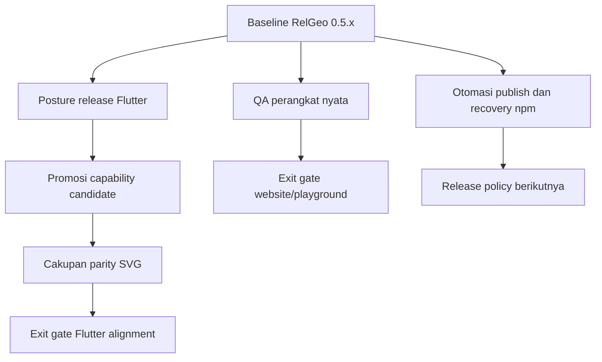

# RelGeo Cross-Repo Open Decisions

**Status:** Accepted with Android/iOS deferred; desktop/web/CLI prioritized
**Tanggal:** 2026-09-18  
**Pemilik keputusan:** Agus Made  
**Ruang lingkup:** Playground, Flutter, renderer parity, dan release npm

Dokumen ini mengumpulkan keputusan yang masih terbuka setelah baseline RelGeo
memiliki integration gate, release preflight, conformance fixtures, dan release
manual `0.5.1` yang lulus. Tujuannya adalah memisahkan:

- pekerjaan yang hanya membutuhkan evidence operasional;
- keputusan kontrak atau produk yang harus disetujui maintainer;
- keputusan keamanan dan operasional release yang sebaiknya tidak diambil
  hanya karena automation sudah tersedia.

Dokumen ini tidak mengaktifkan perubahan apa pun. Ia menjadi tempat mencatat
keputusan sebelum sub-rencana implementasi dibuat.

**Pembaruan keputusan 2026-09-23:** scope Android dan iOS ditunda tanpa tanggal
sampai web/PWA, macOS Flutter, Linux/Ubuntu Flutter, Windows Flutter, dan CLI
lebih komprehensif serta kokoh. Rekomendasi operasional terbaru dan strategi
build Windows dicatat pada [09-open-work-recommendations.md](09-open-work-recommendations.md)
dan menjadi rujukan utama untuk keputusan perangkat.

## 1. Peta keputusan

## 2. Ringkasan rekomendasi

| Topik | Jenis keputusan | Rekomendasi terbaik | Persetujuan maintainer |
| --- | --- | --- | --- |
| QA perangkat nyata | evidence operasional | uji iPhone/Safari, Android/Chrome, dan macOS/VoiceOver; simpan evidence terstruktur | tidak perlu keputusan produk, tetapi perlu waktu/perangkat |
| Promosi capability Flutter | keputusan contract | jangan promosi otomatis; evaluasi dan promosi satu per satu setelah contract serta fixture active disetujui | ya |
| Parity SVG Flutter | keputusan acceptance | gunakan semantic parity sebagai contract; pisahkan geometry dari presentation/style/viewBox | ya untuk scope acceptance |
| SDK Flutter dan platform release | keputusan posture produk/toolchain | tetap workbench non-publishable; pin Flutter stable `3.41.9` di CI dan tunda release desktop | ya |
| Otomasi npm dan recovery | keputusan risiko release | pertahankan publish manual untuk beberapa release berikutnya; jika diotomasi, gunakan OIDC + environment approval dan forward-fix, bukan rollback | ya |

## 2.1 Keputusan yang sudah disetujui

Rekomendasi dokumen ini disetujui sebagai arah kerja, dengan satu batasan:

- policy QA perangkat nyata diterima, tetapi evidence iOS nyata ditunda sampai
  ada akses ke iPhone/iPad milik sendiri, pinjaman, atau layanan real-device;
- promosi capability Flutter dilakukan satu per satu dan tidak otomatis;
- semantic parity SVG berlapis menjadi policy acceptance;
- Flutter tetap workbench non-publishable dengan baseline stable `3.41.9`;
- publish npm tetap manual; target automation masa depan adalah OIDC dengan
  approval environment dan recovery forward-fix, bukan rollback.

## 3. Keputusan A — QA perangkat nyata

### 3.1 Apa yang sebenarnya perlu diputuskan

Poin ini terutama bukan keputusan arsitektur. Yang perlu diputuskan adalah
batas minimum evidence sebelum Tahap 5 dianggap selesai. Emulasi browser dan
E2E sudah tersedia, tetapi tidak membuktikan seluruh perilaku touch, keyboard,
atau assistive technology pada perangkat nyata.

### 3.2 Pilihan

1. **Minimal satu perangkat** — cepat, tetapi browser engine dan assistive
   technology lain tetap tidak teruji.
2. **Satu iPhone + satu Android + macOS VoiceOver** — cakupan terbaik dengan
   usaha yang masih masuk akal.
3. **Matrix lengkap banyak ukuran/perangkat** — lebih kuat, tetapi tidak
   proporsional untuk baseline publik RelGeo saat ini.

### 3.3 Rekomendasi

Gunakan pilihan 2 sebagai exit gate minimum:

- iPhone dengan iOS/Safari saat ini: touch target, drawer, surface switcher,
  virtual keyboard, scroll, pan, dan pinch;
- Android dengan Chrome saat ini: alur touch yang sama dan TalkBack untuk
  surface utama;
- macOS dengan keyboard fisik dan VoiceOver: landmark, dialog, drawer, tabs,
  Errors, Graph, status `READY`, dan recovery.

Catat model perangkat, OS, browser, viewport, tanggal, hasil, dan issue yang
ditemukan. Jika salah satu perangkat tidak tersedia, jangan menandai exit gate
sebagai selesai; tandai evidence sebagai terbatas.

### 3.4 Keputusan yang dicatat

- [x] menyetujui matrix minimum iPhone + Android + macOS VoiceOver;
- [ ] memilih perangkat aktual dan tanggal pengujian; **ditunda karena akses iOS belum tersedia**;
- [x] menyetujui format evidence di audit Playground.

Status evidence iOS saat ini: **pending external device access**. Android dan
macOS tetap dapat diuji lebih dahulu, tetapi Tahap 5 belum boleh ditutup penuh.

## 4. Keputusan B — Promosi capability candidate Flutter

Capability candidate saat ini memiliki fixture, snapshot scene, snapshot SVG,
semantic projection, dan evidence lokal/CI. Namun evidence itu belum otomatis
mengubah candidate menjadi active contract.

### 4.1 Pilihan

1. **Tetap candidate** — paling konservatif; tidak memperluas janji kompatibilitas.
2. **Promosi dua candidate sekaligus** — cepat, tetapi memperbesar kontrak
   active tanpa review terpisah.
3. **Promosi bertahap** — setiap capability memiliki decision record, active
   fixture, dokumentasi, dan acceptance sendiri.

### 4.2 Rekomendasi

Pilih opsi 3 sebagai kebijakan jangka panjang, tetapi **jangan melakukan
promosi otomatis pada putaran ini**. Untuk setiap candidate, wajib ada:

1. definisi semantik yang disetujui pada spec atau decision record;
2. fixture yang dipindahkan dari `capability` menjadi `active`;
3. expected scene dan SVG semantic snapshot yang tetap lulus pada TypeScript
   dan Flutter;
4. dokumentasi public yang menjelaskan batas capability;
5. compatibility matrix yang diubah secara eksplisit.

Dengan demikian, candidate tetap aman untuk dieksplorasi, sementara promosi
dapat dilakukan satu per satu tanpa mengunci dua capability sekaligus ke
kontrak publik.

### 4.3 Keputusan yang dicatat

- [x] menyetujui kebijakan promosi satu per satu;
- [ ] candidate pertama yang diprioritaskan: `boolean/intersection` atau
  `evaluator/unit`;
- [x] menyetujui bahwa evidence semantic projection saja belum cukup tanpa
  contract dan dokumentasi public.

## 5. Keputusan C — Cakupan parity SVG Flutter

### 5.1 Pilihan

1. **Byte-for-byte SVG parity** — sangat rapuh terhadap urutan atribut,
   whitespace, formatting, dan detail renderer.
2. **Geometry-only parity** — cukup untuk koordinat, primitive, path, dan
   object identity; tidak menjamin presentation.
3. **Semantic parity berlapis** — geometry menjadi contract inti; style,
   viewBox, metadata, dan overlay memiliki contract presentation terpisah
   hanya jika dibutuhkan.

### 5.2 Rekomendasi

Gunakan opsi 3.

Contract inti sebaiknya memeriksa:

- object identity dan urutan semantik;
- primitive type dan subpath;
- endpoint, ring, dan geometry dengan tolerance yang terdokumentasi;
- status objek yang berasal dari scene yang sama.

Style, viewBox, text metrics, metadata, dan diagnostic overlay jangan langsung
dimasukkan ke parity inti. Tambahkan acceptance presentation hanya ketika ada
consumer atau release surface yang benar-benar bergantung padanya. Ini menjaga
parity tetap bermakna tanpa mengikat dua engine pada output SVG mentah yang
belum tentu harus identik.

### 5.3 Keputusan yang dicatat

- [x] menyetujui semantic parity berlapis sebagai policy resmi;
- [ ] menyetujui daftar property presentation yang benar-benar perlu menjadi
  contract;
- [x] menunda raw SVG equality sebagai non-goal.

## 6. Keputusan D — Pin SDK Flutter dan posture platform release

### 6.1 Pilihan

1. **Workbench non-publishable** — Flutter tetap aplikasi/workbench publik,
   tidak ikut transaksi publish npm atau pub.dev.
2. **Package Dart publik** — membutuhkan API package, pub.dev policy, versioning,
   dan release gate baru.
3. **Desktop release sekarang** — membutuhkan packaging, signing, distribution,
   support matrix, dan recovery operasional.

Untuk toolchain juga ada pilihan antara hanya mem-pin channel/version atau
mem-pin revision SDK yang sangat spesifik.

### 6.2 Rekomendasi

Setujui posture berikut:

- Flutter tetap **workbench non-publishable** untuk line `0.5.x`;
- CI menggunakan Flutter stable `3.41.9` dan mencatat Dart `3.11.5`;
- `.gitmodules`, workflow, dan decision record menjadi sumber evidence
  toolchain;
- exact SDK revision boleh dicatat sebagai evidence saat dibutuhkan, tetapi
  tidak perlu mengubah Flutter menjadi package/release surface baru;
- build macOS tetap dipertahankan sebagai CI confidence gate, bukan komitmen
  distribusi desktop;
- desktop release ditunda sampai ada kebutuhan pengguna dan owner operasional.

Ini memberi reproducibility yang cukup tanpa membuka kewajiban pub.dev,
signing, distribusi, dan support platform terlalu dini.

### 6.3 Keputusan yang dicatat

- [x] menyetujui Flutter sebagai workbench non-publishable;
- [x] menyetujui Flutter stable `3.41.9` sebagai baseline line `0.5.x`;
- [x] menyetujui build macOS sebagai CI gate, bukan release desktop;
- [x] menyetujui bahwa exact revision SDK dicatat sebagai evidence bila perlu,
  bukan sebagai package contract.

## 7. Keputusan E — Otomasi publish npm dan recovery partial release

### 7.1 Masalah yang harus dibedakan

Publish npm bersifat irreversible pada level versi: versi yang sudah terbit
tidak seharusnya dihapus atau dipublish ulang. Karena itu “rollback transaction”
sebenarnya bukan rollback database; recovery yang aman adalah menghentikan
urutan, mencatat partial state, memperbaiki source, lalu melakukan forward-fix
ke versi berikutnya.

### 7.2 Pilihan

1. **Manual publish + automated preflight** — paling mudah diaudit dan cocok
   untuk maintainer tunggal.
2. **Publish CI dengan token npm** — mengurangi interaksi manual, tetapi
   menambah secret jangka panjang dan risiko workflow.
3. **Publish CI dengan npm trusted publishing/OIDC** — tanpa token npm jangka
   panjang; tetap membutuhkan workflow yang sangat spesifik, permission OIDC,
   protected environment, dan prosedur partial-release.
4. **Fully automatic multi-package publish** — paling cepat setelah matang,
   tetapi paling sulit dihentikan dengan aman ketika package tengah gagal.

### 7.3 Rekomendasi

Untuk sekarang pilih opsi 1:

- pertahankan `npm publish` manual;
- wajibkan `release:preflight`, `npm pack --dry-run`, registry verification,
  dan public integration gate;
- gunakan `release:recovery:plan` hanya sebagai planner read-only;
- jangan mengklaim rollback otomatis; gunakan forward-fix dan release record
  baru.

Jika setelah beberapa release manual pola operasional sudah stabil, evolusikan
ke opsi 3 secara bertahap:

1. satu package per workflow atau satu package job yang dapat diisolasi;
2. trigger tag/manual dispatch yang eksplisit;
3. GitHub Environment `npm-publish` dengan required reviewer;
4. permission minimal `id-token: write` dan `contents: read`;
5. OIDC trusted publishing npm, bukan token npm jangka panjang;
6. post-publish verification dan artifact release evidence;
7. jika gagal di tengah urutan, stop + partial record + forward-fix, tanpa
   republish versi yang sama.

Dokumentasi resmi yang menjadi rujukan teknis:

- [npm Trusted Publishing](https://docs.npmjs.com/trusted-publishers/)
- [npm access tokens](https://docs.npmjs.com/about-access-tokens/)
- [GitHub Environments dan required reviewers](https://docs.github.com/en/actions/reference/workflows-and-actions/deployments-and-environments)

Dokumentasi npm saat ini menyebut trusted publishing memakai OIDC,
menghilangkan token jangka panjang, dan memerlukan npm CLI `11.5.1+` serta
Node `22.14.0+`. Toolchain RelGeo saat ini (`npm 11.19.0`, Node `24.21.0`)
sudah berada di atas batas tersebut, tetapi itu belum menjadi alasan untuk
langsung mengaktifkan publish otomatis.

### 7.4 Keputusan yang dicatat

- [x] menyetujui manual publish sebagai policy resmi untuk release berikutnya;
- [x] menyetujui bahwa recovery selalu forward-fix, bukan rollback;
- [x] menyetujui OIDC sebagai target automation masa depan;
- [x] menyetujui required reviewer pada environment publish;
- [x] menyetujui bahwa publish multi-package tidak boleh menjadi satu transaksi
  yang mengklaim atomic rollback.

## 8. Urutan penerapan yang direkomendasikan

1. Tutup QA perangkat nyata dan simpan evidence Playground.
2. Setujui posture Flutter non-publishable dan baseline SDK.
3. Setujui policy semantic SVG parity.
4. Review candidate Flutter satu per satu; jangan promosi hanya karena test
   sudah lulus.
5. Jalankan beberapa release manual berikutnya dengan release preflight.
6. Setelah pola release stabil, buat sub-rencana terpisah untuk OIDC publish
   dan partial-release recovery.

Urutan ini menjaga keputusan berisiko tinggi tetap datang setelah evidence yang
relevan tersedia.

## 9. Catatan keputusan maintainer

| ID | Keputusan | Status | Tanggal | Evidence/commit |
| --- | --- | --- | --- | --- |
| A | QA perangkat nyata | Accepted; iOS evidence deferred | 2026-09-18 | akses perangkat iOS belum tersedia |
| B | Promosi capability Flutter | Accepted | 2026-09-18 | kebijakan promosi bertahap |
| C | Parity SVG Flutter | Accepted | 2026-09-18 | semantic parity berlapis |
| D | SDK dan posture platform Flutter | Accepted | 2026-09-18 | workbench non-publishable; stable `3.41.9` |
| E | Otomasi npm dan recovery | Accepted | 2026-09-18 | manual sekarang; OIDC sebagai target masa depan |

Setelah keputusan diambil, ubah status menjadi `Accepted`, `Rejected`, atau
`Deferred`, lalu buat atau perbarui sub-rencana implementasi yang relevan.
