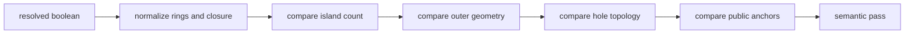
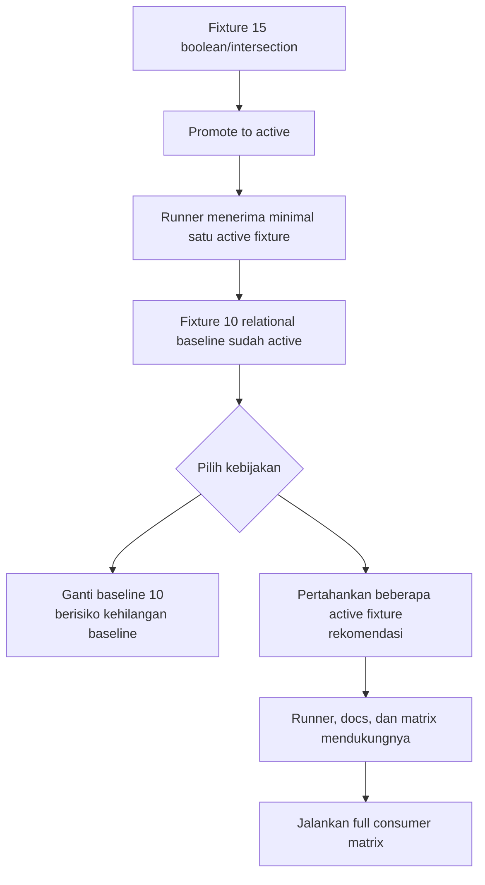

# Decision Record 08 — Boolean/Intersection Contract Review

**Status:** Boundary disetujui secara prinsip; implementasi promosi menunggu penyelesaian model active-fixture
**Tanggal:** 2026-09-18  
**Owner:** relgeo/workspace + relgeo/core + relgeo/geometry + relgeo/flutter  
**Terkait:** [Sub-Rencana 07](../plans/07-flutter-capability-promotion-and-svg-parity.md)

## 1. Tujuan

Dokumen ini memisahkan contract yang sudah tertulis di spec dari perilaku
implementasi yang belum layak dijadikan jaminan publik. Fokusnya adalah
candidate fixture `15-v05-boolean-intersection-candidate`:

- line intersection pada fixture;
- boolean `intersect`;
- boolean `subtract`;
- semantic scene dan SVG projection lintas TypeScript dan Flutter.

Dokumen ini belum mengubah status fixture menjadi `active`. Ia adalah bahan
review untuk keputusan promosi.

## 2. Evidence saat ini

| Area | Temuan | Klasifikasi |
|---|---|---|
| Spec | Boolean v0.5 mencantumkan `union`, `subtract`, `intersect`, `xor` pada `ClosedShape 2D` dan mode `single`/`multi`. | Normatif yang sudah ada |
| Spec | `intersection(...)` menghasilkan `point` atau `collection<point>` bergantung konteks dan mendukung selector. | Normatif yang sudah ada |
| Fixture 15 | Menguji line-line intersection, rectangle intersection, dan rectangle subtraction. | Candidate evidence |
| TypeScript | `ClipperBooleanEngine` menyediakan empat operasi; resolver memvalidasi operand, empty result, dan multipart result. | Implementasi |
| Flutter | Adapter Clipper2 menyediakan operasi boolean, dan semantic projection candidate lulus lokal serta CI. | Implementasi + evidence |
| Geometry normalization | Rect, circle, polygon, path, boolean, dan clone dinormalisasi; circle disampling menjadi 64 titik; cleaning memakai ambang `1e-7`. | Detail implementasi |
| Ordering/topology | Output ring/island dan titik penutup dinormalisasi oleh comparator; urutan engine tidak boleh dianggap sebagai contract tanpa keputusan eksplisit. | Gap contract |

## 3. Rekomendasi contract minimum

Rekomendasi saya adalah mempromosikan hanya surface yang benar-benar sudah
memiliki fixture lintas consumer, lalu memperluasnya secara terpisah.

### 3.1 Line intersection

Untuk promosi pertama, jaminan minimum adalah:

1. dua object `line` finite yang tidak degenerat;
2. hasil tunggal yang dipilih dari perpotongan line sesuai selector;
3. hasil tanpa selector mengikuti error model jika jumlah titik bukan satu;
4. hasil yang tidak berpotongan menghasilkan `NO_INTERSECTION` pada konteks
   yang mengharuskan titik;
5. koordinat dibandingkan dengan tolerance numerik yang sudah dipakai oleh
   semantic comparator, bukan exact floating-point equality.

Kemampuan line-circle, circle-circle, arc, path-like, selector kompleks, dan
multi-result tetap boleh didukung implementasi, tetapi tidak ikut diklaim
sebagai bagian dari promotion pertama kecuali fixture-nya ditambahkan.

### 3.2 Boolean intersection dan subtraction

Untuk promotion pertama, jaminan minimum adalah:

1. operand berupa `ClosedShape 2D` yang sudah didukung fixture: rectangle;
2. `intersect` menerima dua atau lebih operand pada field `shapes`;
3. `subtract` menerima satu `base` dan satu atau lebih `tools`;
4. hasil default `single` harus tepat satu island; hasil multipart harus
   ditolak dengan `BOOLEAN_MULTIPART_RESULT`;
5. `result.mode: multi` boleh menghasilkan beberapa island yang deterministik
   secara semantik;
6. hasil memiliki object identity, tipe boolean, ring/holes, bbox, dan anchor
   yang dapat dipakai oleh query/renderer sesuai surface resolved object;
7. hasil kosong pada runtime normal menghasilkan `BOOLEAN_EMPTY_RESULT`;
8. bentuk ring dan titik penutup dibandingkan secara semantik setelah
   normalisasi, bukan berdasarkan urutan vertex atau byte SVG.

`union`, `xor`, circle/polygon/path/clone sebagai operand, dan topology holes
yang lebih luas tetap merupakan perluasan contract berikutnya. Mereka sudah
tersedia pada sebagian implementation surface atau spec, tetapi belum
tercakup oleh fixture promotion pertama.

## 4. Error dan input boundary

| Kondisi | Keputusan rekomendasi | Status |
|---|---|---|
| operation tidak dikenal | `INVALID_BOOLEAN_OPERATION` | dapat dijamin sekarang |
| `subtract` tanpa `base` atau `tools` | `INVALID_BOOLEAN_OPERATION` | dapat dijamin sekarang |
| operation selain subtract tanpa `shapes` | `INVALID_BOOLEAN_OPERATION` | dapat dijamin sekarang |
| operand ID tidak dikenal | error resolution yang deterministik | perlu fixture/error-code review |
| hasil kosong | `BOOLEAN_EMPTY_RESULT` pada runtime | dapat dijamin sekarang |
| hasil multipart pada mode single | `BOOLEAN_MULTIPART_RESULT` | dapat dijamin sekarang |
| shape tidak tertutup/self-intersecting/degenerate | jangan dipromosikan sampai boundary ditulis | masih terbuka |
| ring orientation dan starting vertex | bukan contract; comparator melakukan normalisasi | rekomendasi siap diterima |
| tolerance dan circle sampling | implementation detail, bukan jaminan geometry | jangan dipromosikan sebagai contract |

## 5. Topology dan determinism

Acceptance comparator sebaiknya memeriksa:

Yang perlu dijamin:

- jumlah island sesuai mode hasil;
- outer ring dan hole topology setara;
- ring boleh berbeda arah atau titik awal setelah normalisasi;
- endpoint penutup tidak dihitung sebagai vertex tambahan;
- ordering hanya dijamin setelah canonicalization comparator;
- tolerance tidak boleh diperlebar diam-diam untuk membuat fixture lulus.

## 6. Keputusan yang masih diminta

Saya merekomendasikan maintainer menyetujui pilihan berikut:

1. **Promosi awal:** line-line intersection + rectangle `intersect` +
   rectangle `subtract`.
2. **Operasi yang belum active:** `union`, `xor`, dan operand non-rectangle
   tetap `partial/candidate` sampai fixture lintas consumer tersedia.
3. **Topology:** mode `single` dan `multi` dipertahankan; multi-island tidak
   boleh disederhanakan menjadi satu path.
4. **Numerik:** tolerance comparator tetap menjadi evidence rule, bukan DSL
   promise; detail `1e-7` cleaning dan 64-sample circle tidak diekspos sebagai
   public contract.
5. **Flutter:** promotion hanya setelah fixture aktif lulus TypeScript,
   Flutter, CLI, Playground, dan CI dari checkout bersih.

## 7. Temuan kesiapan promosi

Review terhadap runner conformance menemukan satu hambatan desain yang harus
diselesaikan sebelum fixture 15 dapat dipromosikan. Manifest memiliki fixture
10 sebagai baseline relasional yang masih diperlukan, sementara promosi
capability tidak boleh menghapus baseline tersebut. Runner kini sudah diubah
agar menerima minimal satu fixture `active`, sehingga beberapa baseline dapat
hidup berdampingan.

Invariant manifest sekarang adalah “minimal satu fixture active; setiap fixture
active wajib memiliki snapshot resolved/output”. Owner canonical tetap berada
di level manifest. Dengan begitu fixture 10 tetap menjadi baseline relasional
dan fixture 15 dapat menjadi baseline capability setelah negative fixture
serta evidence lintas consumer tersedia. Status fixture tetap tidak berubah
secara otomatis hanya karena runner sudah mendukung beberapa active fixture.

## 8. Checklist tindak lanjut

- [x] inventory spec, fixture, resolver, engine, matrix, dan error tests;
- [x] rekomendasi surface promotion pertama ditulis;
- [x] boundary implementation-detail vs contract ditulis;
- [x] arah contract dan promosi bertahap pada bagian 6 disetujui secara prinsip;
- [x] boundary operasi awal, topology, tolerance, error behavior, dan output
  semantics dicatat sebagai rekomendasi contract;
- [x] audit kesiapan promosi menemukan invariant single-active-fixture;
- [x] ubah policy runner agar beberapa fixture `active` dapat dipelihara;
- [x] tambahkan negative fixture untuk empty-result dan multipart-result boundaries;
- [ ] ubah fixture 15 menjadi `active` hanya setelah keputusan diterima;
- [ ] jalankan full consumer matrix dan simpan evidence release;
- [ ] perbarui matrix, README, spec reference, dan Sub-Rencana 07.

## 9. Kesimpulan

Secara teknis candidate sudah cukup matang untuk direview, dan boundary
promosi awal sudah diterima secara prinsip. Candidate belum boleh disebut
active sebelum evidence lintas consumer selesai. Negative fixture untuk
`BOOLEAN_EMPTY_RESULT` sekarang menjadi bagian dari conformance workspace;
boundary unsupported/degenerate lain tetap ditahan sampai memiliki contract
dan fixture yang spesifik.
Policy multi-active fixture sudah diterapkan pada runner tanpa mengubah status
candidate secara otomatis. Rekomendasi terbaik tetap promosi kecil dengan tiga
surface di atas, sambil menahan klaim untuk operation dan topology yang belum
memiliki fixture lintas consumer.

## 10. Inventaris presentation SVG

Audit renderer TypeScript dan exporter Flutter menunjukkan empat kelompok
property yang tidak boleh dicampur dengan semantic geometry:

| Property | Rekomendasi | Alasan |
|---|---|---|
| `id`, object kind, primitive/path geometry | semantic core | diperlukan untuk identity, scene projection, dan geometry comparison |
| `data-role`, `data-intent`, `data-label`, visibility/filter role | presentation contract terpilih | dibutuhkan consumer yang mencari metadata atau menyaring role; perlu fixture khusus sebelum dipromosikan |
| `fill`, `stroke`, `stroke-width`, opacity, dash, font family/size | presentation best-effort | renderer boleh punya kebijakan visual berbeda selama semantic geometry sama |
| `viewBox`, width/height, padding, `preserveAspectRatio` | surface-specific | bergantung pada target SVG/export context dan belum cocok menjadi parity inti |
| text metrics, line wrapping, dimension typography | surface-specific | dipengaruhi font/runtime dan tidak stabil lintas TypeScript/Flutter |
| diagnostic overlay dan animasi violation | runtime diagnostic presentation | harus diuji sebagai diagnostic surface terpisah, bukan bagian geometri |
| whitespace, attribute order, path formatting, marker implementation | implementation detail | tidak membawa makna contract |

Kesimpulan inventaris: untuk promotion pertama, tidak perlu memperluas
comparator SVG. Jika kemudian metadata atau diagnostic overlay menjadi public
consumer contract, buat fixture dan comparator presentation terpisah dengan
scope yang sempit.
