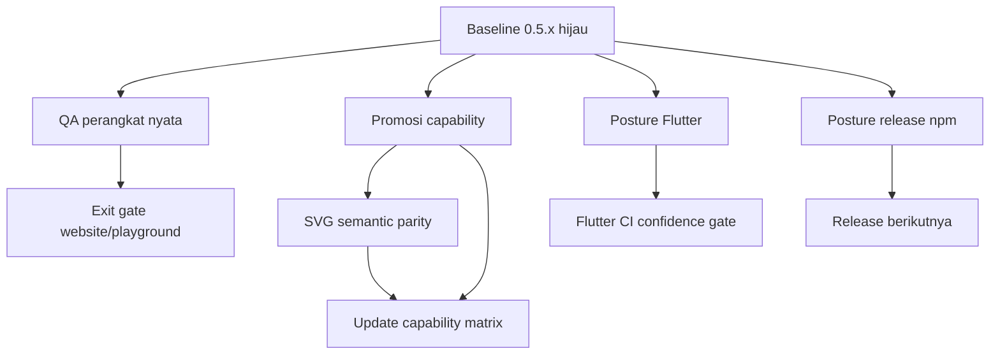
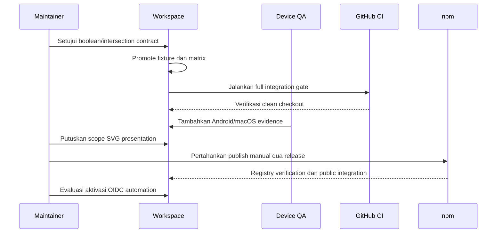

# RelGeo Open Work — Recommendation Record

**Status:** Draft rekomendasi untuk persetujuan maintainer  
**Tanggal:** 2026-09-23  
**Pemilik keputusan:** Agus Made  
**Ruang lingkup:** Flutter capability, SVG parity, QA perangkat, toolchain, dan release npm  
**Dokumen terkait:**

- [Cross-Repo Open Decisions](07-cross-repo-open-decisions.md)
- [Flutter Capability Promotion dan SVG Parity](../plans/07-flutter-capability-promotion-and-svg-parity.md)
- [Release dan npm Publishing Guard](../plans/03-npm-release-guard.md)
- [Maturation Master Plan](../MATURATION-MASTER-PLAN.md)

Dokumen ini merangkum pekerjaan yang masih terbuka dan memberikan satu
rekomendasi operasional untuk masing-masing. Tujuannya bukan mengaktifkan
perubahan secara otomatis, melainkan menyediakan keputusan yang dapat disetujui
sebelum sub-rencana implementasi berikutnya dibuat.

## 1. Status evidence saat ini

Baseline teknis sudah cukup kuat untuk masuk ke tahap keputusan:

- conformance workspace: `253/253` pada 20 fixture;
- compatibility matrix: `283/283`;
- strict baseline: `81/81`;
- local integration gate Node `24.21.0`: `36/36`;
- GitHub Integration `#142`: `verify`, `flutter`, `flutter-macos`, dan `public`
  semuanya sukses;
- release npm `0.5.1`: selesai secara manual;
- workspace bersih dan tersinkron ke `origin/main`.

Yang tersisa bukan kegagalan baseline, melainkan keputusan acceptance, evidence
eksternal, atau otomasi berisiko.

## 2. Peta keputusan



Urutan yang direkomendasikan adalah menyelesaikan keputusan acceptance terlebih
dahulu, menjalankan evidence yang tersedia, baru kemudian mengotomasi release.

## 3. Ringkasan rekomendasi

| Area | Rekomendasi terbaik | Status rekomendasi |
| --- | --- | --- |
| Promosi capability | Promosikan satu capability per keputusan; mulai dari `boolean/intersection`, lalu `evaluator/unit` | perlu persetujuan maintainer |
| SVG parity | Gunakan semantic parity berlapis; geometry adalah contract inti, presentation hanya bila ada consumer nyata | arah teknis sudah disetujui; scope presentation terbuka |
| Flutter | Tetap workbench non-publishable; pin stable `3.41.9`; build macOS hanya CI confidence gate | sudah disetujui |
| QA perangkat | Uji Android fisik dan macOS VoiceOver sekarang; iOS melalui pinjaman/device lab; jangan klaim Tahap 5 selesai sebelum iOS evidence ada | strategi disetujui; perangkat/tanggal terbuka |
| npm publishing | Pertahankan manual publish untuk minimal dua release berikutnya; siapkan OIDC + environment approval setelah itu | perlu persetujuan timing |
| Recovery npm | Jangan rollback atau republish versi; gunakan partial record dan forward-fix patch | sudah menjadi policy |
| SDK/toolchain | Pertahankan pin CI dan catat revision sebagai evidence bila perlu; jangan buka package pub.dev/desktop release | sudah disetujui |

## 4. Keputusan A — Promosi capability Flutter

### Rekomendasi

Promosikan capability secara berurutan, bukan borongan:

1. `boolean/intersection` menjadi kandidat pertama karena contract-nya lebih
   terlokalisasi;
2. `evaluator/unit` ditinjau setelah capability pertama aktif dan stabil;
3. tidak ada promosi otomatis hanya karena test lulus.

Untuk setiap promosi, maintainer cukup menyetujui contract berikut:

- operasi dan object type yang dijamin;
- topology, ring closure, tolerance, dan degenerate behavior;
- error behavior untuk empty dan multipart result;
- batas implementation detail yang tidak dijamin.

Setelah persetujuan, fixture candidate diubah menjadi `active`, capability
matrix dan dokumentasi diperbarui, lalu full integration gate dijalankan.

### Keputusan yang diperlukan

- [ ] setujui `boolean/intersection` sebagai capability pertama yang dipromosikan;
- [ ] setujui `evaluator/unit` menunggu hasil promosi pertama;
- [ ] setujui bahwa promosi selalu memerlukan decision record dan fixture active.

## 5. Keputusan B — SVG parity

### Rekomendasi

Gunakan tiga lapisan acceptance:

1. **Semantic core — wajib:** object identity, primitive type, path/subpath,
   endpoint, ring, geometry, dan tolerance yang terdokumentasi.
2. **Presentation contract — opsional:** viewBox, style, text metrics, metadata,
   dan diagnostic overlay hanya diuji jika consumer atau release benar-benar
   bergantung padanya.
3. **Raw SVG — non-goal:** urutan atribut, whitespace, formatting, dan byte
   equality tidak menjadi contract.

Untuk line `0.5.x`, rekomendasi terbaik adalah tidak menambah presentation
property ke contract inti. Inventaris boleh tetap ada sebagai daftar kandidat.

### Keputusan yang diperlukan

- [ ] setujui bahwa tidak ada property presentation tambahan yang dipromosikan
  pada release `0.5.x` tanpa consumer konkret;
- [ ] setujui comparator presentation terpisah hanya bila kebutuhan tersebut
  muncul;
- [x] pertahankan raw SVG byte equality sebagai non-goal.

## 6. Keputusan C — Posture Flutter dan toolchain

### Rekomendasi

Pertahankan Flutter sebagai workbench publik non-publishable:

- stable Flutter `3.41.9` dan Dart `3.11.5` tetap baseline CI;
- build macOS tetap dijalankan di CI sebagai confidence gate;
- tidak ada package pub.dev atau desktop distribution pada line `0.5.x`;
- exact SDK revision dicatat sebagai evidence bila terjadi masalah reproduksi,
  bukan dijadikan kontrak distribusi baru.

Keputusan ini menjaga reproducibility tanpa membuka kewajiban signing,
packaging, support matrix, dan recovery platform.

### Keputusan

- [x] Flutter tetap workbench non-publishable;
- [x] stable `3.41.9` menjadi baseline;
- [x] macOS build adalah CI gate, bukan komitmen desktop release.

## 7. Keputusan D — QA perangkat nyata dan akses iOS

### Rekomendasi

Pisahkan pekerjaan yang bisa dilakukan sekarang dari evidence yang membutuhkan
perangkat eksternal:

**Sekarang:**

- Android fisik + Chrome: touch, scroll, drawer, surface switcher, virtual
  keyboard, dan TalkBack jika tersedia;
- macOS + keyboard fisik + VoiceOver: landmark, dialog, tabs, drawer, Errors,
  Graph, status `READY`, dan recovery.

**Kemudian:**

- iPhone/iPad melalui perangkat pinjaman, rekan, atau real-device service;
- Safari touch dan virtual keyboard dicatat sebagai evidence terpisah.

Tidak memiliki iPhone bukan alasan untuk menghentikan seluruh pekerjaan, tetapi
Tahap 5 tidak boleh ditandai selesai penuh tanpa evidence iOS. Jika belum ada
akses iOS, status yang benar adalah `Accepted; iOS evidence deferred`.

### Format evidence minimum

- model perangkat;
- OS dan versi;
- browser/assistive technology;
- viewport/orientasi;
- tanggal pengujian;
- hasil per skenario;
- issue atau limitation yang ditemukan.

### Keputusan yang diperlukan

- [x] setujui Android dan macOS diuji lebih dahulu;
- [x] setujui iOS evidence ditunda sampai perangkat tersedia;
- [ ] tentukan perangkat Android dan tanggal QA pertama;
- [ ] tentukan sumber akses iOS atau real-device service.

## 8. Keputusan E — npm publishing dan recovery

### Rekomendasi sekarang

Pertahankan publish manual untuk minimal dua release berikutnya. Setiap release
wajib melewati:

```text
release preflight
→ tarball audit
→ npm publish manual dengan 2FA/passkey
→ registry verification
→ public integration
→ update release record dan baseline
```

Alasannya: jalur manual baru terbukti pada release `0.5.1`, sedangkan failure
recovery nyata belum pernah dijalankan. Automation sebelum itu akan menambah
risiko tanpa menghilangkan kebutuhan keputusan operator.

### Target automation setelah dua release stabil

- npm trusted publishing/OIDC, bukan token jangka panjang;
- protected environment dengan approval manual;
- satu package per job atau transaction step yang dapat dihentikan;
- partial-release record wajib dibuat saat package berikutnya gagal;
- forward-fix patch sebagai recovery, bukan delete/rollback/republish versi;
- registry verification dan public integration tetap wajib setelah automation.

### Keputusan yang diperlukan

- [ ] setujui minimal dua release manual tambahan sebelum automation;
- [x] setujui forward-fix sebagai satu-satunya recovery normal;
- [x] setujui larangan republish versi npm yang sama;
- [ ] setujui OIDC + protected environment sebagai target automation.

## 9. Urutan pengerjaan yang direkomendasikan



Urutan praktis:

1. Setujui candidate `boolean/intersection`.
2. Promosikan fixture dan matrix secara eksplisit.
3. Jalankan full local dan CI gate.
4. Jalankan Android/macOS QA dan simpan evidence.
5. Tunda evaluator/unit sampai hasil tahap pertama stabil.
6. Jalankan dua release npm berikutnya secara manual.
7. Setelah dua release tanpa recovery failure, buat sub-rencana automation OIDC.

## 10. Sisa terbuka setelah rekomendasi ini

| Item | Mengapa belum selesai | Tindakan berikutnya |
| --- | --- | --- |
| Promosi boolean/intersection | menunggu persetujuan contract maintainer | setujui B lalu buat sub-rencana promosi |
| Promosi evaluator/unit | sengaja menunggu candidate pertama | jangan dikerjakan sebelum B stabil |
| Presentation SVG | belum ada consumer yang memerlukan | pertahankan semantic-only untuk `0.5.x` |
| Android/macOS QA | perangkat dan jadwal belum dicatat | lakukan sesi QA pertama |
| iOS QA | tidak ada akses perangkat saat ini | pinjam perangkat atau gunakan real-device service |
| npm automation | jalur manual baru selesai satu patch release | tunggu dua release manual tambahan |
| Recovery transaction automation | belum ada partial-release run nyata | pertahankan planner/validator read-only |

## 11. Exit condition dokumen

Dokumen ini dapat diubah statusnya menjadi `Accepted` setelah maintainer
menyetujui checklist keputusan pada bagian 4, 5, 7, dan 8. Setelah itu setiap
keputusan implementasi harus dipindahkan ke sub-rencana teknis yang relevan;
dokumen ini tetap menjadi ringkasan induk, bukan tempat detail implementasi.
