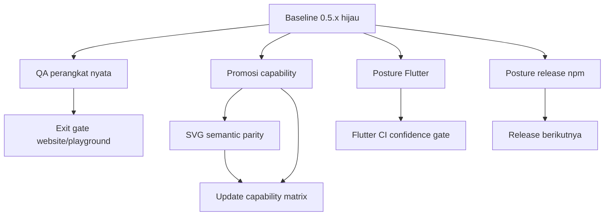
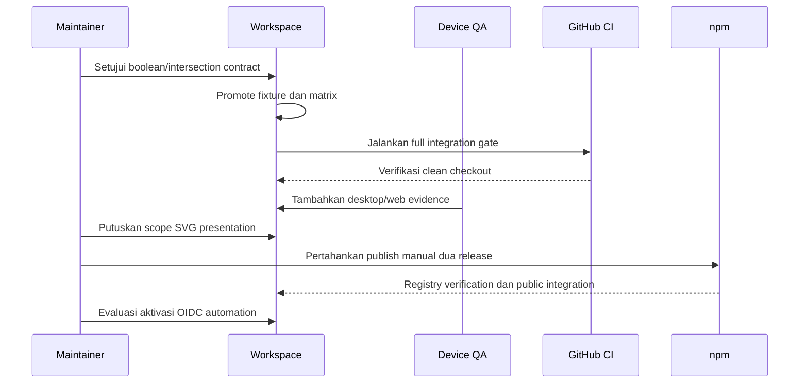

# RelGeo Open Work — Recommendation Record

**Status:** Accepted dengan boolean/intersection fixture 15 active pada scope terbatas; evaluator/unit dan mobile tetap ditunda
**Tanggal:** 2026-09-23  
**Pemilik keputusan:** Agus Made  
**Ruang lingkup:** Flutter capability, SVG parity, QA perangkat, toolchain, dan release npm  
**Dokumen terkait:**

- [Cross-Repo Open Decisions](07-cross-repo-open-decisions.md)
- [Flutter Capability Promotion dan SVG Parity](../plans/07-flutter-capability-promotion-and-svg-parity.md)
- [Release dan npm Publishing Guard](../plans/03-npm-release-guard.md)
- [Maturation Master Plan](../MATURATION-MASTER-PLAN.md)

Dokumen ini awalnya merangkum pekerjaan terbuka dan rekomendasi untuk keputusan
maintainer. Rekomendasi boolean/intersection kini telah diterapkan pada fixture
15 setelah canonical CI run 37832260326; status di bawah membedakan boundary
active itu dari evaluator/unit dan pekerjaan platform yang masih terbuka.

## 1. Status evidence saat ini

Baseline teknis sudah cukup kuat untuk masuk ke tahap keputusan:

- conformance workspace: `253/253` pada 20 fixture;
- compatibility matrix: `283/283`;
- strict baseline: `81/81`;
- local integration gate Node `24.21.0`: `36/36`;
- GitHub Integration `#142`: `verify`, `flutter`, `flutter-macos`, dan `public`
  semuanya sukses;
- release npm `0.5.1`: selesai secara manual;
- workspace bersih dan tersinkron ke `origin/main`.

Yang tersisa bukan kegagalan baseline, melainkan keputusan acceptance, evidence
eksternal, atau otomasi berisiko.

## 2. Peta keputusan


```mermaid
flowchart TD
  baseline["Baseline 0.5.x hijau"] --> qa["QA perangkat nyata"]
  baseline --> promotion["Promosi capability"]
  promotion --> parity["SVG semantic parity"]
  baseline --> posture["Posture Flutter"]
  baseline --> release["Posture release npm"]
  qa --> stage5["Exit gate website/playground"]
  promotion --> matrix["Update capability matrix"]
  parity --> matrix
  posture --> flutterGate["Flutter CI confidence gate"]
  release --> nextRelease["Release berikutnya"]
```

Urutan yang direkomendasikan adalah menerapkan keputusan yang sudah diterima,
menjalankan evidence yang tersedia, baru mengevaluasi automation release.

## 3. Ringkasan rekomendasi

| Area | Rekomendasi terbaik | Status rekomendasi |
| --- | --- | --- |
| Promosi capability | Promosikan satu capability per keputusan; mulai dari `boolean/intersection`, lalu `evaluator/unit` | fixture 15 boolean/intersection active pada scope contract; evaluator/unit tetap candidate |
| SVG parity | Gunakan semantic parity berlapis; geometry adalah contract inti, presentation hanya bila ada consumer nyata | disetujui; tidak menambah property presentation pada 0.5.x tanpa kebutuhan consumer |
| Flutter | Tetap workbench non-publishable; pin stable `3.41.9`; build macOS hanya CI confidence gate | sudah disetujui |
| Platform dan QA | Tunda Android/iOS tanpa tanggal; prioritaskan web/PWA, macOS, Linux, Windows, dan CLI | keputusan disetujui; desktop runtime evidence masih terbuka; artifact Windows CI tersedia |
| npm publishing | Pertahankan manual publish untuk dua siklus tambahan setelah persetujuan 2026-09-23; evaluasi OIDC + environment approval sesudahnya | disetujui bersyarat; audit 2026-10-08 masih 0/2 dan gate automation tertutup |
| Recovery npm | Jangan rollback atau republish versi; gunakan partial record dan forward-fix patch | sudah menjadi policy |
| SDK/toolchain | Pertahankan pin CI dan catat revision sebagai evidence bila perlu; jangan buka package pub.dev/desktop release | sudah disetujui |

## 4. Keputusan A — Promosi capability Flutter

### Rekomendasi dan status pelaksanaan

Promosikan capability secara berurutan, bukan borongan:

1. `boolean/intersection` menjadi capability active pertama karena contract-nya
   lebih terlokalisasi; fixture 15 sudah aktif setelah canonical run
   37832260326;
2. `evaluator/unit` ditinjau setelah capability pertama aktif dan stabil;
3. tidak ada promosi otomatis hanya karena test lulus.

Untuk setiap promosi, maintainer cukup menyetujui contract berikut:

- operasi dan object type yang dijamin;
- topology, ring closure, tolerance, dan degenerate behavior;
- error behavior untuk empty dan multipart result;
- batas implementation detail yang tidak dijamin.

Setelah persetujuan, fixture candidate diubah menjadi `active`, capability
matrix dan dokumentasi diperbarui, lalu full integration gate dijalankan.

### Keputusan yang diperlukan

- [x] setujui `boolean/intersection` sebagai capability pertama yang dipromosikan;
- [x] setujui `evaluator/unit` menunggu hasil promosi pertama;
- [x] setujui bahwa promosi selalu memerlukan decision record dan fixture active.

### Boundary yang mengikat keputusan

Keputusan ini hanya menyetujui boundary promotion pertama, bukan seluruh
surface boolean pada spec atau seluruh kemampuan engine. Scope yang dapat
menjadi active adalah line-line intersection pada fixture, rectangle
`intersect`, dan rectangle `subtract`, dengan outer/hole topology, ring
closure, semantic tolerance, serta error `INVALID_BOOLEAN_OPERATION`,
`BOOLEAN_EMPTY_RESULT`, `BOOLEAN_MULTIPART_RESULT`, `NO_INTERSECTION`, dan
`MULTIPLE_INTERSECTIONS` sebagaimana dirinci pada [Decision Record
08](08-boolean-intersection-contract-review.md).

Operand non-rectangle, `union`, `xor`, degenerate/self-intersecting input,
unknown-reference error code, dan detail engine/ordering tetap di luar active
contract sampai memiliki evidence dan keputusan tersendiri. Fixture 15 kini
active setelah clean-checkout CI/public/Flutter evidence canonical run
37832260326; fixture 16 evaluator/unit tidak ikut dipromosikan.

## 5. Keputusan B — SVG parity

### Rekomendasi

Gunakan tiga lapisan acceptance:

1. **Semantic core — wajib:** object identity, primitive type, path/subpath,
   endpoint, ring, geometry, dan tolerance yang terdokumentasi.
2. **Presentation contract — opsional:** viewBox, style, text metrics, metadata,
   dan diagnostic overlay hanya diuji jika consumer atau release benar-benar
   bergantung padanya.
3. **Raw SVG — non-goal:** urutan atribut, whitespace, formatting, dan byte
   equality tidak menjadi contract.

Untuk line `0.5.x`, rekomendasi terbaik adalah tidak menambah presentation
property ke contract inti. Inventaris boleh tetap ada sebagai daftar kandidat.

### Keputusan yang diperlukan

- [x] setujui bahwa tidak ada property presentation tambahan yang dipromosikan
  pada release `0.5.x` tanpa consumer konkret;
- [x] setujui comparator presentation terpisah hanya bila kebutuhan tersebut
  muncul;
- [x] pertahankan raw SVG byte equality sebagai non-goal.

## 6. Keputusan C — Posture Flutter dan toolchain

### Rekomendasi

Pertahankan Flutter sebagai workbench publik non-publishable:

- stable Flutter `3.41.9` dan Dart `3.11.5` tetap baseline CI;
- build macOS tetap dijalankan di CI sebagai confidence gate;
- tidak ada package pub.dev atau desktop distribution pada line `0.5.x`;
- exact SDK revision dicatat sebagai evidence bila terjadi masalah reproduksi,
  bukan dijadikan kontrak distribusi baru.

Keputusan ini menjaga reproducibility tanpa membuka kewajiban signing,
packaging, support matrix, dan recovery platform.

### Keputusan

- [x] Flutter tetap workbench non-publishable;
- [x] stable `3.41.9` menjadi baseline;
- [x] macOS build adalah CI gate, bukan komitmen desktop release.

## 7. Keputusan D — Scope platform dan QA perangkat

### Rekomendasi

Untuk sementara, Android dan iOS dikeluarkan dari target implementasi dan QA
aktif. Penundaan ini tidak memiliki tanggal akhir; mobile baru diaktifkan lagi
setelah surface utama sudah komprehensif, kokoh, dan benar-benar berguna.

Prioritas implementasi dan evidence menjadi:

1. web/PWA;
2. macOS Flutter;
3. Linux Flutter, minimal Ubuntu;
4. Windows Flutter pada Windows 11;
5. CLI.

QA accessibility yang relevan untuk sekarang adalah keyboard/VoiceOver pada
macOS, browser accessibility pada web/PWA, dan smoke test desktop. Android,
iOS, Safari touch, virtual keyboard mobile, TalkBack, dan VoiceOver iOS tidak
menjadi exit gate line saat ini.

### Strategi Windows dari Mac/Ubuntu

Mac dan Ubuntu tetap menjadi mesin pengembangan utama, tetapi build Windows
sebaiknya dilakukan oleh runner Windows di CI. Flutter secara resmi meminta
environment Windows untuk menyiapkan dan membangun target Windows; karena itu
cross-compile langsung dari Mac atau Ubuntu bukan jalur utama yang perlu
dipelihara.

Tahap distribusinya:

1. **Artifact internal pertama:** GitHub Actions `windows-latest` menjalankan
   `flutter build windows --release` dan mengunggah folder Release sebagai ZIP.
   ZIP harus membawa `.exe`, seluruh DLL, dan folder `data`.
2. **Installer untuk keluarga/pengguna awal:** setelah smoke test pada Windows
   11 lulus, buat MSIX menggunakan `msix` atau installer Windows yang sesuai.
3. **Distribusi publik:** baru pertimbangkan signing certificate, Windows
   Store, atau installer release setelah ada kebutuhan pengguna yang nyata.

Dengan urutan ini, komputer Windows 11 istri dapat menerima artifact dari CI
tanpa mengharuskan Anda memiliki komputer Windows untuk proses build. Namun
artifact tetap harus diuji pada Windows 11 nyata sebelum dianggap usable.

### Format evidence minimum

- model perangkat;
- OS dan versi;
- browser/assistive technology;
- viewport/orientasi;
- tanggal pengujian;
- hasil per skenario;
- issue atau limitation yang ditemukan.

### Keputusan yang dicatat

- [x] Android ditunda tanpa tanggal sampai scope desktop/web/CLI matang;
- [x] iOS ditunda tanpa tanggal sampai scope desktop/web/CLI matang;
- [x] macOS, Linux/Ubuntu, Windows 11, web/PWA, dan CLI menjadi scope utama;
- [ ] siapkan smoke-test Windows 11 pada komputer yang tersedia;
- [ ] tentukan kapan mobile diaktifkan kembali.

## 8. Keputusan E — Jalur artefak Windows

### Rekomendasi

Implementasikan workflow terpisah `flutter-windows` di root workspace dengan
karakteristik berikut:

- runner `windows-latest`;
- Flutter stable yang sama dengan baseline CI;
- `flutter pub get --enforce-lockfile`;
- `flutter analyze` dan `flutter test`;
- `flutter build windows --release`;
- assertion bahwa executable, DLL, dan `data` tersedia;
- packaging ZIP sebagai artifact;
- smoke test manual pada Windows 11 sebelum memilih installer.

Jangan mulai dari MSIX signing. ZIP release lebih sederhana untuk membuktikan
bahwa binary dan dependency benar-benar berjalan. Setelah smoke test stabil,
barulah buat sub-rencana packaging MSIX/installer dan signing.

### Keputusan yang diperlukan

- [x] gunakan Windows CI runner sebagai build authority;
- [x] mulai dengan ZIP artifact, bukan installer bersigning;
- [ ] jalankan smoke test artifact pada Windows 11;
- [ ] setelah smoke test lulus, pilih MSIX atau installer tradisional.

## 9. Keputusan F — npm publishing dan recovery

### Rekomendasi sekarang

Pertahankan publish manual untuk minimal dua release berikutnya. Setiap release
wajib melewati:

```text
release preflight
→ tarball audit
→ npm publish manual dengan 2FA/passkey
→ registry verification
→ public integration
→ update release record dan baseline
```

Alasannya: jalur manual baru terbukti pada release `0.5.1`, sedangkan failure
recovery nyata belum pernah dijalankan. Automation sebelum itu akan menambah
risiko tanpa menghilangkan kebutuhan keputusan operator.

### Target automation setelah dua release stabil

- npm trusted publishing/OIDC, bukan token jangka panjang;
- protected environment dengan approval manual;
- satu package per job atau transaction step yang dapat dihentikan;
- partial-release record wajib dibuat saat package berikutnya gagal;
- forward-fix patch sebagai recovery, bukan delete/rollback/republish versi;
- registry verification dan public integration tetap wajib setelah automation.

### Keputusan yang diperlukan

- [x] setujui minimal dua release manual tambahan sebelum automation;
- [x] setujui forward-fix sebagai satu-satunya recovery normal;
- [x] setujui larangan republish versi npm yang sama;
- [x] setujui OIDC + protected environment sebagai target automation.

### Evaluasi gate aktual — 2026-10-08

Gate belum memenuhi exit criteria dan automation tidak boleh diaktifkan.
Tidak ada record `completed` pascakeputusan 2026-09-23; registry masih berada
pada `0.5.1`, dan pemeriksaan `npm whoami` memerlukan autentikasi (`401
Unauthorized`). Dengan demikian dua siklus manual belum dapat diklaim selesai.

| Exit criterion | Status audit | Evidence |
| --- | --- | --- |
| Dua release manual pascakeputusan | **belum** (`0/2`) | `docs/releases/` hanya memiliki completed `0.5.0` dan `0.5.1` |
| Preflight, compatibility/integration, dan tarball per release | **belum untuk release baru** | compatibility `283/283`; tarball `106/106` lokal; belum terikat ke record release baru |
| Manual publish 2FA/passkey | **blocked** | `npm whoami` mengembalikan `401 Unauthorized` |
| Registry verification dan public integration | **belum untuk release baru** | tidak ada versi npm baru atau record baru yang bisa diverifikasi |
| Partial-release recovery | **policy siap, runtime belum** | validator/failure-injection lulus; tidak ada partial publish nyata |
| OIDC + protected environment | **tertahan** | baru boleh dirancang setelah dua release stabil tanpa recovery failure |

Probe lokal yang tidak mengubah repository lulus: `compatibility:check`
`283/283`, tarball audit `106/106` dengan cache sementara, kedua release
record historis `35/35`, dan `release:record:failure`. Ini adalah evidence
readiness, bukan pengganti publish, registry verification, atau public
integration untuk dua release baru.

## 10. Urutan pengerjaan yang direkomendasikan


```mermaid
sequenceDiagram
  participant M as Maintainer
  participant W as Workspace
  participant QA as Device QA
  participant CI as GitHub CI
  participant N as npm

  M->>W: Setujui boolean/intersection contract
  W->>W: Promote fixture dan matrix
  W->>CI: Jalankan full integration gate
  CI-->>W: Verifikasi clean checkout
  QA->>W: Tambahkan desktop/web evidence
  M->>W: Putuskan scope SVG presentation
  M->>N: Pertahankan publish manual dua release
  N-->>W: Registry verification dan public integration
  M->>W: Evaluasi aktivasi OIDC automation
```

Urutan praktis:

1. [x] Setujui candidate `boolean/intersection`.
2. [x] Promosikan fixture 15 dan matrix secara eksplisit.
3. [x] Jalankan full local dan CI gate melalui canonical run 37832260326.
4. Tambahkan Windows CI artifact dan uji pada Windows 11; lanjutkan QA web/macOS/Linux.
5. Tunda evaluator/unit sampai hasil tahap pertama stabil.
6. Jalankan dua release npm berikutnya secara manual.
7. Setelah dua release tanpa recovery failure, buat sub-rencana automation OIDC.

## 11. Sisa terbuka setelah rekomendasi ini

| Item | Mengapa belum selesai | Tindakan berikutnya |
| --- | --- | --- |
| Promosi boolean/intersection | keputusan disetujui dan fixture 15 active pada scope terbatas | pertahankan evidence; evaluasi evaluator/unit secara terpisah |
| Promosi evaluator/unit | sengaja menunggu candidate pertama | jangan dikerjakan sebelum B stabil |
| Presentation SVG | belum ada consumer yang memerlukan | pertahankan semantic-only untuk `0.5.x` |
| Desktop/web QA | Windows artifact CI ada; target runtime Ubuntu/Windows 11 dan desktop/web accessibility belum diverifikasi | smoke target yang tersedia dan catat limitation |
| Android/iOS QA | sengaja ditunda tanpa tanggal | jangan jadikan blocker; buka kembali setelah scope utama matang |
| Windows packaging | ZIP CI ada, Windows 11 runtime belum diuji; belum ada installer formal | uji ZIP dahulu; evaluasi MSIX hanya bila perlu |
| npm automation | jalur manual tersedia; audit 2026-10-08 menunjukkan dua siklus pascakeputusan belum tercatat dan npm auth belum tersedia | tetap manual sampai 2 siklus manual tambahan selesai; jangan aktifkan OIDC |
| Recovery transaction automation | belum ada partial-release run nyata | pertahankan planner/validator read-only |

## 12. Exit condition dokumen

Keputusan pada rekomendasi telah diterima. Yang masih terbuka terutama
pekerjaan eksekusi/evidence: promosi capability, smoke target desktop dan
accessibility, serta dua siklus release manual. Scope mobile sengaja ditunda
tanpa tanggal; keputusan untuk membuka kembali mobile bukan pekerjaan aktif.
Detail implementasi harus dipindahkan ke sub-rencana teknis yang
relevan; dokumen ini tetap menjadi ringkasan induk, bukan tempat detail
implementasi.
