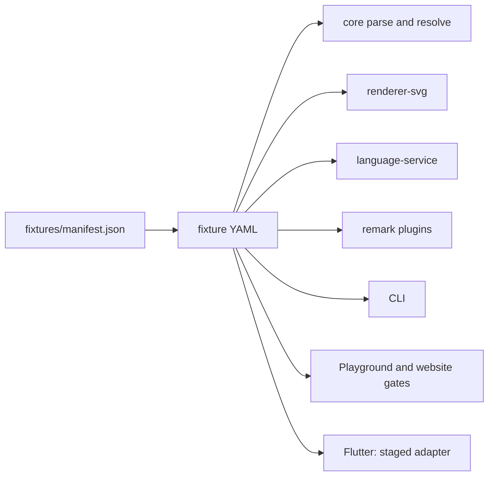
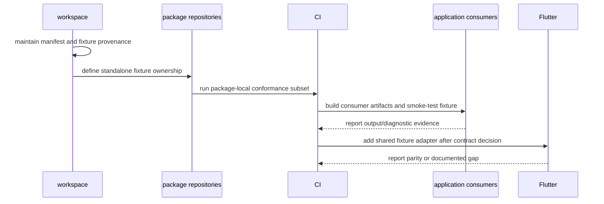

# Sub-rencana Tahap 4 — Shared Conformance Fixtures dan Contract Tests

**Status:** Berjalan — manifest, fixture aktif/legacy/invalid/runtime-diagnostic/capability-candidate, workspace runner, exact consumer checks, human-readable highlighting snapshot, standalone validation package/consumer TypeScript, smoke runtime manual Playground publik, automated browser smoke workspace/public-registry, runner Flutter lokal, checkout Flutter terisolasi, serta active/runtime-diagnostic/candidate scene dan SVG semantic projection Flutter sudah lulus; CI/deployment publik terbaru serta keputusan promotion candidate masih terbuka  
**Induk:** ../MATURATION-MASTER-PLAN.md  
**Tanggal:** 2026-09-15  
**Owner koordinasi:** relgeo/workspace  
**Scope:** fixture dan contract evidence lintas `spec`, package TypeScript, CLI, Playground, website, dan Flutter

## 1. Tujuan

Menjadikan satu sumber contoh kontrak yang dapat dibaca ulang oleh beberapa consumer. Tahap ini bukan usaha menghapus seluruh test inline pada repository anak; tujuan awalnya adalah memiliki fixture yang statusnya jelas, memiliki expected behavior, dan dapat dijalankan dari fresh workspace tanpa path privat operator.

Fixture bersama harus membantu menjawab tiga pertanyaan:

1. apakah dokumen valid pada contract line yang aktif dapat diparse dan di-resolve;
2. apakah output penting tetap konsisten di renderer, language service, Markdown, dan CLI;
3. apakah dokumen invalid ditolak dengan diagnostics yang dapat ditindaklanjuti.

## 2. Boundary dan source of truth



`fixtures/manifest.json` menyimpan status, contract version, surface yang dituju, dan expected identity/type atau diagnostic. YAML tetap menjadi bahan input yang dibaca manusia. Spec tetap menjadi sumber normatif; fixture tidak boleh memperkenalkan aturan bahasa yang tidak ada di spec.

### Keputusan ownership standalone

Fixture canonical tetap dimiliki `relgeo/workspace`, tidak diterbitkan sebagai package baru. Repository anak tetap harus dapat diuji standalone memakai test dan fixture lokal miliknya sendiri; test standalone tidak boleh mengimpor path sibling workspace. Root integration runner adalah otoritas untuk conformance lintas-repo dan boleh mengonsumsi fixture canonical ini.

Policy ini dicatat machine-readable pada `fixtures/manifest.json` melalui `standaloneStrategy`. Dengan begitu keputusan ownership tidak tersembunyi di script atau asumsi operator.

Fixture dibagi menjadi lima status:

| Status | Makna | Perlakuan |
| --- | --- | --- |
| `active` | contoh utama untuk compatibility line saat ini | harus lulus parse, resolve, dan subset consumer yang relevan |
| `supported-legacy` | kontrak lama yang masih sengaja didukung | harus tetap dapat diparse/resolved sesuai coverage yang dideklarasikan |
| `invalid` | input yang sengaja melanggar kontrak | harus ditolak dan menghasilkan diagnostic yang diharapkan |
| `runtime-diagnostic` | dokumen valid yang menghasilkan violation setelah resolve | parse/resolve tetap berhasil, violation dan output diagnostic harus stabil |
| `capability` | candidate untuk capability yang belum diaktifkan sebagai baseline semua consumer | harus memiliki expected snapshot dan evidence lokal; tidak otomatis menjadi active contract |

## 3. Inventory baseline

- 9 fixture `supported-legacy` pada DSL `v0.4` untuk coverage presentasional/sheet yang masih didukung runtime.
- 1 fixture `active` pada DSL `v0.5`: `10-v05-relational-baseline.yaml`.
- 3 fixture `invalid` pada DSL `v0.5`: object tanpa field `type`, YAML syntax rusak, dan unknown reference untuk menguji parser dan language-service diagnostics.
- 1 fixture `runtime-diagnostic` pada DSL `v0.5`: dokumen valid dengan relasi `align` yang sengaja tidak terpenuhi untuk menguji diagnostic pasca-resolve.
- 2 fixture `capability` pada DSL `v0.5`: candidate boolean/intersection dan evaluator/unit dengan expected scene/SVG snapshot; operasi, unit/evaluator, dan semantic projection ter-normalisasi Flutter sudah lulus lokal, tetapi belum menjadi active semantic Flutter conformance fixture.
- Repository anak masih dapat memiliki test inline dan test fixture lokal. Sebagian test renderer/consumer mengakses root `fixtures` saat dijalankan melalui workspace; public integration runner menyalin folder tersebut ke checkout temporary.

Gap implementasi: checkout standalone repository anak tidak otomatis membawa `fixtures/`. Keputusan saat ini adalah canonical fixture tetap di root workspace, child repository tetap memakai test/fixture lokalnya sendiri, dan tidak dibuat package fixture publik baru. Validasi package/consumer TypeScript pada checkout temporary berbasis registry, browser smoke lokal, runner Flutter lokal, checkout Flutter terisolasi, operasi/scene projection candidate Flutter, evaluator/unit projection, serta active/runtime-diagnostic/candidate SVG semantic projection sudah lulus; validasi CI pascapush, browser publik terbaru, dan keputusan menjadikan candidate capability sebagai active contract masih diperlukan.

## 4. Implementasi tahap ini

### 4.1 Manifest dan fixture

- [x] manifest machine-readable tersedia di `fixtures/manifest.json`;
- [x] setiap fixture memiliki `id`, path, contract version, status, dan surface;
- [x] manifest memisahkan active v0.5 dari supported legacy v0.4;
- [x] manifest memuat tiga invalid fixture dengan expected diagnostic;
- [x] ownership strategy standalone/child repository dicatat machine-readable pada manifest;
- [x] manifest menetapkan owner koordinasi dan alasan untuk setiap kelas status; README fixture menjelaskan boundary dan aturan penambahan.

### 4.2 Workspace runner

- [x] `scripts/run-conformance-fixtures.mjs` membaca manifest tanpa path absolut;
- [x] runner memvalidasi schema minimum manifest, uniqueness id/path, status, dan surface;
- [x] fixture valid diuji parse, resolve, version, serta non-empty scene;
- [x] fixture active diuji pada renderer SVG, security boundary, language service, semantic token, highlighting, Markdown preview, dan CLI compile;
- [x] fixture active memiliki snapshot SVG deterministik yang dibandingkan runner sebagai diff yang dapat direview;
- [x] fixture active memiliki snapshot resolved-scene deterministik untuk geometry, bbox, metadata, dan violations;
- [x] fixture invalid diuji agar parser menolak dan language service memunculkan diagnostic yang diharapkan;
- [x] fixture runtime-diagnostic diuji agar parse/resolve tetap berhasil dan violation terstruktur, renderer, language service, serta CLI tetap memiliki perilaku yang dapat direview;
- [x] root command `pnpm run conformance:fixtures` tersedia;
- [x] workflow Integration menjalankan runner sebagai bagian dari local integration gate setelah seluruh package/consumer build.

### 4.3 Bukti lokal

Command:

```bash
pnpm run conformance:fixtures
```

Bukti pada 2026-09-16:

```text
summary: 204 passed, 0 failed across 16 fixtures
```

Runner memeriksa sembilan fixture legacy, satu active v0.5 lintas surface, satu runtime-diagnostic v0.5, dua capability candidate v0.5, dan tiga invalid v0.5. Angka pass mencakup validasi manifest, parse/resolve, output/security renderer, language-service diagnostics/tokens, dua remark surface, exact serialized highlighting digest, exact preview-pipeline SVG, exact CLI SVG, expected violation dan snapshot runtime-diagnostic, serta expected snapshot kedua candidate capability. Untuk candidate evaluator/unit, metadata `cliUnit: mm` meneruskan target unit secara eksplisit karena default CLI tetap `px`.

Flutter conformance runner pada 2026-09-16 juga lulus secara lokal: Flutter `3.41.9`,
Dart `3.11.5`, 16 fixture di-stage, `flutter pub get --enforce-lockfile`, analyzer
non-fatal, dan 119 test Flutter. Fixture active dan runtime-diagnostic diverifikasi
melalui semantic projection; candidate boolean/intersection dan evaluator/unit juga
lulus pada level operasi/evaluator serta semantic projection ter-normalisasi. Candidate
tetap capability-only sampai keputusan active contract dan evidence CI dibuat.

Integration gate lokal penuh pada 2026-09-15 juga lulus `34 passed, 0 failed, 34 total`, dengan conformance runner sebagai stage terakhir setelah build dan test seluruh consumer workspace.

Public-registry integration gate pada 2026-09-15 lulus `48 passed, 0 failed, 48 total`. Package TypeScript, Playground, dan website dipasang dari npm pada checkout temporary; tidak ada sibling source workspace yang dipakai sebagai dependency.

### 4.4 Audit compatibility behavior

- [x] inventory read-only terhadap parser, runtime regression tests, language service, fixture manifest, Playground examples, fallback, dan dependency line dilakukan;
- [x] hasil audit disimpan di [`../compatibility-behavior-audit.md`](../compatibility-behavior-audit.md);
- [x] fallback Base64 legacy dan clipboard sudah diklasifikasikan sebagai behavior yang disengaja dan terdokumentasi;
- [x] mismatch nama file contoh `v04_*` dengan deklarasi DSL `v0.5` dicatat;
- [x] inventory behavior dapat diulang dengan command read-only `pnpm run compatibility:audit`;
- [ ] policy eksplisit untuk public support `v0.1`–`v0.4` dan penanganan future version belum diputuskan;
- [ ] negative conformance tests untuk version policy belum ditambahkan.

## 5. Urutan penyelesaian berikutnya



Prioritas kerja:

1. push root workspace agar integration gate terbaru (termasuk runner) dieksekusi oleh CI;
2. jalankan validasi standalone pada checkout repository anak sesuai policy manifest;
3. jalankan automated browser smoke pada CI dan ulangi browser smoke terhadap artifact publik setelah deployment;
4. tambahkan minimal satu fixture error pada boundary baru jika consumer tersebut menjanjikan diagnostics;
5. jalankan adapter Flutter yang sudah tersedia setelah keputusan binding/runtime Flutter jelas.

## 6. Pekerjaan yang masih terbuka

- [ ] runner CI terbaru menghasilkan evidence setelah perubahan ini dipush;
- [x] active fixture memiliki exact output check untuk highlighting, Markdown preview pipeline, dan CLI selain snapshot resolved-scene/SVG; serialized highlighting output dijaga dengan SHA-256 digest;
- [x] human-readable highlight snapshot tersedia sebagai `fixtures/expected/10-v05-relational-baseline.highlight.txt` dan dijaga dengan exact check;
- [x] policy menetapkan package/consumer standalone tidak bergantung pada folder sibling workspace;
- [x] package dan consumer TypeScript memiliki validasi standalone pada checkout temporary berbasis public registry (`48/48` stage);
- [x] smoke check browser lokal Playground memuat fixture runtime-diagnostic, mencapai status `READY`, tetap merender preview, dan menampilkan satu diagnostic pada tab Errors;
- [x] smoke check manual pada Playground publik memuat fixture runtime-diagnostic, mencapai status `READY`, tetap mempertahankan preview, dan menampilkan satu diagnostic pada tab Errors;
- [x] Pages artifact assertion memverifikasi bundle Playground membawa editor label, state `READY`, tab `Errors`, dan pesan runtime diagnostic;
- [x] automated browser smoke untuk source → `READY` → preview → runtime diagnostic dan mobile surface switcher tersedia serta lulus lokal `2/2`;
- [ ] evidence CI pascapush dan browser interaction evidence pada artifact publik masih belum tersedia;
- [x] fixture invalid mencakup YAML syntax error dan unknown reference;
- [x] fixture runtime-diagnostic diperluas ke semantic/runtime diagnostics yang tidak berhenti pada parser;
- [x] compatibility behavior inventory diselesaikan dan disimpan sebagai audit terpisah;
- [x] Flutter memiliki adapter fixture yang menerima root portable dan runner workspace yang menyiapkan staging sementara; audit dan desain adapter ada di [`06-flutter-alignment.md`](06-flutter-alignment.md);
- [x] Flutter menjalankan active/runtime/invalid fixture yang sama secara lokal dan mencatat gap parity capability tambahan pada evidence matrix; evidence CI masih terbuka;
- [ ] parser/version policy eksplisit dan negative tests memastikan tidak ada compatibility behavior tersembunyi di luar manifest, spec, atau test yang terdokumentasi.

## 7. Exit gate Tahap 4

- [x] fixture memiliki owner/status/alasan yang dapat ditelusuri melalui manifest dan README;
- [x] satu active fixture melintasi parse, resolve, renderer, language service, Markdown, dan CLI pada workspace runner;
- [x] tiga invalid fixture diuji pada parser dan language service;
- [x] satu runtime-diagnostic fixture diuji pada resolver, renderer, language service, dan CLI;
- [x] gate dijalankan dari root tanpa path privat operator;
- [x] output SVG active menghasilkan snapshot/diff assertion yang dapat direview;
- [x] strategi ownership fixture untuk standalone child repositories sudah eksplisit pada manifest dan dokumen;
- [x] validasi implementasi standalone dijalankan untuk package dan consumer TypeScript pada checkout temporary berbasis public registry;
- [x] Playground memiliki local runtime fixture smoke evidence;
- [x] Playground publik memiliki direct browser smoke evidence untuk runtime-diagnostic fixture;
- [x] artifact website memverifikasi kontrak runtime Playground yang terpaket;
- [x] automated browser smoke lokal untuk consumer Playground;
- [x] public-registry browser smoke standalone lulus `2/2`;
- [ ] evidence CI pascapush dan browser smoke berbasis interaksi pada deployment publik terbaru;
- [x] inventory compatibility behavior dan mismatch example version sudah direkam;
- [ ] public historical-version policy, future-version handling, dan negative tests;
- [x] Flutter memiliki adapter, capability mapping, dan gap record yang terdokumentasi pada [`06-flutter-alignment.md`](06-flutter-alignment.md);
- [ ] Flutter memiliki fixture parity runtime/SVG yang diverifikasi pada CI; active/candidate evidence lokal dan checkout terisolasi sudah lulus, sedangkan candidate boolean/intersection belum menjadi active contract dan belum memiliki evidence CI.

Tahap 4 belum selesai. Implementasi sekarang menutup fondasi conformance di level workspace; gap berikutnya membutuhkan keputusan packaging/consumer dan bukti runtime yang belum boleh diasumsikan.

## 8. Pemeliharaan fixture

Saat menambah atau mengubah fixture:

1. jelaskan contract version dan alasan fixture pada manifest;
2. gunakan status `active`, `supported-legacy`, atau `invalid` secara eksplisit;
3. tambahkan expected identity/type/output/diagnostic yang cukup untuk menangkap drift;
4. jalankan `pnpm run conformance:fixtures` dan integration gate;
5. jika perubahan memengaruhi contract line, update spec, compatibility matrix, release plan, dan baseline dalam perubahan terkoordinasi;
6. jangan menaruh credential, path lokal, atau data internal ke fixture publik.

## 9. Log perubahan

| Tanggal | Perubahan | Bukti/status |
| --- | --- | --- |
| 2026-09-15 | Audit fixture existing dilakukan | 9 fixture root berstatus legacy v0.4; test child tertentu membutuhkan root fixture saat workspace integration |
| 2026-09-15 | Manifest dan active v0.5 baseline dibuat | `fixtures/manifest.json`, `10-v05-relational-baseline.yaml` |
| 2026-09-15 | Workspace runner dibuat | parser, resolver, renderer, language service, remark plugins, dan CLI tercakup |
| 2026-09-15 | Invalid parser/diagnostic fixtures ditambahkan | `11-v05-invalid-missing-type.yaml`, `12-v05-invalid-yaml-syntax.yaml`, `13-v05-invalid-unknown-reference.yaml` |
| 2026-09-15 | Runtime-diagnostic fixture ditambahkan untuk constraint `align` yang gagal setelah resolve | `14-v05-runtime-align-violation.yaml` beserta expected violation dan snapshot scene/SVG; runner 141/141; integration gate penuh 34/34; CI evidence setelah push masih diperlukan |
| 2026-09-15 | Active fixture diperkuat dengan exact output checks untuk highlighting, Markdown preview, dan CLI | serialized highlighting SHA-256, preview-pipeline SVG, dan CLI SVG lulus; runner 142/142 pada tahap ini; integration gate kemudian dijalankan ulang |
| 2026-09-15 | Snapshot highlighting human-readable ditambahkan | `10-v05-relational-baseline.highlight.txt` lulus exact check; runner terbaru 147/147; integration gate lokal terbaru 34/34 |
| 2026-09-15 | Local Playground browser smoke menjalankan fixture runtime-diagnostic | status `READY`, preview tetap tampil, dan tab Errors menampilkan 1 diagnostic `Points are not aligned. Distance: 14.1421`; automated browser evidence masih terbuka |
| 2026-09-15 | Public-registry standalone gate dijalankan | package TypeScript, Playground, dan website lulus install/build/test pada checkout temporary; `48/48` stage; automated browser dan Flutter masih terbuka |
| 2026-09-15 | Direct public Playground browser smoke menjalankan fixture runtime-diagnostic | `https://relgeo.github.io/playground/` mencapai `READY`, preview tetap tersedia, dan tab Errors menampilkan 1 diagnostic `Points are not aligned. Distance: 14.1421`; bukti ini manual, automated browser/website evidence masih terbuka |
| 2026-09-15 | Compatibility behavior audit diselesaikan | parser version gate, historical regression coverage, fallback yang disengaja, dan mismatch nama file `v04_*` dicatat di `docs/compatibility-behavior-audit.md`; policy public historical/future version masih terbuka |
| 2026-09-15 | Compatibility behavior audit dimasukkan ke workflow Integration | command read-only lulus lokal dengan `7 passed, 9 warnings, 0 failed`; CI pascapush belum menjadi evidence |
| 2026-09-15 | Pages artifact assertion diperkuat untuk runtime Playground | bundle terpaket kini wajib memuat editor accessibility label, state `READY`, tab `Errors`, dan pesan diagnostic align; browser interaction evidence masih terbuka |
| 2026-09-16 | Automated browser smoke Playground ditambahkan | Playwright `1.63.0` exact; dua test lokal lulus untuk runtime diagnostic dan mobile surface switcher; CI pascapush masih diperlukan |
| 2026-09-16 | Automated browser smoke dijalankan melalui integration gate penuh | `35/36` stage lulus; Playwright install dan `relgeo-playground: test:e2e` lulus, satu failure hanya strict baseline karena submodule lokal belum clean |
| 2026-09-16 | Automated browser smoke dijalankan pada public-registry gate | `49/50` stage lulus; Playwright install dan `test:e2e` lulus dengan package npm publik, satu failure hanya strict baseline karena submodule lokal belum clean |
| 2026-09-16 | Candidate boolean/intersection v0.5 dan expected snapshot ditambahkan | TypeScript conformance menjadi `179 passed, 0 failed across 15 fixtures`; Flutter runner memverifikasi active/runtime/invalid serta operasi, scene projection, dan SVG semantic projection ter-normalisasi candidate, sementara candidate belum active dan CI masih terbuka |
| 2026-09-16 | Adapter Flutter dijalankan melalui terminal VS Code | Flutter `3.41.9` / Dart `3.11.5`; staging, dependency resolution, analyzer non-fatal, dan 118 test lulus; CI masih terbuka |
| 2026-09-16 | Checkout Flutter terisolasi diverifikasi | tanpa parent workspace, analyzer non-fatal lulus dengan 130 lint/info legacy; `flutter test` lulus 99 test dan skip 7 shared-fixture test secara eksplisit; CI parity dan keputusan candidate capability sebagai active contract masih terbuka |
| 2026-09-16 | SVG semantic projection active diperluas pada Flutter | fixture active kini membandingkan rect/circle/polygon-path geometry terhadap expected SVG TypeScript; lulus lokal, full capability/presentation policy dan CI masih terbuka |
| 2026-09-16 | SVG semantic projection runtime-diagnostic diperluas pada Flutter | fixture runtime-diagnostic kini membandingkan object path geometry terhadap expected SVG TypeScript; lulus lokal, full capability/presentation policy dan CI masih terbuka |
| 2026-09-16 | Checkout Flutter standalone dijalankan ulang setelah parity SVG active/runtime diperluas | tanpa parent workspace, 99 test lulus dan 7 shared-fixture test skip dengan alasan eksplisit; analyzer non-fatal selesai dengan 130 lint/info legacy |
| 2026-09-16 | Candidate evaluator/unit v0.5 ditambahkan | fixture canonical ke-16 menutup parameter length, `in`/`mm`, derived placement, dan object projection; `cliUnit: mm` membuat target CLI eksplisit |
| 2026-09-16 | Root conformance dan Flutter runner diverifikasi ulang setelah candidate evaluator/unit | root `199 passed, 0 failed across 16 fixtures` sebelum validator candidate diperketat; Flutter staging 16 fixture dan `119 test` lulus; CI/promotion candidate masih terbuka |
| 2026-09-16 | Validator capability candidate diperketat dan conformance diulang | setiap candidate wajib memiliki expected scene/output snapshot; root terbaru `204 passed, 0 failed across 16 fixtures` |
| 2026-09-16 | Integration gate root diulang setelah candidate evaluator/unit | seluruh stage implementasi lulus; ringkasan `35 passed, 1 failed, 36 total`, dengan satu-satunya failure berupa strict-baseline karena perubahan lokal pada website, Playground, dan Flutter |
