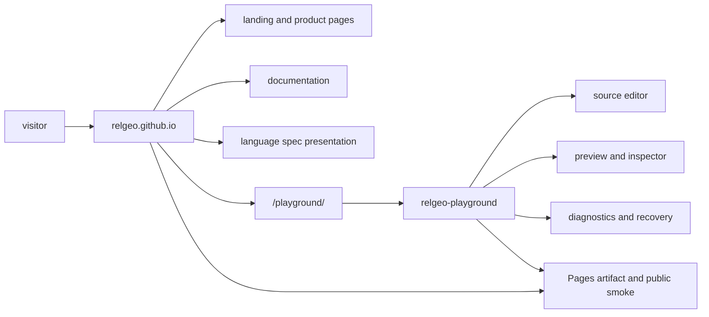
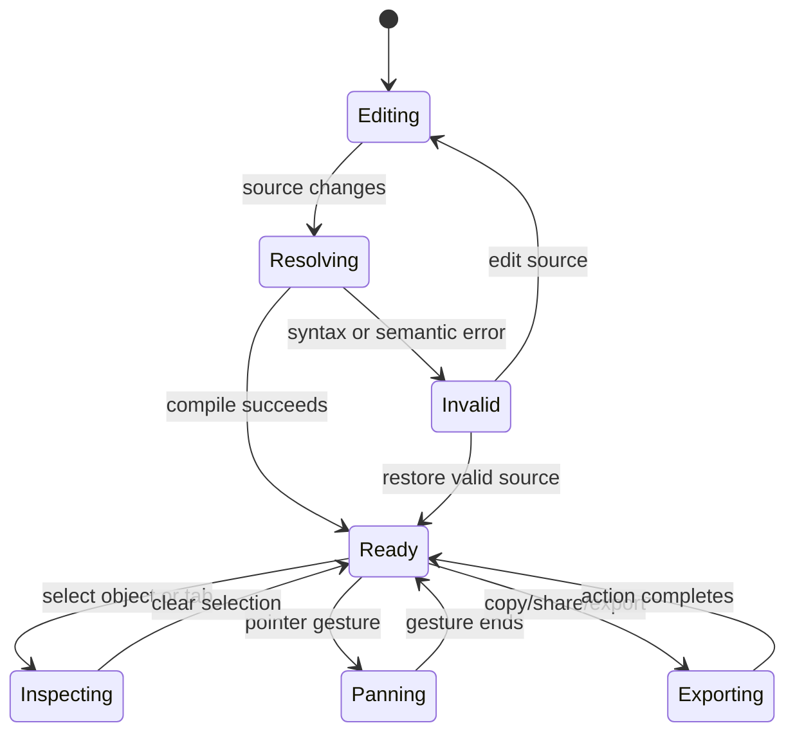

# Sub-rencana Tahap 5 — Public Docs, Website, dan Playground Hardening

**Status:** Berjalan — baseline implementasi, build, browser QA, accessibility tree, dan public smoke sudah kuat; validasi perangkat touch nyata, keyboard fisik, dan assistive technology masih terbuka
**Induk:** ../MATURATION-MASTER-PLAN.md  
**Tanggal:** 2026-09-16  
**Owner koordinasi:** relgeo/workspace  
**Owner implementasi:** `relgeo/relgeo.github.io` dan `relgeo/playground`  
**Scope:** public website, documentation surface, language-spec presentation, Playground browser IDE, dan delivery evidence

## 1. Tujuan

Menjadikan website dan Playground sebagai public surface yang padat informasi, mudah dipahami, dapat diakses, responsif, dan dapat dipercaya. Tahap ini tidak menambah kemampuan bahasa atau mengubah kontrak runtime; fokusnya adalah kualitas presentation layer dan bukti bahwa alur utama dapat dipakai pada kondisi nyata.

Sub-rencana ini menjadi indeks koordinasi. Detail implementasi yang spesifik tetap tinggal di repository pemiliknya:

- audit redesign dan aturan visual website berada di `relgeo.github.io/docs/`;
- audit UX/UI dan bukti screenshot Playground berada di `playground/docs/`;
- source component/style/test tetap berada di repository masing-masing;
- root workspace hanya menyimpan status lintas-repo, acceptance criteria, dan evidence yang diperlukan untuk release.

## 2. Batasan dan non-goals

Tahap ini tidak mencakup:

- perubahan grammar atau semantics RelGeo DSL;
- perubahan public API package TypeScript;
- promosi capability Flutter menjadi active contract;
- pembuatan design system eksternal yang menggantikan source CSS repository;
- penambahan fitur Playground hanya demi memperbanyak kemampuan sebelum baseline UX stabil.

Pekerjaan visual harus mengikuti prinsip bahwa bentuk mengikuti fungsi. Rounded bukan default untuk container, code, spec, atau reading surface. Artwork landing page tetap statis dan art-directed; preview interaktif, source, dan eksperimen renderer tetap berada di Playground atau dokumentasi teknis.

## 3. Peta surface publik

Setiap surface harus memiliki tujuan yang jelas:

| Surface | Tujuan | Bentuk yang diprioritaskan |
| --- | --- | --- |
| Landing | orientasi dan ajakan mencoba | editorial, ringkas, artwork statis |
| Product pages | menjelaskan alasan dan use case | reading surface, bukan dashboard |
| Documentation | onboarding dan penggunaan | navigasi terbaca, contoh terarah |
| Language spec | kontrak normatif | reference/standards surface, authority jelas |
| Playground | mencoba source → resolve → preview | workbench fungsional, dense, actionable |
| Deployment | memastikan yang dibaca publik sama dengan yang diuji | artifact assertion dan smoke evidence |

## 4. Prinsip visual dan interaction

Aturan normatif untuk perubahan baru diringkas di [`relgeo.github.io/docs/VISUAL-DESIGN-RULES.md`](../../relgeo.github.io/docs/VISUAL-DESIGN-RULES.md). Prinsip yang harus dijaga pada kedua repository:

1. Informasi penting masuk viewport pertama sedini mungkin.
2. Spacing memisahkan kelompok informasi; tidak dipakai untuk menciptakan ruang kosong dekoratif.
3. Navbar, brand, heading, body, dan control mengikuti alignment grid yang konsisten.
4. Hierarki dibuat dengan typography, posisi, rule, dan kontras; bukan dengan membesarkan semua benda.
5. Reading, code, spec, dan technical surface square atau memakai radius sangat kecil secara default.
6. Rounded hanya digunakan bila membantu affordance, status ringkas, atau pengelompokan yang benar-benar fungsional.
7. Control keyboard, focus state, target sentuh, dan screen-reader name adalah bagian dari desain, bukan QA belakangan.
8. Motion harus memiliki reduced-motion fallback.
9. Preview dan editor harus mempertahankan jalur pemulihan yang jelas saat source invalid atau runtime diagnostic muncul.
10. Visual yang belum matang tidak dipaksakan menjadi hero proof; gunakan artwork statis bila itu menyampaikan pesan dengan lebih baik.

## 5. Baseline yang sudah terbukti

### 5.1 Website

- [x] Astro static build menghasilkan 138 halaman.
- [x] `astro check` lulus dengan 0 error, warning, dan hint.
- [x] Built-output assertion melindungi route utama, favicon, touch icon, metadata, Playground artifact, dan localized navigation state.
- [x] Website memakai custom Pages workflow dan merakit hasil build Playground ke `/playground/`.
- [x] Landing, Documentation index, Language Spec index, dan leaf pages sudah melalui redesign utama untuk mengurangi nested-card dan vertical waste.
- [x] Navigation model sudah disatukan antara landing dan internal pages, termasuk active state Why RelGeo.
- [x] Spacing atas navbar, radius global, dan container teknis sudah diperketat sesuai aturan visual.
- [x] Artwork hero statis memakai WebP dengan PNG fallback.
- [x] Public smoke mencakup route utama, docs, language spec, Playground, sitemap, favicon, dan apple-touch-icon.

Source detail dan history perubahan ada di [`VISUAL-REDESIGN-AUDIT-AND-PLAN.md`](../../relgeo.github.io/docs/VISUAL-REDESIGN-AUDIT-AND-PLAN.md).

### 5.2 Playground

- [x] First-run resolve, camera fit, selected sheet, split/sidebar resize, dan preview recovery sudah memiliki implementation/test coverage.
- [x] Mode Both/Source/Preview, responsive drawer, Inspector, Graph, Values, BOM, diagnostics, share, reset, dan confirmation flow sudah diperbaiki.
- [x] Source, preview, toolbar global, dan contextual toolbar dibedakan secara semantik dan visual.
- [x] Pan satu pointer dan pinch-zoom dua pointer memiliki Pointer Events implementation serta browser/unit contract.
- [x] Dirty draft confirmation, restore draft, reset, dan example switching memiliki jalur pembatalan yang aman.
- [x] Keyboard traversal, focus trap drawer/dialog, AX tree lokal, accessible names, selected/expanded/pressed state, dan skip link sudah diuji.
- [x] Reduced-motion CSS, overflow containment, breakpoint matrix browser, dan minimum control sizing sudah memiliki gate.
- [x] Main bundle diperkecil melalui lazy loading; build tidak lagi menghasilkan advisory chunk di atas 500 kB.
- [x] Local E2E lulus `2/2` untuk runtime diagnostic dan mobile surface switcher; suite terpisah memakai profil iPhone 13 Chromium dan `touchscreen.tap`.
- [x] Mobile-device emulation memverifikasi touch capability, viewport 390px, dan perpindahan Source/Preview; ini bukan pengganti validasi handset fisik.
- [x] Deployment-aware E2E dengan `PLAYWRIGHT_BASE_URL=https://relgeo.github.io/playground/` lulus `2/2` pada public Playground.
- [x] `audit:ux` lulus dengan 13 component files dan 4 dynamic inline styles yang disetujui.

Source detail dan evidence screenshot ada di [`playground/docs/UX-UI-AUDIT-AND-PLAN.md`](../../playground/docs/UX-UI-AUDIT-AND-PLAN.md).

### 5.3 Delivery dan evidence lintas-repo

- [x] Local integration gate lulus `36/36`.
- [x] Release preflight lulus: strict baseline `81/81`, compatibility `256/256`, release audit `106/106`, dan integration `36/36` pada baseline sebelum policy-version fixture ditambahkan; compatibility terbaru `256/256` diverifikasi ulang setelah policy tersebut.
- [x] GitHub `Integration #112` lulus untuk job `flutter`, `verify`, dan `public` pada `workspace@0adadf8`; action artifact Node 24 berjalan tanpa warning Node 20, dan report integration serta Playwright tersedia.
- [x] Public Playground smoke mencapai `READY`, preview tetap terlihat, tab `Errors` menampilkan diagnostic expected, dan console browser bersih.
- [x] Root commit `0adadf8` sudah dipush; `Integration #112` memvalidasi failure-injection release guard dan seluruh job selesai sukses.

## 6. Workstream dan status

### Workstream A — Shared visual language

- [x] Aturan visual website ditulis dan diterapkan sebagai baseline.
- [x] Radius global diturunkan; code/spec/technical surface tidak lagi memakai rounded sebagai default.
- [x] Shared stylesheet website dipisah menjadi token, foundation, layout, components, dan responsive layers.
- [x] Playground CSS memiliki token, layer, dan gate `audit:ux` untuk mencegah selector/inline-style drift.
- [x] Typography UI, editor, dan worker memiliki fallback yang eksplisit.
- [ ] Review estetika final lintas perangkat masih memerlukan penilaian manusia dengan screenshot aktual.
- [ ] Optimasi font lintas perangkat masih opsional, bukan release blocker.

### Workstream B — Navigation dan information architecture

- [x] Primary navigation website disatukan antara landing dan internal pages.
- [x] Active route state dan Why RelGeo sudah diperbaiki.
- [x] Mobile header dan horizontal navigation strip sudah dibuat deliberate, bukan accidental wrapping.
- [x] Website memiliki jalur yang terlihat ke `/playground/`.
- [x] Docs dan Language Spec memiliki sidebar/reading order yang berbeda sesuai fungsi.
- [ ] Re-evaluasi navigation setelah perubahan konten besar berikutnya.

### Workstream C — Reading and reference surfaces

- [x] Landing hero tidak lagi bergantung pada live renderer/highlighter sebagai dekorasi utama.
- [x] Documentation index menggunakan group map, reading path, dan reference rows.
- [x] Language Spec index menggunakan authoritative sidebar dan reading column.
- [x] Leaf pages mengurangi nested card dan membedakan reading surface dari utility navigation.
- [x] Normative spec tetap bersumber dari repository `spec`, bukan disalin manual ke website.
- [x] Review editorial konten setelah contract/version policy berubah; Language Status website EN/ID kini menjelaskan active, supported legacy, regression-only, dan future-version behavior.

### Workstream D — Playground workbench interaction

- [x] Editing → resolving → READY → preview flow memiliki browser smoke.
- [x] Invalid source mempertahankan preview valid terakhir dan menampilkan error actionable.
- [x] Runtime diagnostic tetap menampilkan preview dan Errors inspector.
- [x] Surface switcher dan responsive drawer memiliki behavior test.
- [x] Surface switcher juga diuji melalui touchscreen tap pada mobile-device emulation.
- [x] Selection, related depth, graph, values, and source jump memiliki state semantics.
- [x] Share/copy/reset memiliki feedback, fallback, dan confirmation contract.
- [ ] Touch gesture pada handset/tablet fisik belum diverifikasi.

### Workstream E — Accessibility and responsive behavior

- [x] Landmark `main`, conditional skip link, visible focus, button types, labels, roles, dan states sudah diaudit.
- [x] Keyboard sweep lokal mencakup navbar, editor, preview, drawer, Inspector, Graph, Values, Errors, dan dialog.
- [x] Drawer dan confirmation dialog memiliki focus trap serta focus return.
- [x] Browser AX tree pada state utama tersedia dan seluruh kontrol yang diuji memiliki accessible name.
- [x] Dedicated mobile-device emulation berbasis profil iPhone 13 Chromium lulus untuk tap surface switcher dan viewport 390px.
- [x] Reduced-motion stylesheet dan browser emulation sudah diverifikasi.
- [x] Browser matrix 390×844, 480, 768×1024, 840, 1024, 1280×720, dan 1440×900 tidak menunjukkan page-level horizontal overflow pada scope yang diuji.
- [ ] Uji keyboard fisik pada perangkat nyata belum dilakukan.
- [ ] VoiceOver/TalkBack nyata belum dilakukan.
- [ ] Touch keyboard, pinch, pan, scroll, dan drawer pada handset/tablet nyata belum dilakukan.

### Workstream F — Delivery and public confidence

- [x] Website build, artifact assertion, and Pages deployment path tersedia.
- [x] Public route smoke tersedia.
- [x] Public Playground browser smoke tersedia secara manual dan deployment-aware secara otomatis.
- [x] Integration CI memvalidasi package, Playground, website, Flutter, and public-registry paths.
- [x] Release preflight terdokumentasi sebagai boundary sebelum publish manual.
- [ ] Public smoke perlu dijalankan ulang setelah setiap release yang mengubah website atau Playground.
- [ ] Evidence perangkat eksternal perlu ditambahkan ke audit setelah pengujian dilakukan.

## 7. Urutan kerja yang direkomendasikan

Urutan berikut menghindari pencampuran implementasi dengan validasi eksternal:

1. **Konsolidasi dokumen** — selesai dengan pembuatan sub-rencana ini dan tautan dari master plan.
2. **Pertahankan baseline teknis** — setiap perubahan website/Playground wajib melewati build, check/test, `audit:ux`, E2E, dan integration gate yang relevan.
3. **Validasi perangkat fisik** — uji satu handset/tablet iOS atau Android untuk touch gesture, keyboard virtual, scroll halaman, drawer, target sentuh, dan layout.
4. **Validasi assistive technology** — uji VoiceOver atau TalkBack dengan fokus pada landmark, dialog, drawer, tabs, Errors, Graph, READY, dan recovery.
5. **Catat evidence eksternal** — simpan model perangkat, OS, browser, viewport, langkah uji, hasil, dan defect pada audit Playground/website.
6. **Perbaiki hanya temuan nyata** — jangan menambah fitur atau mengubah visual tanpa evidence masalah yang jelas.
7. **Review release** — setelah perubahan yang berdampak publik, jalankan preflight, integration CI, Pages deploy, public smoke, dan update baseline.

## 8. Acceptance criteria dan exit gate

### 8.1 Gate implementasi

- [x] Website dan Playground memiliki aturan visual tertulis.
- [x] Navbar, active state, container, spacing, typography, dan radius tidak memiliki regression yang diketahui pada baseline saat ini.
- [x] Landing, docs, spec, dan Playground memiliki hierarchy yang sesuai dengan tujuan surface.
- [x] Source/code/spec tidak menggunakan rounded container sebagai default dekoratif.
- [x] Alur source → resolve → preview → diagnostic memiliki recovery yang dapat dipahami.
- [x] Build, lint/check, unit test, E2E, artifact assertion, dan local integration gate lulus.

### 8.2 Gate public validation

- [x] Route website publik utama HTTP `200`.
- [x] Public Playground mencapai `READY` dan menampilkan preview.
- [x] Runtime diagnostic tampil pada Errors tanpa menghilangkan preview valid.
- [x] Console browser public smoke tidak memiliki error/warning yang diketahui.
- [ ] Touch gesture diverifikasi pada perangkat fisik.
- [ ] Keyboard dan assistive technology diverifikasi pada perangkat fisik.
- [ ] Evidence perangkat eksternal disimpan pada audit.

### 8.3 Kriteria selesai tahap

Tahap 5 dapat dipindahkan menjadi **Selesai** apabila:

1. semua gate implementasi tetap hijau;
2. setidaknya satu perangkat touch nyata lulus alur utama tanpa blocker;
3. setidaknya satu screen reader nyata lulus traversal dan pengumuman state utama tanpa blocker;
4. temuan yang tersisa adalah limitation yang terdokumentasi atau peningkatan opsional;
5. public smoke pascadeploy dan evidence CI untuk commit final tersedia.

Sampai kondisi tersebut terpenuhi, status Tahap 5 tetap **Berjalan**.

## 9. Sisa pekerjaan

### Wajib sebelum menutup Tahap 5

- [ ] uji touch nyata pada satu handset/tablet: pan, pinch-zoom, scroll di luar canvas, drawer, surface switcher, target sentuh, dan keyboard virtual;
- [ ] uji keyboard fisik pada perangkat nyata;
- [ ] uji VoiceOver atau TalkBack: landmark, dialog konfirmasi, drawer, tabs Inspector, Errors, Graph, READY, dan recovery;
- [ ] simpan device/OS/browser/viewport/result sebagai evidence;
- [ ] jalankan ulang public smoke setelah perubahan yang dibuat dari temuan eksternal.

### Menunggu keputusan atau scope

- [x] final support policy historical/future version sudah diterapkan pada copy Language Status website EN/ID dan capability wording tetap tidak overclaim;
- [ ] promotion candidate Flutter dan parity SVG yang lebih luas dikelola Tahap 6, bukan blocker implementasi website saat ini;
- [ ] graph zoom/minimap dan usability review dengan pengguna lain bersifat opsional;
- [ ] optimasi font lintas perangkat bersifat opsional.

## 10. Risiko dan aturan perubahan

| Risiko | Dampak | Mitigasi |
| --- | --- | --- |
| visual drift antara website dan Playground | public surface terasa tidak konsisten | ubah token/aturan secara eksplisit dan review screenshot |
| code/spec kembali menjadi rounded card | authority dan keterbacaan teknis turun | pertahankan radius gate dan review technical surfaces |
| perubahan Playground tidak ikut masuk Pages artifact | publik membaca build lama | jalankan artifact assertion dan public smoke |
| emulasi browser dianggap sama dengan perangkat nyata | touch/AT defect lolos | simpan emulation sebagai bukti terpisah dan lakukan external validation |
| perubahan copy overclaim capability | ekspektasi pengguna salah | sinkronkan dengan matrix, spec, dan release record |
| CSS exception bertambah tanpa batas | maintenance sulit dan regression meningkat | gunakan layer/token; inline style hanya untuk runtime state yang sah |

Aturan perubahan:

1. perubahan UX/UI harus memiliki alasan dan surface yang terdampak;
2. perubahan visual besar sebaiknya menyertakan screenshot baseline baru pada repository pemilik;
3. perubahan behavior yang memengaruhi source/resolve/diagnostic harus masuk fixture atau test consumer yang relevan;
4. perubahan route, navigation, atau public copy harus memperbarui built-output/public smoke assertion bila perlu;
5. jangan menandai gate eksternal selesai berdasarkan browser emulation saja;
6. setiap batch selesai harus memperbarui checklist dan log sub-rencana ini.

## 11. Evidence register

| Evidence | Lokasi/status |
| --- | --- |
| Website visual audit | `relgeo.github.io/docs/VISUAL-REDESIGN-AUDIT-AND-PLAN.md` |
| Website visual rules | `relgeo.github.io/docs/VISUAL-DESIGN-RULES.md` |
| Playground UX/UI audit | `playground/docs/UX-UI-AUDIT-AND-PLAN.md` |
| Local build/check/test | website 138 pages, 0 Astro diagnostics, assertions lulus |
| Local Playground E2E | `2/2` lulus |
| Public Playground E2E | `2/2` lulus dengan `PLAYWRIGHT_BASE_URL` |
| Local mobile-device E2E | `2/2` suite total; touchscreen tap Source/Preview lulus pada profil iPhone 13 Chromium |
| Local integration | `36/36` lulus |
| Release preflight | snapshot baseline: `81/81`, `250/250`, `106/106`, `36/36`; compatibility terkini `256/256` |
| CI evidence | `Integration #112` pada `workspace@0adadf8` sukses untuk job `flutter`, `verify`, dan `public`; artifact report dan Playwright annotations tersedia; action artifact Node 24 tidak lagi menghasilkan warning Node 20 |
| Public browser smoke | READY, preview, Errors diagnostic, route utama `200`, console bersih |

## 12. Log perubahan

| Tanggal | Perubahan | Status |
| --- | --- | --- |
| 2026-09-16 | Gap formal sub-rencana Tahap 5 ditemukan saat audit master plan | ditutup dengan dokumen ini |
| 2026-09-16 | Audit website, aturan visual, audit UX/UI Playground, dan evidence delivery dikonsolidasikan | baseline implementasi tercatat |
| 2026-09-16 | Website dan Playground diringkas sebagai dua owner implementasi dengan satu public-surface gate | selesai sebagai struktur koordinasi |
| 2026-09-16 | Acceptance criteria dipisahkan antara implementation gate dan external validation gate | selesai |
| 2026-09-16 | Physical touch, keyboard nyata, dan VoiceOver/TalkBack ditetapkan sebagai sisa wajib | terbuka, membutuhkan perangkat/operator |
| 2026-09-16 | Playground menambahkan suite mobile-device emulation dengan touchscreen tap | `e73b212`, `pnpm run test:e2e` lulus `2/2`; validasi handset fisik dan assistive technology tetap terbuka |
| 2026-09-16 | Root integration gate diulang setelah pointer Playground dan manifest diselaraskan | root `f953b32`, `36/36` pass; CI pascapush terbaru tetap perlu diverifikasi |
| 2026-09-16 | Policy version acceptance dan action artifact diperbarui | `Integration #105` pada `workspace@a866fcc` sukses; workflow berikutnya memakai `actions/upload-artifact@v6` |
| 2026-09-16 | Upgrade artifact action diverifikasi pada CI | `Integration #106` pada `workspace@b3f7bb6` sukses dan seluruh job berjalan tanpa warning Node 20 |
| 2026-09-17 | Failure-injection release guard dan cross-repo gate diverifikasi pada CI | `Integration #112` pada `workspace@0adadf8` sukses untuk job `flutter`, `verify`, dan `public`; artifact report dan Playwright annotations tersedia |
