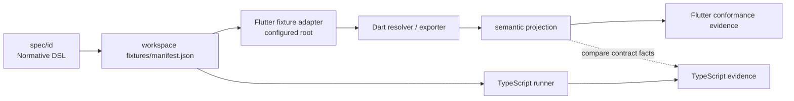
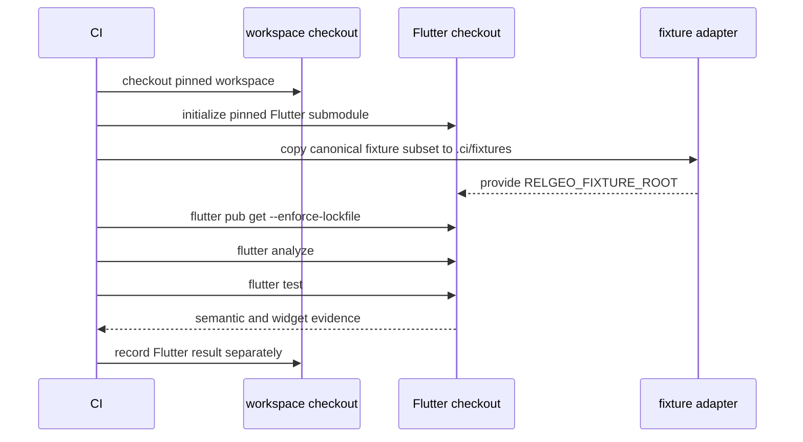

# Sub-rencana Tahap 6 — Flutter Contract Alignment

**Status:** Berjalan — audit baseline, adapter fixture, semantic projection, boundary tests, runner lokal, checkout mandiri terisolasi, build macOS, dan gate CI Flutter selesai; parity lintas engine yang belum tercakup, promotion candidate, serta keputusan platform release masih terbuka
**Induk:** ../MATURATION-MASTER-PLAN.md  
**Tanggal mulai:** 2026-09-16  
**Owner koordinasi:** relgeo/workspace  
**Pemilik implementasi:** relgeo/flutter  
**Scope:** workbench/aplikasi Flutter yang mengonsumsi dan merender RelGeo DSL

## 1. Tujuan dan batas

Tahap ini membawa Flutter ke jalur bukti kontrak yang sama dengan consumer TypeScript, tanpa menjadikannya prasyarat untuk gate TypeScript. Targetnya bukan memaksa kedua implementasi memiliki struktur kode atau output byte-for-byte yang sama; targetnya adalah memastikan input DSL yang sama menghasilkan perilaku semantik yang dapat dibandingkan dan setiap perbedaan diketahui.

Flutter saat ini adalah workbench/aplikasi non-publishable (`publish_to: none`), bukan package Dart publik yang menjadi bagian dari transaksi publish npm. Versi aplikasi `1.0.0+1` adalah versi aplikasi Flutter dan tidak boleh dibaca sebagai versi DSL. Contract line aktif tetap RelGeo DSL `0.5` sampai compatibility matrix mengubahnya melalui keputusan eksplisit.

Non-goal tahap ini:

- tidak mengaktifkan publish ke pub.dev;
- tidak mengganti implementasi Flutter dengan package TypeScript atau membuat bridge runtime lintas bahasa secara prematur;
- tidak mengklaim parity penuh dari keberadaan test lokal saja;
- tidak menjadikan Flutter sebagai dependency untuk build/test Playground, CLI, atau website;
- tidak menyamakan pixel golden Flutter dengan SVG atau scene serialization TypeScript.

## 2. Temuan audit baseline

### Sudah tersedia

- [x] repository Flutter terpisah dan dipin di `docs/integration-baseline.json`;
- [x] `lib/relgeo_flutter.dart` mengekspor tipe geometri, evaluator, resolver, intersection, boolean engine, Canvas painter, dan SVG exporter;
- [x] workbench UI memiliki editor DSL, viewport, inspector, diagnostics, sheet/view selector, role filter, preference, dan export SVG;
- [x] test lokal mencakup evaluator, graph, resolver, boolean, renderer, SVG contract, golden preview, widget smoke, dan sebagian fixture reference;
- [x] README menyatakan targetnya parity tinggi terhadap baseline TypeScript dan tidak mengklaim parity final absolut;
- [x] repository tidak melacak `build/`, `.dart_tool/`, coverage, cache, credential-like file, atau export runtime;
- [x] runtime dan exporter menandai surface aktif sebagai `v0.5` pada beberapa titik UI/output.

### Gap yang terbukti dari inspeksi

- [x] Flutter sekarang menjadi `nonNodeConsumers.flutter` pada `docs/compatibility-matrix.json` tanpa dimasukkan ke release order Node; status evidence tetap `partial`, dan evidence CI job `Integration #94` sudah terverifikasi;
- [x] test shared fixture tidak lagi mengunci satu literal path: `flutter/test/support/shared_fixture.dart` menerima `RELGEO_FIXTURE_ROOT` dan menyediakan fallback relatif workspace; canonical fixture tetap tidak dibawa ke child repo;
- [x] active fixture `10-v05-relational-baseline.yaml` memiliki test Flutter dan sudah dijalankan melalui staging fixture; manifest menandai surface Flutter yang memang dicakup evidence;
- [x] runtime Flutter mengimplementasikan port Dart tersendiri dan pemetaan capability/function/diagnostic ke implementasi TypeScript kini tersedia machine-readable; evidence parity pada tiap mapping tetap terbuka;
- [x] `flutter/pubspec.yaml` memiliki deskripsi RelGeo dan statement compatibility line `0.5`; application version `1.0.0+1` tetap dipisahkan secara eksplisit;
- [x] mapping capability/function Flutter terhadap sumber TypeScript dicatat machine-readable di [`../flutter-capability-matrix.json`](../flutter-capability-matrix.json), dengan status evidence yang belum lengkap tetap eksplisit;
- [x] referensi `v0.4` yang tersisa diklasifikasikan sebagai regression/compatibility history; statement aktif pada README, pubspec, painter, exporter, dan workbench menggunakan `v0.5`;
- [x] job `flutter analyze`/`flutter test` terpisah sudah ditambahkan pada workflow root; job `flutter` pada `Integration #94` berhasil dari checkout CI, dan build Flutter macOS juga sudah lulus secara lokal;
- [x] Flutter SDK lokal tersedia dan diverifikasi melalui terminal VS Code; runner lengkap berhasil pada Flutter `3.41.9` dan Dart `3.11.5`. Evidence lokal, checkout mandiri, job CI, dan build platform macOS lokal sudah tersedia; job `flutter-macos` kini juga ditambahkan ke workflow root dengan locale UTF-8 dan runner `macos-latest`.
- [x] Verifikasi hijau pertama untuk job `flutter-macos` selesai pada `Integration #119` di `workspace@dc40653`; runner `macos-latest` menyelesaikan `flutter build macos --no-pub --release` dengan Flutter stable `3.41.9`.

## 3. Boundary fixture yang disepakati untuk dibahas

Canonical fixture tetap dimiliki `relgeo/workspace` dan tidak dipublish sebagai package baru. Agar repository Flutter tetap dapat diuji standalone, adapter harus menerima root fixture melalui konfigurasi portable:

### Rekomendasi adapter

1. Test Flutter menggunakan `RELGEO_FIXTURE_ROOT` bila tersedia.
2. Saat tidak ada environment variable, test mencari lokasi relatif yang jelas hanya untuk mode workspace, bukan absolute path operator.
3. Root integration runner menyalin fixture yang diperlukan ke directory `.ci/fixtures` checkout sementara Flutter sebelum menjalankan gate.
4. Repository Flutter boleh menyimpan fixture kecil untuk test unit yang sepenuhnya mandiri, tetapi tidak boleh diam-diam menjadi salinan canonical active fixture.
5. Manifest baru menambahkan Flutter sebagai surface setelah adapter dan evidence pertama lulus; penambahan label tidak boleh mendahului bukti.

Alternatif membuat package fixture Dart publik atau menyalin seluruh canonical fixture ke repository Flutter ditahan. Keduanya menambah ownership/versioning surface sebelum kebutuhan itu terbukti.

## 4. Capability matrix awal

| Capability | TypeScript baseline | Flutter baseline | Status evidence |
| --- | --- | --- | --- |
| YAML/DSL input | `@relgeo/core` + YAML boundary consumer | `yaml` + resolver Dart | active shared fixture dan semantic projection lulus lokal; vocabulary diagnostic lintas consumer masih terbuka |
| scalar/evaluator | core evaluator | `src/core/evaluator.dart` | candidate shared fixture dan semantic projection lulus lokal serta CI; belum active baseline |
| dependency graph | core resolver | `src/core/graph.dart` dan resolver | local test dan active shared fixture projection lulus; coverage lintas operation masih terbuka |
| geometry/intersection | `@relgeo/geometry` | `src/geometry/*` | candidate shared fixture dan semantic projection lulus lokal serta CI; belum active baseline |
| boolean | geometry boolean engine | `clipper2` adapter | candidate shared fixture, operasi, dan semantic projection ter-normalisasi lulus lokal serta CI; belum menjadi active baseline |
| SVG output | `@relgeo/renderer-svg` | `SvgExporter` | active, runtime-diagnostic, dan candidate SVG semantic projection lulus lokal; surface capability yang lebih luas dan policy presentation masih terbuka |
| Canvas presentation | bukan target package utama | `CanvasPainter` | Flutter-specific, divalidasi oleh golden/widget test |
| diagnostics | core/runtime + language-service | `ConstraintViolation`/workbench diagnostics | runtime local ada; diagnostic code/message mapping belum distandarkan |
| active contract | DSL `0.5` | compatibility matrix, pubspec, README, painter, exporter, dan workbench | statement aktif eksplisit; active/runtime semantic evidence lokal dan CI lulus, capability tambahan masih terbuka |

Matrix ini adalah baseline audit, bukan claim parity. Mapping machine-readable yang sama tersedia di [`../flutter-capability-matrix.json`](../flutter-capability-matrix.json) dan diperiksa oleh `pnpm run compatibility:check`. Flag `localFlutterTests`, `sharedFixtures`, dan `semanticParity` hanya menyatakan pemeriksaan yang benar-benar sudah dieksekusi; flag tersebut tidak mempromosikan candidate menjadi active contract. Hanya `supportLevel`/`evidenceStatus` bersama keputusan contract yang menentukan status capability. Flag `ci` baru boleh `true` setelah workflow resmi lulus dari checkout bersih. Setiap cell harus berubah menjadi `verified`, `partial`, atau `unsupported` beserta evidence sebelum Tahap 6 ditutup.

### Previously observed semantic mismatch: `align` diagnostic

Fixture `14-v05-runtime-align-violation.yaml` memperlihatkan delta yang harus
diselesaikan sebelum Flutter diberi label conformance. TypeScript menghitung
jarak Euclidean `14.1421`, memakai path `constraints[0]`, message
`Points are not aligned. Distance: 14.1421`, dan `involvedObjects: []`.
Audit awal menemukan Flutter menghitung deviasi maksimum sumbu X/Y, memakai
path `constraints.align`, message per-sumbu, dan mengisi object IDs. Perubahan
lokal sekarang mengikuti formula, path, message, dan object list baseline
TypeScript untuk default point alignment. Ini bukan perbedaan kosmetik;
diagnostic terstruktur adalah bagian dari consumer contract. Detail source
comparison dicatat di
[`../compatibility-behavior-audit.md`](../compatibility-behavior-audit.md).

## 5. Rencana pengerjaan bertahap

### Stage A — Contract statement dan metadata

- [x] audit repository, entrypoint, pubspec, README, test, dan source boundary;
- [x] tambahkan record compatibility Flutter yang tidak merusak checker Node melalui section `nonNodeConsumers` pada `docs/compatibility-matrix.json`;
- [x] tetapkan pada matrix bahwa `1.0.0+1` adalah application release version dan `0.5` adalah DSL compatibility line;
- [x] rapikan komentar `v0.4`/`v0.5` berdasarkan klasifikasi legacy vs active, tanpa penggantian massal pada fixture/test historis;
- [x] update README Flutter dengan contract statement, status evidence, dan instruksi fixture adapter.

### Stage B — Standalone fixture adapter

- [x] buat loader fixture yang menerima root melalui `RELGEO_FIXTURE_ROOT` dan fallback relatif yang terdokumentasi;
- [x] hilangkan ketergantungan test terhadap `../fixtures` sebagai satu-satunya path;
- [x] tambahkan `scripts/stage-flutter-fixtures.mjs` dan command `pnpm run fixtures:stage:flutter` untuk menyalin fixture canonical secara deterministik ke staging directory Flutter;
- [x] tambahkan runner `pnpm run flutter:conformance` untuk staging fixture sementara lalu menjalankan `flutter pub get --enforce-lockfile`, analyzer dengan baseline lint non-fatal yang terlihat jelas, dan `flutter test` dalam urutan deterministik;
- [x] jalankan runner lokal lengkap melalui SDK Flutter yang tersedia; staging 18 fixture, dependency resolution, analyzer, dan 119 test Flutter berhasil;
- [x] jalankan test Flutter dari checkout terisolasi tanpa parent workspace; 99 test lulus dan 7 shared-fixture test dilewati secara eksplisit karena fixture canonical memang dimiliki root workspace;
- [x] catat proposal bahwa fixture v0.4 dipertahankan sebagai regression history, sedangkan active conformance ditargetkan ke v0.5; persetujuan maintainer tetap terbuka di [decision record](../decisions/06-flutter-release-posture.md).

### Stage C — Semantic conformance v0.5

Fixture minimum:

- [x] test semantic projection dan conformance untuk `10-v05-relational-baseline.yaml` ditambahkan dan lulus pada runner Flutter lokal;
- [x] test semantic projection dan conformance untuk `14-v05-runtime-align-violation.yaml` ditambahkan dan lulus pada runner Flutter lokal;
- [x] boundary test untuk invalid YAML, object tanpa `type`, dan unknown reference ditambahkan dan lulus; exact diagnostic vocabulary lintas consumer masih terbuka;
- [x] candidate fixture boolean/intersection v0.5 ditambahkan beserta expected snapshot pada workspace; coverage operasi dan semantic projection ter-normalisasi Flutter untuk candidate ini lulus lokal; candidate belum menjadi active conformance fixture;
- [x] candidate fixture evaluator/unit v0.5 ditambahkan beserta expected scene/SVG snapshot; parameter, unit conversion, derived placement, semantic projection, dan SVG projection Flutter lulus lokal; candidate belum menjadi active conformance fixture;
- [x] implementasi default point `align` diselaraskan dengan kontrak TypeScript dan regression test inline ditambahkan; eksekusi Flutter serta verifikasi fixture canonical lulus pada runner lokal;

Projection awal yang dibandingkan:

1. object IDs dan object kinds;
2. numeric values dengan tolerance yang disepakati;
3. bounding box dan unit;
4. violation type/path/involved objects;
5. SVG contract anchors yang semantik, bukan whitespace atau ordering incidental.

Untuk candidate boolean/intersection, comparator semantik hanya menormalkan
perbedaan representasi yang tidak mengubah bentuk: metadata kosong dihilangkan,
duplikasi titik penutup ring dihapus, segment garis degenerat diabaikan, dan
urutan awal ring/segment diputar ke titik leksikografis terkecil. Arah ring,
koordinat, operation, dan topology tidak diubah. Tolerance numeric tetap
`1e-6`. Dengan batas ini projection candidate lulus lokal; hasil tersebut tidak
berarti bahwa output SVG atau candidate sudah menjadi active contract.

Untuk output SVG active dan candidate, comparator membaca object ID, primitive
geometry, dan path subpaths dari kedua SVG. `<polygon>` dan path garis tertutup
dinormalisasi ke representasi path semantik yang sama ketika geometrinya ekuivalen.
Background, marker definitions, styling, whitespace, dan viewBox tidak dibandingkan
karena itu adalah presentation policy. Ring garis tertutup boleh berbeda titik awal
dan arah, tetapi endpoint, command geometry, dan jumlah subpath tetap harus cocok.
Comparator ini sudah dipakai pada fixture active, runtime-diagnostic, dan candidate; surface SVG yang
lebih luas tetap memerlukan coverage dan keputusan contract tersendiri.

### Stage D — Renderer dan workbench evidence

- [x] bandingkan SVG Flutter active dan candidate dengan expected semantic contract renderer TypeScript pada level object/primitive/path geometry; styling, viewBox, dan full active surface masih terbuka;
- [x] pertahankan golden Flutter sebagai evidence visual khusus Flutter, bukan sebagai pengganti conformance semantic; suite golden dan seluruh test Flutter lulus lokal;
- [x] tambahkan widget smoke untuk active v0.5 fixture: load, render, diagnostic, dan export; test lulus lokal;
- [x] tambahkan widget assertion untuk runtime diagnostic `align`; pesan canonical terverifikasi pada Flutter runtime lokal;
- [x] tambahkan regression test bahwa edit invalid menampilkan diagnostic dan mempertahankan preview valid terakhir; test lulus lokal;
- [x] dokumentasikan capability yang hanya ada di workbench Flutter, seperti Canvas interaction, preferences, dan sheet controls; README Flutter dan capability matrix menjadi rujukannya.

### Stage E — Clean checkout dan CI gate

- [x] tentukan channel/version Flutter yang dipin untuk CI: stable `3.41.9`;
- [x] tambahkan job Flutter terpisah, tidak menjadi dependency job TypeScript;
- [x] jalankan `flutter pub get --enforce-lockfile`, analyzer non-fatal, dan `flutter test` dari checkout Flutter terisolasi secara lokal; 99 test lulus dan 7 shared-fixture test dilewati secara eksplisit;
- [x] bila build desktop masuk scope release, `flutter build macos --no-pub` berhasil secara lokal pada checkout Flutter dan menghasilkan `relgeo_flutter.app`; job macOS CI sudah ditambahkan untuk verifikasi reproduktif;
- [x] Keberhasilan job macOS CI sudah diverifikasi pada `Integration #119`;
- [ ] Keputusan pin/revisi SDK final dan keputusan scope release desktop masih terbuka;
- [x] simpan summary dan failure output tanpa mengunggah source fixture atau trace yang tidak diperlukan;
- [ ] pin revision Flutter pada baseline setelah evidence CI pertama lulus dan keputusan toolchain final disetujui.

Evidence lokal yang sudah tersedia tidak menggantikan stage di atas: runner workspace
lulus dengan Flutter `3.41.9`, Dart `3.11.5`, 18 fixture yang di-stage, `pub get`,
analyzer non-fatal, dan 119 test. Job Flutter CI `Integration #94` juga lulus dari
checkout workspace/submodule resmi; job `verify` dan `public` pada run yang sama
ikut lulus. Analyzer masih melaporkan 130 lint/info legacy; temuan tersebut terlihat
tetapi tidak menjadi blocker pada baseline ini.

### Stage F — Release/readiness decision

- [x] status tiap capability menjadi verified/partial/unsupported; matrix saat ini memakai `partial` karena active-contract boundary dan parity/presentation yang lebih luas masih terbuka meskipun evidence CI dasar sudah lulus;
- [x] compatibility matrix menyebut Flutter secara jujur sebagai non-Node consumer berstatus `partial` berdasarkan evidence lokal dan `Integration #91`, dengan capability yang belum dipromosikan tetap terbuka;
- [x] README dan master plan tidak lagi menyiratkan parity hanya karena test lokal ada;
- [x] draft release decision record menyatakan rekomendasi Flutter tetap workbench non-publishable; persetujuan posture dan release policy final masih terbuka di [decision record](../decisions/06-flutter-release-posture.md);
- [x] gap yang tersisa memiliki owner, bukti, dan langkah forward-fix pada register berikut.

### Gap register

| Gap | Owner | Evidence saat ini | Forward-fix |
| --- | --- | --- | --- |
| Flutter runtime belum tersedia pada environment koordinasi | relgeo/workspace + relgeo/flutter | resolved locally: SDK Flutter `3.41.9` / Dart `3.11.5` dipakai melalui terminal VS Code dan runner lengkap lulus | ulangi dari CI/checkout bersih; pertahankan `RELGEO_FLUTTER_BIN` sebagai override portable |
| Evidence CI untuk active fixture dan diagnostic | relgeo/flutter | `Integration #91` job `flutter` lulus dari checkout resmi; runner mencakup active/runtime/invalid dan dua candidate dengan 16 fixture serta 119 test | pertahankan evidence CI; pisahkan capability yang belum tercakup oleh fixture aktif saat promotion dibahas |
| Standalone Flutter checkout tanpa parent workspace belum menjalankan seluruh fixture canonical | relgeo/flutter | checkout terisolasi lokal lulus analyzer non-fatal dan 99 test; 7 shared-fixture test skip dengan alasan eksplisit, sementara official workspace checkout pada `Integration #91` lulus | pertahankan fixture canonical sebagai input opt-in atau sediakan paket fixture resmi bila standalone parity kelak diwajibkan |
| Semantic parity candidate boolean/intersection belum menjadi active contract | relgeo/workspace + relgeo/flutter | operation-level dan semantic projection ter-normalisasi candidate Flutter lulus lokal dan pada `Integration #91`; expected JSON/SVG TypeScript juga lulus; candidate belum masuk active baseline | sepakati apakah candidate masuk active contract, pertahankan normalisasi sebagai aturan evidence, lalu ubah status matrix secara eksplisit |
| Semantic parity candidate evaluator/unit belum menjadi active contract | relgeo/workspace + relgeo/flutter | parameter, `in`/`mm`, derived placement, scene snapshot, dan SVG semantic projection candidate lulus lokal dan pada `Integration #91`; candidate belum masuk active baseline | sepakati promotion boundary bersama candidate boolean/intersection; pertahankan `cliUnit` eksplisit untuk snapshot non-default |
| Cakupan SVG Flutter di luar anchor active/runtime/candidate belum penuh | relgeo/flutter + relgeo/renderer-svg | active, runtime-diagnostic, dan candidate lulus SVG semantic projection lokal; full capability surface, style, viewBox, dan policy presentation belum menjadi contract | perluas semantic anchors dengan tolerance ke capability yang disepakati, bukan raw SVG bytes |
| Pin revision Flutter belum ditetapkan pada baseline | relgeo/workspace | `Integration #91` berhasil dengan stable `3.41.9`; workflow dan job Flutter sudah terverifikasi | tetapkan apakah pin version/channel sudah cukup atau simpan revision SDK eksplisit setelah posture release disetujui |
| Posture release Flutter belum disetujui | maintainer RelGeo | decision record berstatus `Proposed` | setujui/ubah proposal sebelum membuat release policy atau package publik |

## 6. Acceptance criteria Tahap 6

- [x] checkout `relgeo/flutter` dapat menjalankan test unit tanpa mengandalkan absolute path atau parent workspace tertentu; checkout terisolasi lokal lulus 99 test dan melewati 7 test canonical secara eksplisit;
- [x] canonical active fixture dapat dijalankan melalui adapter Flutter dari integration workspace;
- [x] minimal satu scene aktif dan satu runtime diagnostic memiliki test pembanding semantik terhadap snapshot TypeScript; kedua test tersebut lulus pada runner Flutter lokal;
- [x] mode error memiliki regression test yang mempertahankan preview valid terakhir sambil menampilkan diagnostic; eksekusi Flutter lulus;
- [x] diagnostic `align` Flutter memiliki projection canonical yang cocok pada type, message, deviation, path, dan involved objects pada hasil test Flutter lokal;
- [x] invalid input memiliki boundary test untuk YAML syntax, struktur object, dan unknown reference; exact vocabulary lintas consumer masih merupakan gap terpisah;
- [x] `flutter analyze` non-fatal dan `flutter test` lulus pada toolchain `3.41.9` dari checkout terisolasi lokal; job Flutter pada `Integration #94` juga lulus;
- [x] Flutter job berdiri sendiri dan tidak mengubah status gate TypeScript ketika Flutter belum tersedia; konfigurasi remote terbukti pada `Integration #94`;
- [x] README, compatibility record, fixture manifest, dan master plan menyatakan status evidence lokal dan gap CI/standalone yang sama;
- [ ] tidak ada klaim parity final sebelum seluruh capability matrix memiliki evidence.

## 7. Risiko dan keputusan yang ditahan

| Risiko | Dampak | Mitigasi/keputusan saat ini |
| --- | --- | --- |
| Parser Dart dan TypeScript drift | scene berbeda walau test lokal lulus | active fixture + semantic projection lintas consumer |
| Fixture canonical tidak tersedia di child repo | test standalone rapuh | environment-configured adapter dan `.ci/fixtures` sementara |
| SVG ordering/float berbeda | false positive bila compare byte-for-byte | compare semantic anchors dengan tolerance |
| Flutter SDK/toolchain berubah | CI tidak reproducible | pin Flutter channel/version dan record toolchain |
| Flutter dijadikan dependency TypeScript | CI lebih rapuh dan lambat | job terpisah, hasil dilaporkan paralel |
| komentar legacy v0.4 dianggap active | overclaim compatibility | klasifikasi explicit pada matrix/audit sebelum edit |
| membuat package fixture baru terlalu dini | surface publish bertambah | canonical owner tetap workspace sampai ada kebutuhan nyata |

Keputusan berikut membutuhkan persetujuan maintainer sebelum implementasi parser atau perubahan compatibility policy:

- rentang historical DSL yang benar-benar didukung Flutter;
- apakah Flutter hanya workbench internal/publik non-publishable atau kelak menjadi package/release tersendiri;
- apakah semantic projection cukup untuk acceptance awal atau perlu byte-stable SVG tertentu;
- platform Flutter yang masuk release gate: macOS saja, desktop lintas platform, atau mobile juga.

## 8. Bukti saat ini

- Audit source/readme/pubspec/test dilakukan pada 2026-09-16.
- Runner Flutter lokal dijalankan dengan Flutter `3.41.9` dan Dart `3.11.5`; staging 18 fixture, `flutter pub get --enforce-lockfile`, analyzer non-fatal, serta 119 test lulus.
- Test semantic projection untuk fixture active dan runtime-diagnostic, boundary invalid, widget smoke, golden, dan regression edit invalid sudah dieksekusi dan lulus secara lokal.
- Perbaikan yang terverifikasi dalam run tersebut mencakup wrapping pesan violation pada inspector agar tidak overflow dan penjadwalan ulang frame pada regression invalid edit agar perubahan controller diproses oleh widget test.
- Evidence CI Flutter terbaru tersedia melalui `Integration #132` pada `workspace@321c7b2` (job `flutter`, `flutter-macos`, `verify`, dan `public` sukses). Mismatch manifest Flutter yang ditemukan pada `Integration #117` sudah diperbaiki dan tetap hijau pada beberapa run sesudahnya. Active, runtime-diagnostic, dan candidate lulus pada scene projection serta SVG semantic projection ter-normalisasi, tetapi candidate masih capability-only dan cakupan SVG/policy presentation yang lebih luas masih terbuka.
- Draft release posture Flutter sudah dicatat sebagai decision record; statusnya masih `Proposed` dan tidak dianggap sebagai persetujuan maintainer.
- Runner `pnpm run flutter:conformance` sudah memiliki jalur blocked yang eksplisit untuk environment tanpa Flutter dan dapat memakai `RELGEO_FLUTTER_BIN`.
- Capability mapping machine-readable sudah ditambahkan dan path/symbol mapping-nya diverifikasi oleh compatibility checker root.
- Compatibility checker root lulus `256 passed, 0 failed`, termasuk validasi capability matrix Flutter, record non-Node untuk Flutter, dan version acceptance policy.
- Root conformance runner saat ini menghasilkan `228 passed, 0 failed across 18 fixtures` untuk consumer TypeScript/CLI; angka ini tidak termasuk 119 test Flutter. Validator manifest juga mewajibkan setiap capability candidate memiliki snapshot scene dan output yang dapat direview.
- Definisi machine-readable untuk arti setiap evidence flag sudah ditambahkan: local test, shared fixture, semantic parity, dan CI dibedakan dari status active/partial; checker compatibility tetap lulus setelah perubahan.
- Gap evaluator/unit lokal dirapikan: Flutter kini mendukung inch (`in`), signed unit literal, konversi `LengthUnit.ip`, dan mempertahankan string non-numerik saat normalisasi; regression suite evaluator lulus `6/6`.
- Candidate evaluator/unit kemudian diuji lintas core, renderer, CLI, dan Flutter melalui fixture canonical ke-16; target unit CLI `mm` dicatat eksplisit agar snapshot tidak bergantung pada default `px` CLI.
- Full Flutter test suite diulang setelah patch unit/evaluator dan candidate fixture dan lulus `119 test`; shared fixture tersedia pada workspace sehingga conformance active/runtime/candidate ikut berjalan, sedangkan analyzer tetap memakai baseline lint/info non-fatal.
- Probe `flutter build macos --no-pub` dilakukan pada 2026-09-16. Percobaan awal tertahan oleh locale CocoaPods non-UTF-8; percobaan ulang saat itu berhenti karena `No space left on device`, sehingga artefak build dibersihkan.

## 9. Log perubahan

| Tanggal | Perubahan | Status |
| --- | --- | --- |
| 2026-09-16 | Audit awal Flutter dan boundary fixture dilakukan | Stage A audit selesai; implementasi adapter dan CI masih terbuka |
| 2026-09-16 | Compatibility record Flutter ditambahkan ke matrix tanpa memasukkannya ke release order Node | `nonNodeConsumers.flutter` berstatus `unverified`; checker memvalidasi pubspec, README, baseline pointer, dan verification flags |
| 2026-09-16 | Portable shared-fixture loader ditambahkan pada test Flutter | `RELGEO_FIXTURE_ROOT` didukung; fallback relatif workspace dipertahankan; Flutter standalone/CI belum dijalankan karena SDK tidak tersedia di agent |
| 2026-09-16 | Tool staging fixture Flutter ditambahkan | `fixtures:stage:flutter` menyalin fixture dan expected output ke directory `.local`/temporary tanpa mengubah canonical source; test Flutter dan CI belum dijalankan |
| 2026-09-16 | Delta diagnostic `align` Flutter vs TypeScript ditemukan dari source | Flutter memakai deviasi sumbu/path `constraints.align`/object IDs, sedangkan TypeScript memakai jarak Euclidean/path indexed/empty IDs; parity tetap terbuka |
| 2026-09-16 | Default point `align` Flutter diselaraskan dan regression test inline ditambahkan | kode memakai jarak Euclidean, path `constraints[<index>]`, message canonical, dan `involvedObjects: []`; `flutter test` belum dapat dijalankan di agent |
| 2026-09-16 | Semantic projection, conformance test active/runtime, dan invalid boundary test ditambahkan | snapshot TypeScript kini memiliki adapter pembanding Dart; bukti eksekusi Flutter dan exact diagnostic mapping masih terbuka |
| 2026-09-16 | Runner Flutter workspace ditambahkan | staging fixture sementara, `pub get --enforce-lockfile`, analyzer non-fatal, dan `test` memiliki satu command; jalur CI terpisah sudah ditambahkan |
| 2026-09-16 | Capability mapping Flutter–TypeScript ditambahkan | `docs/flutter-capability-matrix.json` memetakan path/symbol, support level, dan evidence flags; checker root memvalidasi schema serta keberadaan source |
| 2026-09-16 | Checkout Flutter terisolasi diverifikasi tanpa parent workspace | analyzer non-fatal lulus dengan 130 lint/info legacy; `flutter test` lulus 99 test dan melewati 7 test shared-fixture dengan alasan eksplisit; CI serta parity capability tambahan masih terbuka |
| 2026-09-16 | Widget smoke active v0.5 ditambahkan | alur load–render–diagnostic–export memiliki assertion UI stabil; eksekusi Flutter masih terbuka |
| 2026-09-16 | Regression test mode error ditambahkan | edit invalid menampilkan `YAML SYNTAX ERROR` tanpa menghilangkan preview valid terakhir; eksekusi Flutter masih terbuka |
| 2026-09-16 | Draft decision record posture Flutter ditambahkan | rekomendasi non-publishable/workbench, regression history v0.4, dan gate Flutter terpisah dicatat; approval maintainer masih terbuka |
| 2026-09-16 | Runner Flutter lengkap dijalankan melalui terminal VS Code | Flutter `3.41.9` / Dart `3.11.5`; 15 fixture di-stage, `pub get`, analyzer non-fatal, dan 118 test lulus; CI masih terbuka |
| 2026-09-16 | Checkout Flutter terisolasi dijalankan ulang setelah active/runtime SVG projection ditambahkan | tanpa parent workspace, `flutter test` lulus dengan 99 test dan 7 shared-fixture test skip eksplisit; analyzer non-fatal selesai dengan 130 lint/info legacy; CI masih terbuka |
| 2026-09-16 | Coverage operasi candidate boolean/intersection ditambahkan pada Flutter | line intersection, boolean intersect, dan boolean subtract lulus terhadap koordinat kontrak; perbedaan titik penutup snapshot dicatat sebagai gap representasi semantic |
| 2026-09-16 | Semantic projection candidate boolean/intersection ditambahkan pada Flutter | expected scene TypeScript dibandingkan dengan projection Dart setelah normalisasi ring/segment yang terdokumentasi; lulus lokal, tetapi candidate belum menjadi active baseline dan CI/SVG parity masih terbuka |
| 2026-09-16 | SVG semantic projection candidate ditambahkan pada Flutter | object ID, primitive, subpath, endpoint, dan geometry path dibandingkan terhadap expected SVG TypeScript; styling/viewBox sengaja dikecualikan; lulus lokal, active/full SVG parity dan CI masih terbuka |
| 2026-09-16 | SVG semantic projection fixture active diperluas pada Flutter | active `10-v05-relational-baseline` kini membandingkan rect/circle/polygon-path geometry terhadap expected SVG TypeScript; `<polygon>` dan path garis tertutup dinormalisasi secara semantik; lulus lokal, coverage SVG yang lebih luas dan CI masih terbuka |
| 2026-09-16 | SVG semantic projection runtime-diagnostic diperluas pada Flutter | runtime fixture `14-v05-runtime-align-violation` kini membandingkan dua object path terhadap expected SVG TypeScript sambil mengabaikan violation presentation overlay; lulus lokal, cakupan capability yang lebih luas dan CI masih terbuka |
| 2026-09-16 | Dua regresi test lokal diperbaiki | pesan violation inspector dibungkus `Expanded` agar tidak overflow; invalid edit menjadwalkan frame sehingga diagnostic ter-render pada widget test |
| 2026-09-16 | Job Flutter terpisah ditambahkan ke workflow Integration | `subosito/flutter-action@v2` memakai channel stable Flutter `3.41.9`, cache SDK/pub, dan runner conformance; menunggu eksekusi CI pertama |
| 2026-09-16 | Evidence matrix Flutter diperjelas | `docs/flutter-capability-matrix.json` kini mendefinisikan arti setiap flag dan menegaskan bahwa evidence candidate tidak otomatis mempromosikannya menjadi active contract; compatibility checker `250/250` dan conformance lokal tetap lulus |
| 2026-09-16 | Gap unit/evaluator Flutter diperbaiki secara lokal | `in`/inch, signed unit literal, `LengthUnit.ip`, dan preservasi string non-numerik diselaraskan dengan helper TypeScript; evaluator regression `6/6` lulus, sedangkan shared scalar projection dan CI tetap terbuka |
| 2026-09-16 | Full Flutter suite diverifikasi setelah patch unit/evaluator | `flutter test --reporter compact` lulus `118 test`; tidak ada regresi pada fixture, widget, golden, renderer, atau conformance tests |
| 2026-09-16 | Candidate evaluator/unit v0.5 ditambahkan ke shared fixture set | fixture ke-16 mencakup parameter length, `in`/`mm`, derived placement, rect/point/circle, expected scene/SVG, dan `cliUnit: mm`; root conformance lulus `199/199` sebelum validator candidate diperketat |
| 2026-09-16 | Official Flutter runner diulang setelah candidate evaluator/unit ditambahkan | staging 16 fixture, `pub get --enforce-lockfile`, analyzer non-fatal, dan `flutter test` lulus `119 test`; local evidence lengkap, CI dan promotion decision tetap terbuka |
| 2026-09-16 | Validator capability candidate diperketat | setiap candidate wajib mendeklarasikan expected scene/output snapshot; conformance terbaru lulus `204/204` across 16 fixtures |
| 2026-09-16 | Integration gate root diulang setelah candidate evaluator/unit | 35 stage lulus dan 1 strict-baseline stage gagal hanya karena tiga submodule masih memiliki perubahan lokal; seluruh package, Playground, website, E2E, Pages artifact, dan conformance stage lulus |
| 2026-09-16 | Probe build macOS dijalankan dari terminal VS Code | CocoaPods hanya dapat diproses dengan locale UTF-8; retry mencapai Xcode tetapi gagal karena disk penuh. Artefak build dibersihkan, file project/lockfile kembali bersih, dan gate macOS tetap terbuka |
| 2026-09-16 | Regression suite Flutter diulang setelah probe macOS | `flutter test --reporter compact` lulus `119 test`; tidak ada perubahan tracked pada file macOS atau lockfile |
| 2026-09-16 | Flutter dipush bersama baseline root dan integration gate clean diulang | submodule Flutter `9de5a1b` cocok dengan manifest; local Flutter suite tetap `119 test` lulus dan integration gate root `36/36` lulus; evidence CI Flutter masih terbuka |
| 2026-09-16 | Integration `#90` diverifikasi pada GitHub | job `flutter`, `verify`, dan `public` semuanya sukses pada commit `6305b8e`; evidence CI Flutter dan public-registry gate tertutup, sedangkan build macOS dan promotion candidate tetap terbuka |
| 2026-09-16 | Evidence CI Flutter pascapush diverifikasi | `Integration #94` pada `workspace@9e77d33` sukses untuk job `flutter`, `verify`, dan `public`; build macOS, pin revision SDK, dan promotion candidate tetap terbuka |
| 2026-09-16 | Evidence CI Flutter terbaru diverifikasi | `Integration #99` pada `workspace@2a36be4` sukses untuk job `flutter`, `verify`, dan `public`; build macOS, pin revision SDK, dan promotion candidate tetap terbuka |
| 2026-09-16 | Evidence CI Flutter diperbarui setelah policy version acceptance | `Integration #105` pada `workspace@a866fcc` sukses untuk job `flutter`, `verify`, dan `public`; build macOS, pin revision SDK, dan promotion candidate tetap terbuka |
| 2026-09-16 | Evidence CI Flutter diperbarui setelah workflow artifact Node 24 | `Integration #106` pada `workspace@b3f7bb6` sukses untuk job `flutter`, `verify`, dan `public`; build macOS, pin revision SDK, dan promotion candidate tetap terbuka |
| 2026-09-17 | Evidence CI Flutter diperbarui setelah sinkronisasi rencana | `Integration #115` pada `workspace@f380079` sukses untuk job `flutter`, `verify`, dan `public`; build macOS, pin revision SDK, dan promotion candidate tetap terbuka |
| 2026-09-17 | Build Flutter macOS berhasil diverifikasi ulang | `flutter build macos --no-pub` lulus dengan locale UTF-8 pada child commit `e46f1ad` dan menghasilkan `relgeo_flutter.app` 45.2 MB; perubahan CocoaPods macOS dipush, sedangkan validasi CI macOS, pin SDK, dan promotion candidate tetap terbuka |
| 2026-09-18 | Baseline Flutter diselaraskan setelah CI menemukan manifest tertinggal | `docs/integration-baseline.json` diperbarui dari `9de5a1b` ke `e46f1ad`; strict baseline `81/81` dan local integration gate `36/36` kembali lulus. `Integration #117` dicatat sebagai failure diagnostik pada root `225092b`; verifikasi CI atas perbaikan manifest masih menunggu run berikutnya |
| 2026-09-18 | Job build macOS Flutter ditambahkan ke workflow Integration | job `flutter-macos` memakai `macos-latest`, Flutter stable `3.41.9`, locale UTF-8, `pub get --enforce-lockfile`, dan `flutter build macos --no-pub --release`; verifikasi runner CI pertama masih terbuka |
| 2026-09-18 | Build macOS Flutter diverifikasi pada runner CI | `Integration #119` pada `workspace@dc40653` sukses untuk job `flutter`, `flutter-macos`, `verify`, dan `public`; runner `macos-latest` menyelesaikan release build, sehingga gap validasi CI macOS ditutup |
| 2026-09-18 | `Integration #129` mengonfirmasi baseline Flutter tetap hijau setelah release record `0.5.1` ditutup | `workspace@aea1188` sukses pada job `flutter`, `flutter-macos`, `verify`, dan `public`; candidate capability tetap belum dipromosikan menjadi active contract dan pin revision Flutter masih memerlukan keputusan eksplisit |
| 2026-09-18 | `Integration #132` mengonfirmasi baseline Flutter tetap hijau setelah pin toolchain Node lokal | `workspace@321c7b2` sukses pada job `flutter`, `flutter-macos`, `verify`, dan `public`; candidate capability tetap belum dipromosikan menjadi active contract, pin revision Flutter dan keputusan platform release masih memerlukan keputusan eksplisit |
