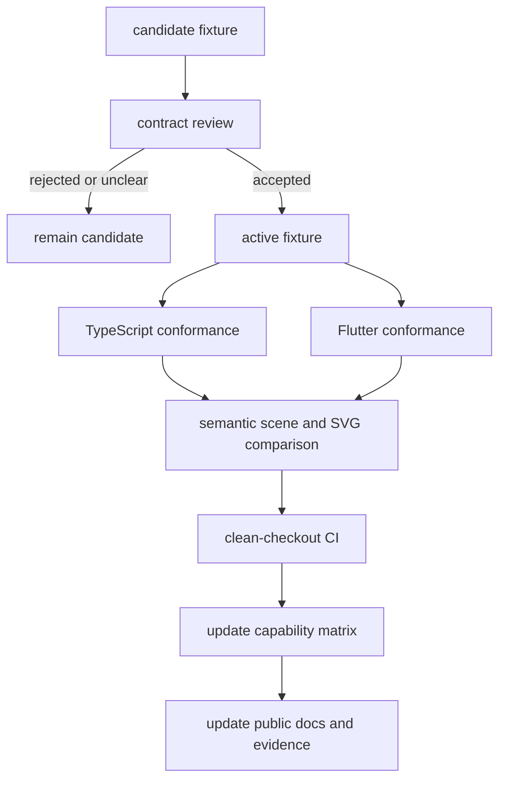

# Sub-Rencana 07 — Flutter Capability Promotion dan SVG Semantic Parity

**Status:** Berjalan  
**Tanggal mulai:** 2026-09-18  
**Owner:** relgeo/workspace + relgeo/flutter + relgeo/renderer-svg  
**Parent:** [MATURATION-MASTER-PLAN.md](../MATURATION-MASTER-PLAN.md)  
**Decision record:** [07-cross-repo-open-decisions.md](../decisions/07-cross-repo-open-decisions.md)

## 1. Tujuan

Sub-rencana ini menerjemahkan keputusan maintainer menjadi pekerjaan teknis
yang dapat diverifikasi:

1. menentukan kapan capability Flutter boleh berubah dari `candidate` menjadi
   `active`;
2. menjaga agar promosi dilakukan satu capability pada satu waktu;
3. menetapkan semantic SVG parity sebagai acceptance contract berlapis;
4. memperluas coverage hanya pada capability yang memang disetujui;
5. mencegah test lokal atau snapshot presentation mengklaim parity final.

Sub-rencana ini tidak membuat Flutter menjadi package publik, tidak mengubah
versi DSL, dan tidak mengaktifkan publish desktop.

## 2. Keputusan kerja

- Candidate tidak dipromosikan hanya karena test lokal/CI lulus.
- Candidate pertama yang direview adalah `boolean/intersection` karena
  operation semantics-nya lebih terlokalisasi daripada evaluator/unit yang
  membawa policy unit dan parameter lebih luas.
- `evaluator/unit` direview setelah candidate pertama memiliki contract active
  dan tidak menimbulkan perubahan policy yang belum disetujui.
- SVG parity inti membandingkan semantic geometry; style, viewBox, metadata,
  text metrics, dan diagnostic overlay berada pada lapisan presentation yang
  terpisah.
- Raw SVG byte equality bukan acceptance target.
- Flutter tetap workbench non-publishable dengan stable `3.41.9`; build macOS
  tetap CI confidence gate, bukan release desktop.

## 3. Model acceptance

Sebuah capability hanya dapat dipromosikan jika seluruh jalur dari contract
review sampai CI dan dokumentasi selesai. Kegagalan salah satu langkah
mengembalikan status ke `candidate` atau `partial`, bukan memaksa status
`active`.

## 4. Stage A — Baseline dan policy

- [x] capability matrix memiliki status, evidence flags, owner, dan source
  mapping yang dapat diperiksa mesin;
- [x] candidate boolean/intersection memiliki fixture, expected scene, dan
  expected SVG snapshot;
- [x] candidate evaluator/unit memiliki fixture, expected scene, expected SVG,
  dan `cliUnit` eksplisit;
- [x] semantic projection Flutter dan TypeScript lulus lokal dan CI untuk
  candidate yang tersedia;
- [x] decision record menerima promosi bertahap dan semantic parity berlapis;
- [x] posture Flutter non-publishable dan baseline stable `3.41.9` diterima;
- [ ] acceptance contract untuk candidate boolean/intersection ditulis sebagai
  bagian normatif atau decision record capability;
- [ ] daftar property presentation SVG yang benar-benar diperlukan disetujui.

## 5. Stage B — Promosi boolean/intersection

### B1. Review contract

- [ ] tetapkan operasi yang masuk contract: line intersection, boolean
  intersection, dan boolean subtraction;
- [ ] tetapkan jenis object dan topology yang dijamin;
- [ ] tetapkan perilaku degenerate input, ring closure, arah ring, dan tolerance;
- [ ] pastikan nama operasi, error behavior, dan output semantics tercermin
  pada spec atau decision record yang dirujuk.

### B2. Promote fixture

- [ ] ubah status fixture dari `capability` menjadi `active` hanya setelah B1
  disetujui;
- [ ] pertahankan expected scene dan SVG semantic snapshot sebagai baseline;
- [ ] tambahkan negative fixture untuk operasi yang sengaja belum didukung;
- [ ] update capability matrix dari `partial/candidate` sesuai contract yang
  benar-benar diterima.

### B3. Verify consumer matrix

- [ ] TypeScript geometry/core/renderer lulus seluruh test terkait;
- [ ] Flutter unit/conformance lulus dari checkout bersih;
- [ ] comparator semantic lulus tanpa toleransi baru yang tidak terdokumentasi;
- [ ] CLI dan Playground tetap menghasilkan output yang konsisten;
- [ ] CI integration dan public-registry gate lulus;
- [ ] README dan docs menyebut capability sebagai active hanya setelah semua
  evidence tersedia.

## 6. Stage C — Promosi evaluator/unit

Stage C dikerjakan setelah Stage B selesai atau ditutup dengan keputusan
eksplisit untuk menahan promosi.

- [ ] tetapkan kontrak literal signed, `in`, `mm`, dan unit default;
- [ ] tetapkan ruang lingkup parameter, derived placement, dan non-numeric
  string preservation;
- [ ] pastikan `cliUnit` hanya menjadi metadata fixture, bukan implicit global
  policy;
- [ ] ubah fixture menjadi active hanya setelah policy unit disetujui;
- [ ] ulangi scene/SVG semantic projection TypeScript dan Flutter;
- [ ] update matrix, README, compatibility evidence, dan release notes;
- [ ] jalankan full integration gate dari clean checkout.

## 7. Stage D — SVG parity presentation layer

### D1. Semantic core — wajib

- [x] object identity dan object kind dibandingkan;
- [x] primitive type, subpath, endpoint, ring, dan geometry dibandingkan;
- [x] numeric tolerance didokumentasikan;
- [x] polygon/path closure dan ring rotation dinormalisasi secara eksplisit;
- [x] executable markup dan unsafe SVG boundary tetap diuji.

### D2. Presentation layer — berdasarkan kebutuhan

- [ ] inventaris style, viewBox, text, metadata, dan diagnostic overlay yang
  dipakai consumer publik;
- [ ] tandai setiap property sebagai `contract`, `implementation detail`, atau
  `best effort`;
- [ ] tambahkan fixture presentation hanya untuk property yang memiliki
  consumer atau kebutuhan release yang jelas;
- [ ] jangan menjadikan formatting/attribute order/raw bytes sebagai contract;
- [ ] buat comparator terpisah jika presentation policy sudah disetujui.

### D3. Exit criteria SVG

- [ ] semantic core tetap lulus pada active, runtime-diagnostic, dan semua
  candidate yang dipromosikan;
- [ ] presentation policy memiliki expected snapshot dan tolerance sendiri;
- [ ] perbedaan yang tidak di-contract tercatat sebagai limitation, bukan
  failure parity;
- [ ] renderer TypeScript dan Flutter tidak mengklaim full SVG parity sebelum
  seluruh capability yang relevan masuk matrix.

## 8. Stage E — CI, docs, dan release evidence

- [x] workflow CI memiliki job Flutter dan macOS terpisah;
- [x] Integration terbaru menjalankan `verify`, `flutter`, `flutter-macos`, dan
  `public` dengan sukses;
- [ ] setiap perubahan matrix/candidate memiliki decision record atau commit
  rationale;
- [ ] local integration gate, public-registry gate, dan conformance report
  disimpan pada evidence release yang sesuai;
- [ ] master plan dan plan Tahap 6 memakai status yang sama dengan matrix;
- [ ] public docs tidak menyebut capability candidate sebagai fitur active;
- [ ] release notes menyebut perubahan contract bila capability dipromosikan.

## 9. Hal yang sengaja belum dikerjakan

- promosi otomatis berdasarkan test pass;
- raw SVG byte equality;
- package Dart/public pub.dev release;
- desktop distribution/signing;
- perubahan versi DSL dari `0.5` ke `0.6`;
- iOS physical validation, yang merupakan evidence eksternal terpisah dari
  sub-rencana ini.

## 10. Exit gate

Sub-rencana ini belum selesai sebelum:

- [ ] minimal satu candidate memiliki contract decision yang diterima;
- [ ] fixture candidate tersebut menjadi active secara eksplisit;
- [ ] TypeScript dan Flutter lulus semantic conformance dari clean checkout;
- [ ] SVG semantic core dan presentation scope tercatat;
- [ ] capability matrix, master plan, README, dan release evidence sinkron;
- [ ] CI terbaru hijau setelah perubahan tersebut.

## 11. Status saat ini

Fondasi teknis dan keputusan policy sudah selesai. Pekerjaan yang tersisa
berada pada contract review dan persetujuan acceptance, bukan pada kekurangan
runner atau toolchain. Candidate boolean/intersection menjadi urutan pertama;
candidate evaluator/unit menunggu hasilnya.
