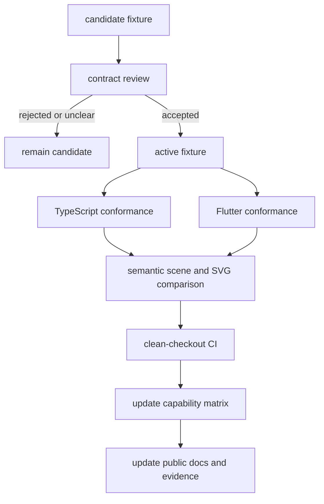

# Sub-Rencana 07 — Flutter Capability Promotion dan SVG Semantic Parity

**Status keputusan:** boundary boolean/intersection disetujui sebagai promotion pertama; evaluator/unit menunggu. **Status implementasi:** fixture 15 dan capability matrix sudah dipromosikan pada scope contract terbatas; fixture 16 evaluator/unit tetap capability/candidate. **Status evidence:** canonical GitHub Actions run 37832260326 pada root 328c869 lulus seluruh enam job.
**Tanggal mulai:** 2026-09-18  
**Status terakhir diperiksa:** 2026-10-09
**Owner:** relgeo/workspace + relgeo/flutter + relgeo/renderer-svg  
**Parent:** [MATURATION-MASTER-PLAN.md](../MATURATION-MASTER-PLAN.md)  
**Decision record:** [07-cross-repo-open-decisions.md](../decisions/07-cross-repo-open-decisions.md)

**Candidate review:** [08-boolean-intersection-contract-review.md](../decisions/08-boolean-intersection-contract-review.md)

**Promotion boundary:** Decision Record 08 §3 adalah contract normatif untuk
promotion pertama. Ia mengunci line-line intersection pada fixture, rectangle
`intersect`/`subtract`, topology/ring semantics, comparator tolerance, dan
error boundary tanpa mengaktifkan fixture atau memperluas claim ke `union`,
`xor`, operand non-rectangle, atau degenerate input.

## 0. Checkpoint gate promotion — 2026-10-08 (historical, superseded)

Pada checkpoint ini promotion belum dilakukan. Replay command wajib pada workspace HEAD
`d3ec2b0430f12bd95f2be312fa7438b6d97757d6` dengan Node `24.21.0` menghasilkan:

- artefak `pnpm run integration:gate -- --local` pada Node `24.21.0` di
  `.local/integration-local-node24-recovery.json` mencatat `33/36` stage lulus.
  Strict baseline, TypeScript geometry/core/renderer/language-service, CLI,
  Playground lint/unit/build, docs check/build, serta shared conformance `253/253`
  lulus; tiga failure adalah frozen install, Playwright Chromium, dan Playground
  E2E karena batas environment;
- `pnpm run integration:public` lulus strict baseline, lalu gagal pada public
  registry install pertama (`@relgeo/geometry`) dengan `ENOTFOUND
  registry.npmjs.org`. Retry berulang dihentikan setelah akar masalah yang sama
  terkonfirmasi pada registry boundary;
- supporting `pnpm run compatibility:check` lulus `283/283`;
- `pnpm run flutter:conformance` belum dapat dimulai karena Flutter SDK gagal
  menulis `bin/cache/engine.stamp` di luar workspace (`EPERM`), sehingga ini
  tetap bukan evidence Flutter checkout bersih;
- percobaan sebelumnya dengan PATH default Node `22.23.2` berhenti preflight;
  percobaan Node 24 di atas adalah evidence gate yang relevan untuk baseline ini.

Report current yang telah tersimpan tetap dibaca konservatif:
`.local/integration-local-current.json` (`6/35`, gagal pada install/dependency dan
consumer stages) serta `.local/integration-public-current.json` (`2/11`, registry
DNS gagal). Keduanya bukan evidence gate hijau dan tidak menggantikan replay Node
24 di atas. Evidence CI terakhir yang valid
adalah `Integration #151`, sebelum pointer Flutter `edc9488`; itu tidak cukup untuk
mempromosikan candidate pada baseline sekarang.

Transcript manual `.internal/tmp-test.txt` kemudian mencatat local `35/35`, public
`50/50`, dan `flutter:conformance` lulus dengan 300 test pada Node `24.21.0` /
pnpm `10.33.3`. Evidence ini mendukung gate workspace manual, tetapi bukan CI
canonical; promotion tetap menunggu keputusan capability dan evidence CI baru untuk
pointer `edc9488`.

Akibatnya fixture `15-v05-boolean-intersection-candidate` dan capability
`boolean-geometry` tetap `capability`/`partial`, sedangkan fixture 16 evaluator/unit
tetap candidate. Tidak ada perubahan status active sampai local, public-registry,
Flutter conformance, CLI/Playground, dan semantic SVG comparator lulus dari
checkout bersih.

### 0.1 Consumer verification rerun — 2026-10-08 (historical, superseded)

Setelah dependency workspace dipulihkan dari pnpm store offline, verification
Node `24.21.0` menghasilkan evidence berikut:

- `pnpm run conformance:fixtures`: `253 passed, 0 failed across 20 fixtures`,
  termasuk fixture 15 dan runtime errors `BOOLEAN_EMPTY_RESULT` serta
  `BOOLEAN_MULTIPART_RESULT`;
- `pnpm -r run test`: geometry `66`, core `427`, renderer-svg `79`,
  language-service `66`, CLI `9`, Playground `93`, remark-relgeo `5`,
  remark-relgeo-hl `3`, serta docs-site built-output assertions lulus;
- Playground lint dan production build lulus; CLI build lulus dan smoke compile
  fixture 15 menghasilkan SVG yang memuat object `overlap` dan `cut` tanpa
  executable markup;
- semantic SVG comparator Flutter tetap terverifikasi secara source-level:
  canonicalization ring dan perbandingan numerik `1e-6` dipakai, sedangkan
  style, viewBox, whitespace, dan attribute formatting tidak dibandingkan;
- `pnpm run flutter:conformance` belum dapat menjalankan test karena Flutter SDK
  gagal menulis `bin/cache/engine.stamp` di luar workspace (`EPERM`). Karena itu
  evidence Flutter checkout bersih belum lengkap dan promotion tidak dilakukan.

Evidence ini membuktikan consumer TypeScript/CLI/Playground dan aturan semantic
projection, tetapi tidak menggantikan Flutter conformance atau public/CI gate.
Fixture 15 tetap `capability`; fixture 16 evaluator/unit tetap `candidate`.

### 0.2 Reconciliation keputusan evidence — 2026-10-08 (sebelum refresh canonical)

Keputusan manusia menerima `.internal/tmp-test.txt` dan
`.local/integration-manual-evidence.json` sebagai supporting local evidence
untuk local `35/35`, public `50/50`, dan Flutter `300 tests`. Klasifikasi ini
tidak mengubahnya menjadi CI/public canonical evidence. Canonical gap yang
masih terbuka adalah:

- Flutter conformance pada checkout bersih dengan pointer `edc9488`;
- clean-checkout consumer verification yang dapat ditautkan ke baseline terbaru;
- integration/public gate canonical pada baseline yang sama.

Selama tiga gap tersebut belum ditutup oleh runner yang memiliki akses toolchain
dan network yang diperlukan, fixture 15 tetap `capability`, capability
`boolean-geometry` tetap `partial`, dan evaluator/unit tetap menunggu.

### 0.3 Audit checkpoint — 2026-10-09 (historical, superseded by §0.4)

Audit read-only pada 2026-10-09 tidak menemukan canonical CI/public/Flutter
evidence baru. Report terbaru tetap local `33/36`, local-current `6/35`, dan
public-current `2/11`; report hijau September bersifat historis. Ini dicatat
sebagai evidence gap eksternal, bukan defect source. Retry dari executor terbatas
dihentikan sesuai keputusan maintainer.

Supporting `.internal/tmp-test.txt` tetap diterima untuk local `35/35`, public
`50/50`, dan Flutter `300 tests`, tetapi tidak mengubah status canonical. Fixture
15 dan `boolean-geometry` tetap `capability`/`partial`; evaluator/unit tetap
menunggu sampai evidence untuk pointer terbaru tersedia.

Daftar gap pada checkpoint ini telah digantikan oleh evidence canonical pada
§0.4; supporting transcript tetap dipertahankan sebagai evidence lokal.

### 0.4 Canonical CI evidence — 2026-10-09

GitHub Actions run [37832260326](https://github.com/relgeo/workspace/actions/runs/37832260326)
pada root commit `328c869b2ffe023806c8a85a9e9ccffa8f523145` sekarang menjadi
evidence canonical terbaru dan menggantikan checkpoint executor lama. Run
berstatus `Success`, seluruh enam job lulus (`verify`, `public`, `flutter`,
`flutter-macos`, `flutter-linux`, `flutter-windows`), dan lima artifact tersedia.

Run ini menutup gate lintas-platform untuk baseline tersebut. Setelah manifest,
capability matrix, README/docs, dan evidence record disinkronkan, fixture 15
dan scope `boolean/intersection` yang disetujui menjadi active. Fixture 16
evaluator/unit tetap `capability`/candidate dan tidak ikut dipromosikan.

### 0.5 Promotion sync — 2026-10-09

Promotion pertama selesai pada boundary yang telah dikunci Decision Record 08:
fixture 15 sekarang `active`, expected scene/SVG snapshot tetap menjadi baseline,
dan matrix menandai line intersection serta rectangle `intersect`/`subtract`
sebagai `verified`. Evidence canonical adalah run
[37832260326](https://github.com/relgeo/workspace/actions/runs/37832260326)
pada root `328c869`; local compatibility `283/283` dan shared conformance
`260/260` juga lulus setelah fixture 15 dipromosikan.

Status active tidak mencakup `union`, `xor`, operand non-rectangle, input
degenerate/non-finite/self-intersecting, multipart policy, atau SVG presentation
parity. Evaluator/unit dan scalar/unit policy tetap candidate untuk Stage C.

## 1. Tujuan

Sub-rencana ini menerjemahkan keputusan maintainer menjadi pekerjaan teknis
yang dapat diverifikasi:

1. menentukan kapan capability Flutter boleh berubah dari `candidate` menjadi
   `active`;
2. menjaga agar promosi dilakukan satu capability pada satu waktu;
3. menetapkan semantic SVG parity sebagai acceptance contract berlapis;
4. memperluas coverage hanya pada capability yang memang disetujui;
5. mencegah test lokal atau snapshot presentation mengklaim parity final.

Sub-rencana ini tidak membuat Flutter menjadi package publik, tidak mengubah
versi DSL, dan tidak mengaktifkan publish desktop.

## 2. Keputusan kerja

- Candidate tidak dipromosikan hanya karena test lokal/CI lulus.
- Candidate pertama yang direview adalah `boolean/intersection` karena
  operation semantics-nya lebih terlokalisasi daripada evaluator/unit yang
  membawa policy unit dan parameter lebih luas.
- `evaluator/unit` direview setelah candidate pertama memiliki contract active
  dan tidak menimbulkan perubahan policy yang belum disetujui.
- SVG parity inti membandingkan semantic geometry; style, viewBox, metadata,
  text metrics, dan diagnostic overlay berada pada lapisan presentation yang
  terpisah.
- Raw SVG byte equality bukan acceptance target.
- Flutter tetap workbench non-publishable dengan stable `3.41.9`; build macOS
  tetap CI confidence gate, bukan release desktop.

## 3. Model acceptance

```mermaid
flowchart TD
  candidate["candidate fixture"] --> contract["contract review"]
  contract -->|"rejected or unclear"| hold["remain candidate"]
  contract -->|"accepted"| active["active fixture"]
  active --> ts["TypeScript conformance"]
  active --> dart["Flutter conformance"]
  ts --> semantic["semantic scene and SVG comparison"]
  dart --> semantic
  semantic --> ci["clean-checkout CI"]
  ci --> matrix["update capability matrix"]
  matrix --> docs["update public docs and evidence"]
```

Sebuah capability hanya dapat dipromosikan jika seluruh jalur dari contract
review sampai CI dan dokumentasi selesai. Kegagalan salah satu langkah
mengembalikan status ke `candidate` atau `partial`, bukan memaksa status
`active`.

## 4. Stage A — Baseline dan policy

- [x] capability matrix memiliki status, evidence flags, owner, dan source
  mapping yang dapat diperiksa mesin;
- [x] candidate boolean/intersection memiliki fixture, expected scene, dan
  expected SVG snapshot;
- [x] candidate evaluator/unit memiliki fixture, expected scene, expected SVG,
  dan `cliUnit` eksplisit;
- [x] semantic projection Flutter dan TypeScript lulus lokal dan CI untuk
  candidate yang tersedia;
- [x] decision record menerima promosi bertahap dan semantic parity berlapis;
- [x] posture Flutter non-publishable dan baseline stable `3.41.9` diterima;
- [x] acceptance contract untuk candidate boolean/intersection ditulis dan disetujui pada [Decision 09](../decisions/09-open-work-recommendations.md);
- [x] inventaris property presentation SVG dan klasifikasi awalnya ditulis;
- [x] untuk contract 0.5.x, tidak menambah property presentation SVG tanpa consumer yang membutuhkannya; inventaris tetap referensi, bukan backlog/utang.

## 5. Stage B — Promosi boolean/intersection

### B1. Review contract

- [x] inventory spec, fixture, resolver, engine, dan error behavior selesai;
- [x] rekomendasi promotion boundary dan pemisahan implementation detail
  terdokumentasi pada [Decision Record 08](../decisions/08-boolean-intersection-contract-review.md);
- [x] tetapkan operasi yang masuk contract: line intersection, boolean
  intersection, dan boolean subtraction;
- [x] tetapkan jenis object dan topology yang dijamin;
- [x] tetapkan perilaku degenerate input, ring closure, arah ring, dan tolerance;
- [x] pastikan nama operasi, error behavior, dan output semantics tercermin
  pada spec atau decision record yang dirujuk.
- [x] ubah invariant runner agar lebih dari satu fixture `active` dapat
  dipelihara tanpa mengganti relational baseline.

### B2. Promote fixture

- [x] ubah status fixture 15 dari `capability` menjadi `active` setelah B1
  disetujui dan canonical CI lulus;
- [x] pertahankan expected scene dan SVG semantic snapshot sebagai baseline;
- [x] tambahkan negative fixtures untuk empty-result dan multipart-result
  boundaries yang sengaja ditolak pada runtime;
- [x] update capability matrix dari `partial/candidate` sesuai contract yang
  benar-benar diterima; evaluator/unit tetap candidate.

### B3. Verify consumer matrix

- [x] TypeScript geometry/core/renderer lulus seluruh test terkait;
- [x] Flutter unit/conformance lulus dari checkout bersih pada canonical run;
- [x] comparator semantic lulus tanpa toleransi baru yang tidak terdokumentasi;
- [x] CLI dan Playground tetap menghasilkan output yang konsisten;
- [x] CI integration dan public-registry gate lulus pada canonical run;
- [x] README dan docs menyebut scope capability sebagai active setelah semua
  evidence tersedia.

## 6. Stage C — Promosi evaluator/unit

Stage C dikerjakan setelah Stage B selesai atau ditutup dengan keputusan
eksplisit untuk menahan promosi.

- [ ] tetapkan kontrak literal signed, `in`, `mm`, dan unit default;
- [ ] tetapkan ruang lingkup parameter, derived placement, dan non-numeric
  string preservation;
- [ ] pastikan `cliUnit` hanya menjadi metadata fixture, bukan implicit global
  policy;
- [ ] ubah fixture menjadi active hanya setelah policy unit disetujui;
- [ ] ulangi scene/SVG semantic projection TypeScript dan Flutter;
- [ ] update matrix, README, compatibility evidence, dan release notes;
- [ ] jalankan full integration gate dari clean checkout.

## 7. Stage D — SVG parity presentation layer

### D1. Semantic core — wajib

- [x] object identity dan object kind dibandingkan;
- [x] primitive type, subpath, endpoint, ring, dan geometry dibandingkan;
- [x] numeric tolerance didokumentasikan;
- [x] polygon/path closure dan ring rotation dinormalisasi secara eksplisit;
- [x] executable markup dan unsafe SVG boundary tetap diuji.

### D2. Presentation layer — berdasarkan kebutuhan

- [x] inventaris style, viewBox, text, metadata, dan diagnostic overlay yang
  dipakai oleh renderer/exporter sudah dibuat pada Decision Record 08;
- [x] tandai setiap property sebagai `contract`, `implementation detail`, atau
  `best effort`; klasifikasi awal tercatat pada Decision Record 08;
- [ ] tambahkan fixture presentation hanya untuk property yang memiliki
  consumer atau kebutuhan release yang jelas;
- [x] jangan menjadikan formatting/attribute order/raw bytes sebagai contract;
  hal itu dicatat sebagai implementation detail/non-goal;
- [ ] buat comparator terpisah jika presentation policy sudah disetujui.

### D3. Exit criteria SVG

- [ ] semantic core tetap lulus pada active, runtime-diagnostic, dan semua
  candidate yang dipromosikan;
- [ ] presentation policy memiliki expected snapshot dan tolerance sendiri;
- [x] perbedaan yang tidak di-contract tercatat sebagai limitation, bukan
  failure parity;
- [x] renderer TypeScript dan Flutter tidak mengklaim full SVG parity sebelum
  seluruh capability yang relevan masuk matrix.

## 8. Stage E — CI, docs, dan release evidence

- [x] workflow CI memiliki job Flutter dan macOS terpisah;
- [x] Integration terbaru menjalankan `verify`, `flutter`, `flutter-macos`, dan
  `public` dengan sukses;
- [x] setiap perubahan matrix/candidate memiliki decision record atau commit
  rationale; Decision Record 08 dan commit `fb4dce5` mencatat inventory
  contract serta scope presentation SVG;
- [x] local integration gate, public-registry gate, dan conformance report
  disimpan pada evidence release yang sesuai;
- [ ] master plan dan plan Tahap 6 memakai status yang sama dengan matrix;
- [x] public docs tidak menyebut capability candidate sebagai fitur active;
- [ ] release notes menyebut perubahan contract bila capability dipromosikan.

## 9. Hal yang sengaja belum dikerjakan

- promosi otomatis berdasarkan test pass;
- raw SVG byte equality;
- package Dart/public pub.dev release;
- desktop distribution/signing;
- perubahan versi DSL dari `0.5` ke `0.6`;
- iOS physical validation, yang merupakan evidence eksternal terpisah dari
  sub-rencana ini.

## 10. Exit gate

Sub-rencana ini belum selesai sebelum:

- [x] minimal satu candidate memiliki contract decision yang diterima;
- [x] fixture candidate tersebut menjadi active secara eksplisit;
- [x] TypeScript dan Flutter lulus semantic conformance dari clean checkout;
- [x] SVG semantic core dan presentation scope tercatat;
- [x] capability matrix, master plan, README, dan release evidence sinkron;
- [x] CI terbaru hijau setelah perubahan tersebut.

## 11. Status saat ini

Fondasi teknis, keputusan policy, dan boundary contract
boolean/intersection telah dipromosikan secara terbatas melalui fixture 15.
Fixture 10 tetap active sebagai relational baseline; fixture 16 evaluator/unit
tetap capability/candidate sampai Stage C memiliki contract unit/evaluator dan
evidence tersendiri. SVG presentation, operasi boolean di luar boundary, dan
platform release tetap sengaja di luar promotion ini.
