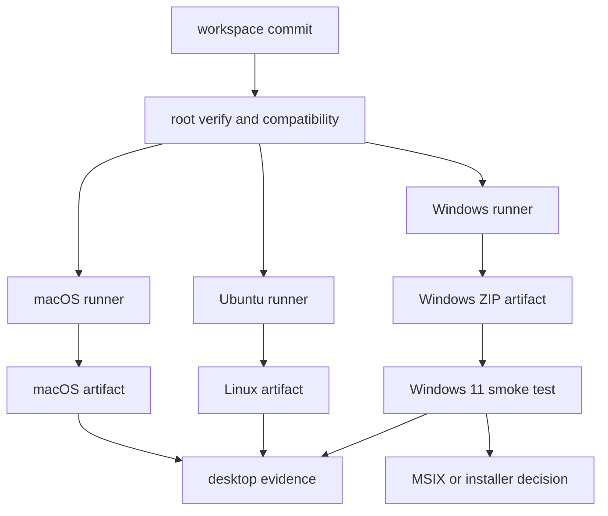

# Sub-Rencana 08 — Desktop Platform Delivery

**Status:** Stage A selesai; Stage B/C/E sedang berjalan
**Tanggal:** 2026-09-23  
**Owner koordinasi:** `relgeo/workspace`  
**Implementasi utama:** `relgeo/flutter`  
**Parent:** [MATURATION-MASTER-PLAN.md](../MATURATION-MASTER-PLAN.md)  
**Decision record:** [09-open-work-recommendations.md](../decisions/09-open-work-recommendations.md)

## 1. Tujuan

Membuat surface Flutter RelGeo dapat dibangun, diuji, dan digunakan pada:

- macOS;
- Linux, minimal Ubuntu;
- Windows 11;

serta menjaga web/PWA dan CLI sebagai surface utama yang tetap independen.

Mobile Android/iOS berada di luar scope sub-rencana ini dan ditunda tanpa
tanggal sampai maintainer memutuskan untuk membukanya kembali.

Sub-rencana ini tidak memulai package pub.dev, Microsoft Store release, signing
production, atau distribusi komersial. Tahap awal hanya membuktikan artifact
desktop yang dapat dijalankan.

## 2. Prinsip kerja

1. Setiap OS dibangun pada runner native OS tersebut.
2. Mac dan Ubuntu tetap menjadi mesin pengembangan utama, tetapi tidak dipaksa
   menjadi cross-compiler Windows.
3. Windows dimulai dari ZIP artifact, bukan installer bersigning.
4. Artifact harus diuji pada Windows 11 nyata sebelum disebut usable.
5. Satu baseline Flutter stable digunakan pada seluruh runner.
6. Build platform tidak boleh menjadi dependency untuk gate TypeScript, web, atau
   CLI.
7. Semua hasil build harus dapat ditelusuri ke commit, Flutter version, Dart
   version, OS runner, dan arsitektur target.

## 3. Target matrix

| Surface | Build authority | Artifact awal | Verifikasi minimum | Status |
| --- | --- | --- | --- | --- |
| macOS Flutter | `macos-latest` atau Mac lokal | `.app` / archive | build release, launch smoke, keyboard | CI + archive; smoke pending |
| Ubuntu/Linux Flutter | `ubuntu-latest` atau Ubuntu lokal | folder release / `.tar.gz` | build release, launch smoke, file access | job + archive; smoke pending |
| Windows Flutter | `windows-latest` | ZIP folder Release | build release, Windows 11 smoke | CI + ZIP assertion hijau; Win11 smoke pending |
| Web/PWA | Linux CI / website workflow | static deployment | browser E2E dan public smoke | sudah berjalan |
| CLI | Linux CI / Node matrix | npm package/binary surface | lint, test, install, command smoke | sudah berjalan |

Flutter menjelaskan bahwa target Windows, macOS, dan Linux membutuhkan setup
platform pada OS masing-masing. Karena itu matrix ini memakai native runner,
bukan asumsi cross-compilation dari Mac.

## 4. Arsitektur pipeline



Build artifact tidak otomatis menjadi release publik. Artifact hanya menjadi
release candidate setelah assertion dan smoke test pada target OS lulus.

## 5. Stage A — Baseline Flutter desktop

- [x] catat Flutter stable dan Dart version yang dipakai seluruh runner;
- [x] pastikan `pubspec.lock` dan lockfile enforcement digunakan;
- [x] audit awal package native Flutter yang dipakai terhadap target macOS,
  Linux, dan Windows; build matrix tetap menjadi bukti final;
- [x] tetapkan application name, binary name, version, icon, dan output naming;
- [x] pastikan seluruh desktop source tidak membawa path lokal, credential, atau
  konfigurasi development-only;
- [x] definisikan smoke scenario bersama: launch, load fixture, render scene,
  edit/save bila relevan, resize window, keyboard navigation, dan clean exit.

Baseline yang dikunci saat ini adalah Flutter `3.41.9`, Dart `3.11.5`,
application version `1.0.0+1`, dan binary `relgeo_flutter`. `flutter test`
lulus dengan 119 test. `flutter analyze` lokal menghasilkan 130 temuan legacy;
CI memakai `--no-fatal-warnings --no-fatal-infos` dan tetap mencetak temuan
tersebut sebagai baseline yang harus dirapikan bertahap.

## 6. Stage B — macOS dan Ubuntu

### macOS

- [x] build macOS sudah menjadi CI confidence gate;
- [x] tambahkan assertion artifact `.app` dan archive `.zip` yang dapat diunduh;
- [ ] jalankan launch smoke pada Mac lokal;
- [ ] catat batasan signing/notarization sebagai non-goal sementara.

### Ubuntu/Linux

- [x] tambahkan job `flutter-linux` yang menjalankan `flutter build linux
  --release`;
- [x] deklarasikan dependency desktop GTK yang diperlukan di runner;
- [x] tambahkan assertion dan archive artifact yang memuat binary, `data`, dan
  `lib` runtime;
- [ ] jalankan smoke test pada Ubuntu nyata atau VM;
- [ ] catat distro/version dan arsitektur target.

## 7. Stage C — Windows CI artifact

### C1. Build

Workflow Windows minimal harus melakukan:

```yaml
- uses: actions/checkout@v7
- uses: subosito/flutter-action@v2
  with:
    channel: stable
    flutter-version: 3.41.9
- run: flutter pub get --enforce-lockfile
- run: flutter analyze --no-fatal-warnings --no-fatal-infos
- run: flutter test
- run: flutter build windows --release
```

Workflow nyata sekarang menjalankan urutan tersebut pada `windows-latest`,
dengan analyzer non-fatal yang sama seperti baseline Flutter workspace.

### C2. Artifact assertion

Setelah build, workflow wajib memastikan folder Release memiliki:

- executable `.exe`;
- `flutter_windows.dll` atau runtime DLL yang sesuai;
- semua DLL dependency yang diperlukan;
- folder `data`;
- metadata version dan binary name yang benar.

Kemudian seluruh folder tersebut dikemas sebagai ZIP dan diunggah sebagai
GitHub Actions artifact. Mengunggah `.exe` saja tidak cukup.

### C3. Smoke test Windows 11

- [ ] unduh ZIP dari run CI;
- [ ] ekstrak pada Windows 11;
- [ ] jalankan executable;
- [ ] load fixture atau dokumen contoh;
- [ ] verifikasi preview/render;
- [ ] uji resize, keyboard, file open/save bila tersedia;
- [ ] catat missing runtime DLL, crash, warning, dan masalah font;
- [ ] simpan model Windows, versi OS, arsitektur, commit, dan run URL.

## 8. Stage D — Packaging installer

Tahap ini baru dimulai setelah ZIP artifact lulus minimal satu smoke test pada
Windows 11.

Pilihan urutan:

1. `msix` package sebagai opsi utama installer Windows modern;
2. installer tradisional seperti Inno Setup/WiX bila MSIX tidak cocok;
3. signing certificate dan public distribution hanya setelah kebutuhan nyata.

MSIX membawa konsekuensi identity, certificate, dan validation tambahan. Karena
itu tidak dimasukkan ke gate artifact pertama.

## 9. Stage E — CI dan evidence

- [x] pisahkan job `flutter-windows` dari job Flutter umum;
- [x] tambahkan job Linux untuk build dan artifact;
- [x] pertahankan job `flutter-macos` yang sudah ada dan tambahkan archive;
- [x] upload artifact dengan nama yang memuat OS, arch, dan commit;
- [x] simpan build summary tanpa memasukkan binary besar ke repository;
- [ ] tambahkan assertion ke integration gate setelah artifact stabil;
- [x] catat commit/run evidence pada sub-plan dan master plan.

### Evidence CI pertama

GitHub `Integration #147` pada commit `791ae33` sukses untuk job `flutter`,
`flutter-linux`, `flutter-macos`, `flutter-windows`, `verify`, dan `public`.
Job native menyelesaikan build release, assertion isi bundle, dan upload artifact
macOS `.zip`, Linux `.tar.gz`, serta Windows `.zip`. Run: [Integration #147](https://github.com/relgeo/workspace/actions/runs/35834154089).

## 10. Exit gate

Sub-rencana ini selesai untuk tahap artifact ketika:

- [ ] macOS release build dan launch smoke lulus;
- [ ] Ubuntu/Linux release build dan smoke lulus;
- [x] Windows CI build lulus pada `windows-latest`;
- [x] Windows ZIP memuat executable, DLL, dan `data` lengkap;
- [ ] ZIP berhasil dijalankan pada Windows 11;
- [x] evidence tersimpan dan dapat ditelusuri;
- [x] web/PWA dan CLI tetap lulus gate tanpa bergantung pada desktop build.

Installer MSIX atau installer tradisional memiliki exit gate terpisah dan tidak
perlu diselesaikan untuk menyatakan artifact desktop awal berhasil.

## 11. Risiko dan mitigasi

| Risiko | Mitigasi |
| --- | --- |
| Windows build hanya diuji pada CI | lakukan smoke test pada Windows 11 nyata |
| executable kehilangan DLL/data | assertion isi folder dan ZIP lengkap |
| plugin hanya mendukung satu OS | matrix plugin dan fallback sebelum build |
| signing menjadi blocker terlalu dini | mulai dari unsigned internal ZIP |
| artifact tidak reproducible | pin Flutter/Dart, lockfile, commit, dan runner |
| desktop merusak gate TypeScript | job desktop tetap terpisah dari core gate |

## 12. Urutan kerja berikutnya

1. ~~Audit `relgeo/flutter` untuk status Linux/Windows project dan dependency.~~
2. ~~Tambahkan workflow Windows build artifact.~~
3. Jalankan CI dan periksa isi ZIP.
4. Uji ZIP pada Windows 11.
5. ~~Tambahkan Linux artifact.~~
6. ~~Rapikan macOS artifact assertion.~~
7. Baru evaluasi MSIX/installer.
