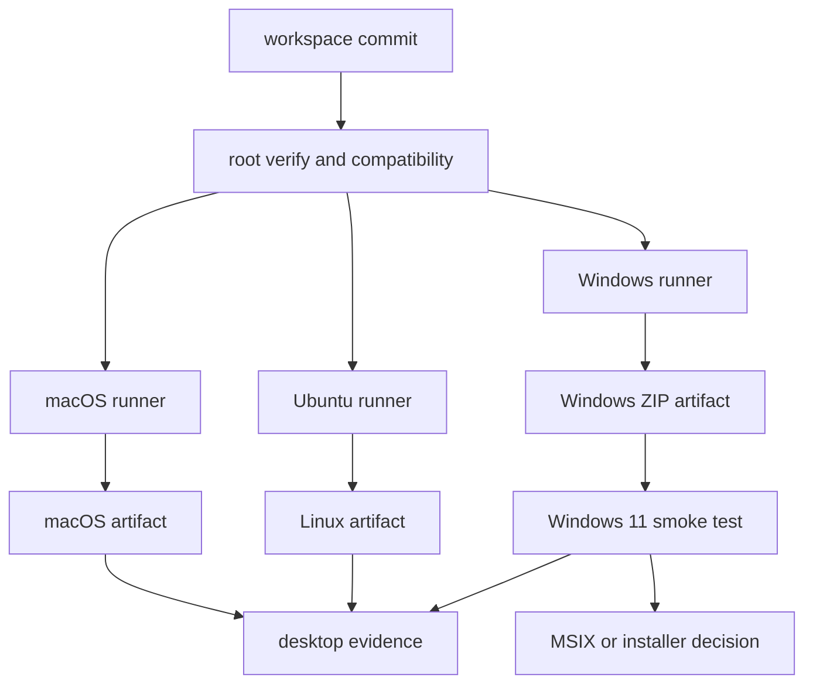

# Sub-Rencana 08 — Desktop Platform Delivery

**Status implementasi:** fondasi dan source-level native window bridge tersedia; parsial. **Status evidence:** Integration #151 berlaku untuk revision sebelum Flutter pointer `edc9488`; fresh CI belum ada. Berdasarkan keputusan manusia 2026-10-08, Ubuntu/Linux dan Windows 11 runtime smoke di-defer sampai host/VM atau runner tersedia. Artifact CI tidak disebut usable tanpa smoke target; defer ini bukan blocker goal.
**Tanggal:** 2026-09-23  
**Owner koordinasi:** `relgeo/workspace`  
**Implementasi utama:** `relgeo/flutter`  
**Parent:** [MATURATION-MASTER-PLAN.md](../MATURATION-MASTER-PLAN.md)  
**Decision record:** [09-open-work-recommendations.md](../decisions/09-open-work-recommendations.md)

## 1. Tujuan

Membuat surface Flutter RelGeo dapat dibangun, diuji, dan digunakan pada:

- macOS;
- Linux, minimal Ubuntu;
- Windows 11;

serta menjaga web/PWA dan CLI sebagai surface utama yang tetap independen.

Mobile Android/iOS berada di luar scope sub-rencana ini dan ditunda tanpa
tanggal sampai maintainer memutuskan untuk membukanya kembali.

Sub-rencana ini tidak memulai package pub.dev, Microsoft Store release, signing
production, atau distribusi komersial. Tahap awal hanya membuktikan artifact
desktop yang dapat dijalankan.

## 2. Prinsip kerja

1. Setiap OS dibangun pada runner native OS tersebut.
2. Mac dan Ubuntu tetap menjadi mesin pengembangan utama, tetapi tidak dipaksa
   menjadi cross-compiler Windows.
3. Windows dimulai dari ZIP artifact, bukan installer bersigning.
4. Artifact harus diuji pada Windows 11 nyata sebelum disebut usable.
5. Satu baseline Flutter stable digunakan pada seluruh runner.
6. Build platform tidak boleh menjadi dependency untuk gate TypeScript, web, atau
   CLI.
7. Semua hasil build harus dapat ditelusuri ke commit, Flutter version, Dart
   version, OS runner, dan arsitektur target.

## 3. Target matrix

| Surface | Build authority | Artifact awal | Verifikasi minimum | Status |
| --- | --- | --- | --- | --- |
| macOS Flutter | `macos-latest` atau Mac lokal | `.app` / archive | build release, launch smoke, keyboard | CI + local launch hijau; keyboard QA pending |
| Ubuntu/Linux Flutter | `ubuntu-latest` atau Ubuntu lokal | folder release / `.tar.gz` | build release, launch smoke, file access | CI + archive evidence; runtime smoke deferred, artifact non-usable |
| Windows Flutter | `windows-latest` | ZIP folder Release | build release, Windows 11 smoke | CI + ZIP assertion evidence; smoke deferred, ZIP non-usable |
| Web/PWA | Linux CI / website workflow | static deployment | browser E2E dan public smoke | sudah berjalan |
| CLI | Linux CI / Node matrix | npm package/binary surface | lint, test, install, command smoke | sudah berjalan |

Flutter menjelaskan bahwa target Windows, macOS, dan Linux membutuhkan setup
platform pada OS masing-masing. Karena itu matrix ini memakai native runner,
bukan asumsi cross-compilation dari Mac.

### 3.1 Reconciled artifact provenance matrix — 2026-10-08

| Evidence source | Workspace commit | Flutter pointer | Toolchain | Target / artifact | Assertion and status |
| --- | --- | --- | --- | --- | --- |
| `Integration #147` — `flutter-macos` | `791ae33adffabaa509223a4f271b6d7babc740bd8` | `e46f1ad7eb8c8df85bada582e3c5066dc73f62a1` | Flutter stable `3.41.9`, Dart `3.11.5` | macOS runner; `relgeo-flutter-macos-${runner.arch}-791ae33adffabaa509223a4f271b6d7babc740bd8.zip` | `.app` directory and executable asserted; archive uploaded; runtime/accessibility smoke is separate |
| `Integration #147` — `flutter-linux` | `791ae33adffabaa509223a4f271b6d7babc740bd8` | `e46f1ad7eb8c8df85bada582e3c5066dc73f62a1` | Flutter stable `3.41.9`, Dart `3.11.5` | Ubuntu runner x64; `relgeo-flutter-linux-x64-791ae33adffabaa509223a4f271b6d7babc740bd8.tar.gz` | executable `relgeo_flutter`, `data`, and `lib` asserted; archive uploaded; runtime smoke deferred |
| `Integration #147` — `flutter-windows` | `791ae33adffabaa509223a4f271b6d7babc740bd8` | `e46f1ad7eb8c8df85bada582e3c5066dc73f62a1` | Flutter stable `3.41.9`, Dart `3.11.5` | Windows runner x64; `relgeo-flutter-windows-x64-791ae33adffabaa509223a4f271b6d7babc740bd8.zip` | `relgeo_flutter.exe`, `flutter_windows.dll`, and `data` asserted before ZIP; Windows 11 smoke deferred, ZIP non-usable |
| Current workspace static artifact | `d3ec2b0430f12bd95f2be312fa7438b6d97757d6` | `edc9488952db7edc74dd2caa7fc2064f03ff62f9` | Flutter baseline `3.41.9`, Dart `3.11.5` | macOS `14.5` arm64; local `RelGeo.app`, universal `arm64 + x86_64` | bundle metadata and executable architecture/hash verified locally; interactive window smoke limited by native-app approval |

`Integration #151` remains the canonical cross-repo report for workspace
`21ee21b2ea8965a8faad45ddd37485a0d55942f8` with Flutter pointer
`7917d17cd269f24c431d035d3c0351e35cbb3c17`; it predates the current Flutter
pointer `edc9488` and is not silently promoted to current-pointer evidence.
The matrix distinguishes CI archive assertions from runtime usability: no
Linux or Windows artifact is called usable while the human decision defers
target smoke.

## 4. Arsitektur pipeline


```mermaid
flowchart TD
  commit["workspace commit"] --> verify["root verify and compatibility"]
  verify --> mac["macOS runner"]
  verify --> linux["Ubuntu runner"]
  verify --> win["Windows runner"]
  mac --> macArtifact["macOS artifact"]
  linux --> linuxArtifact["Linux artifact"]
  win --> winZip["Windows ZIP artifact"]
  winZip --> winSmoke["Windows 11 smoke test"]
  winSmoke --> installer["MSIX or installer decision"]
  macArtifact --> evidence["desktop evidence"]
  linuxArtifact --> evidence
  winSmoke --> evidence
```

Build artifact tidak otomatis menjadi release publik. Artifact hanya menjadi
release candidate setelah assertion dan smoke test pada target OS lulus.

## 5. Stage A — Baseline Flutter desktop

- [x] catat Flutter stable dan Dart version yang dipakai seluruh runner;
- [x] pastikan `pubspec.lock` dan lockfile enforcement digunakan;
- [x] audit awal package native Flutter yang dipakai terhadap target macOS,
  Linux, dan Windows; build matrix tetap menjadi bukti final;
- [x] tetapkan application name, binary name, version, icon, dan output naming;
- [x] pastikan seluruh desktop source tidak membawa path lokal, credential, atau
  konfigurasi development-only;
- [x] definisikan smoke scenario bersama: launch, load fixture, render scene,
  edit/save bila relevan, resize window, keyboard navigation, dan clean exit.

Baseline yang dikunci saat ini adalah Flutter `3.41.9`, Dart `3.11.5`,
application version `1.0.0+1`, dan binary `relgeo_flutter`. `flutter test`
lulus dengan 119 test. Cleanup analyzer pada child commit `7917d17` menghapus
semua warning runtime-relevan. Cleanup lanjutan pada `89d2e95` menurunkan
baseline menjadi `0 WARNING` dan `47 INFO`; seluruh info tersisa kini berupa
deprecation API Flutter yang memerlukan keputusan migrasi API tersendiri. CI
tetap memakai `--no-fatal-warnings --no-fatal-infos` agar info tersebut terlihat
tanpa menghalangi artifact gate.

## 6. Stage B — macOS dan Ubuntu

### macOS

- [x] build macOS sudah menjadi CI confidence gate;
- [x] tambahkan assertion artifact `.app` dan archive `.zip` yang dapat diunduh;
- [x] jalankan launch smoke pada Mac lokal;
- [x] catat batasan signing/notarization sebagai non-goal sementara.

Evidence launch smoke lokal: MacBook Air arm64, macOS `14.5`, Flutter
`3.41.9`. Release app terbuka dengan status `COMPILED OK`; tab diagnostics
menunjukkan `Constraint Violations: 0`, tab values menampilkan parameter dan
scene bounds, tombol SVG model menghasilkan preview SVG, dan proses keluar
bersih melalui Flutter runner. Bundle juga terverifikasi sebagai universal
`arm64`/`x86_64`, dengan bundle ID `com.relgeo.relgeoFlutter` dan versi aplikasi
`1.0.0`. Keyboard traversal penuh dan accessibility review belum ditutup.

Pada Flutter commit `4709b95`, boundary window sudah dipisahkan secara
platform-neutral melalui `WorkbenchWindowHost` dan
`WorkbenchWindowConfiguration`. Kontrak tersebut kini sudah diterapkan pada
runner macOS/Linux/Windows melalui channel `relgeo/window`, dengan ukuran
default `1440×900` dan minimum `1024×640`. Direct `xcodebuild` melalui
`macos/Runner.xcworkspace` berhasil membangun app Debug `arm64` dan app Release
universal (`arm64`/`x86_64`) setelah perubahan bridge terbaru. Wrapper `flutter
build macos` masih gagal menemukan destination arm64 pada host lokal, sehingga
fresh macOS CI tetap dibutuhkan; build Linux/Windows dan runtime verification
lintas host tetap menjadi gate berikutnya.

### Ubuntu/Linux

- [x] tambahkan job `flutter-linux` yang menjalankan `flutter build linux
  --release`;
- [x] deklarasikan dependency desktop GTK yang diperlukan di runner;
- [x] tambahkan assertion dan archive artifact yang memuat binary, `data`, dan
  `lib` runtime;
- [~] jalankan smoke test pada Ubuntu nyata atau VM — di-defer sampai host/VM tersedia;
- [~] catat distro/version dan arsitektur target — menunggu target runtime yang disetujui.

### Ubuntu/Linux runtime evidence checkpoint — 2026-10-08

Artifact provenance yang tersedia berasal dari workflow `flutter-linux` pada
`Integration #147`, workspace commit
`791ae33adffabaa509223a4f271b6d7babc740bd8`, Flutter submodule commit
`e46f1ad7eb8c8df85bada582e3c5066dc73f62a1`, runner `ubuntu-latest`, target
`x64`, Flutter stable `3.41.9`, Dart `3.11.5`, dan archive bernama
`relgeo-flutter-linux-x64-791ae33adffabaa509223a4f271b6d7babc740bd8.tar.gz`.
Workflow meng-assert executable `relgeo_flutter`, folder `data`, dan folder
`lib` sebelum upload.

Runtime smoke belum dapat dijalankan pada task ini. Provenance attempt:
workspace `d3ec2b0430f12bd95f2be312fa7438b6d97757d6`, Flutter submodule
`edc9488952db7edc74dd2caa7fc2064f03ff62f9`, tanggal `2026-10-08`, host macOS
`14.5` arm64. Tidak ada Ubuntu/Linux VM atau container aktif pada host; Docker
tidak memiliki workload yang dapat dipakai dan QEMU/Wine tidak tersedia.

| Skenario | Hasil 2026-10-08 | Klasifikasi |
| --- | --- | --- |
| Download/extract `.tar.gz` | Tidak dijalankan; artifact CI tidak tersedia lokal dan GitHub API tidak dapat diakses karena kredensial `gh` kedaluwarsa | limitation akses |
| Launch/load/render fixture | Tidak dijalankan | belum ada target Ubuntu/Linux |
| Resize/keyboard/file access/clean exit | Tidak dijalankan | belum ada target Ubuntu/Linux |

Kesimpulan: Linux memiliki build/archive provenance, tetapi belum memiliki
runtime evidence dan tidak boleh disebut usable.

## 7. Stage C — Windows CI artifact

### C1. Build

Workflow Windows minimal harus melakukan:

```yaml
- uses: actions/checkout@v7
- uses: subosito/flutter-action@v2
  with:
    channel: stable
    flutter-version: 3.41.9
- run: flutter pub get --enforce-lockfile
- run: flutter analyze --no-fatal-warnings --no-fatal-infos
- run: flutter test
- run: flutter build windows --release
```

Workflow nyata sekarang menjalankan urutan tersebut pada `windows-latest`,
dengan analyzer non-fatal yang sama seperti baseline Flutter workspace.

### C2. Artifact assertion

Setelah build, workflow wajib memastikan folder Release memiliki:

- executable `.exe`;
- `flutter_windows.dll` atau runtime DLL yang sesuai;
- semua DLL dependency yang diperlukan;
- folder `data`;
- metadata version dan binary name yang benar.

Kemudian seluruh folder tersebut dikemas sebagai ZIP dan diunggah sebagai
GitHub Actions artifact. Mengunggah `.exe` saja tidak cukup.

### C3. Smoke test Windows 11

Prosedur lengkap dan template evidence tersedia di
[10-desktop-runtime-smoke-checklist.md](10-desktop-runtime-smoke-checklist.md).

- [~] unduh ZIP dari run CI — di-defer; akses artifact CI belum tersedia;
- [~] ekstrak pada Windows 11 — di-defer sampai host/VM tersedia;
- [~] jalankan executable — di-defer;
- [~] load fixture atau dokumen contoh — di-defer;
- [~] verifikasi preview/render — di-defer;
- [~] uji resize, keyboard, file open/save bila tersedia — di-defer;
- [~] catat missing runtime DLL, crash, warning, dan masalah font — di-defer;
- [~] simpan model Windows, versi OS, arsitektur, commit, dan run URL — provenance artifact CI tetap tersimpan, hasil runtime menunggu.

### Windows 11 runtime evidence checkpoint — 2026-10-08

Artifact provenance yang tersedia berasal dari workflow `flutter-windows` pada
`Integration #147`, workspace commit
`791ae33adffabaa509223a4f271b6d7babc740bd8`, Flutter submodule commit
`e46f1ad7eb8c8df85bada582e3c5066dc73f62a1`, runner `windows-latest`, target
`x64`, Flutter stable `3.41.9`, Dart `3.11.5`, dan archive bernama
`relgeo-flutter-windows-x64-791ae33adffabaa509223a4f271b6d7babc740bd8.zip`.
Workflow meng-assert `relgeo_flutter.exe`, `flutter_windows.dll`, dan folder
`data` sebelum upload.

Runtime smoke belum dapat dijalankan pada task ini. Provenance attempt:
workspace `d3ec2b0430f12bd95f2be312fa7438b6d97757d6`, Flutter submodule
`edc9488952db7edc74dd2caa7fc2064f03ff62f9`, tanggal `2026-10-08`, host macOS
`14.5` arm64. Tidak ada Windows 11 host/VM atau artifact ZIP lokal yang dapat
digunakan; GitHub API tidak dapat diakses dari sesi ini.

| Skenario | Hasil 2026-10-08 | Klasifikasi |
| --- | --- | --- |
| Download/extract ZIP | Tidak dijalankan; artifact CI hanya terdaftar pada provenance historis dan kredensial `gh` kedaluwarsa | limitation akses |
| Launch/load/render fixture | Tidak dijalankan | belum ada target Windows 11 |
| Resize/keyboard/file access/clean exit | Tidak dijalankan | belum ada target Windows 11 |

Kesimpulan: Windows memiliki build/ZIP assertion provenance, tetapi ZIP belum
usable dan tidak boleh disebut usable sebelum smoke Windows 11 nyata/VM lulus.

## 8. Stage D — Packaging installer

Tahap ini baru dimulai setelah ZIP artifact lulus minimal satu smoke test pada
Windows 11.

Pilihan urutan:

1. `msix` package sebagai opsi utama installer Windows modern;
2. installer tradisional seperti Inno Setup/WiX bila MSIX tidak cocok;
3. signing certificate dan public distribution hanya setelah kebutuhan nyata.

MSIX membawa konsekuensi identity, certificate, dan validation tambahan. Karena
itu tidak dimasukkan ke gate artifact pertama.

## 9. Stage E — CI dan evidence

- [x] pisahkan job `flutter-windows` dari job Flutter umum;
- [x] tambahkan job Linux untuk build dan artifact;
- [x] pertahankan job `flutter-macos` yang sudah ada dan tambahkan archive;
- [x] upload artifact dengan nama yang memuat OS, arch, dan commit;
- [x] simpan build summary tanpa memasukkan binary besar ke repository;
- [~] workflow integration sudah menjalankan analyzer, test, native build,
  artifact assertion, dan archive untuk macOS, Linux, serta Windows; fresh run
  setelah perubahan native window bridge masih menunggu dan harus menjadi bukti
  terbaru sebelum gate ini ditandai selesai;
- [x] catat commit/run evidence pada sub-plan dan master plan.

### Evidence CI pertama

GitHub `Integration #147` pada commit `791ae33` sukses untuk job `flutter`,
`flutter-linux`, `flutter-macos`, `flutter-windows`, `verify`, dan `public`.
Job native menyelesaikan build release, assertion isi bundle, dan upload artifact
macOS `.zip`, Linux `.tar.gz`, serta Windows `.zip`. Run: [Integration #147](https://github.com/relgeo/workspace/actions/runs/35834154089).

Audit workflow pada 2026-09-27 tidak menemukan celah cakupan: workflow saat ini
sudah mengompilasi source runner native pada runner OS masing-masing, menjalankan
test/analyzer Flutter, memeriksa isi artifact, dan mengunggah archive. Evidence
`Integration #147` tetap merupakan evidence historis sebelum bridge native
window terbaru; run baru setelah commit `4709b95` masih diperlukan.
Build langsung Xcode lokal menutup source compilation Debug/Release macOS dan
audit source-level kebersihan artifact, tetapi belum menggantikan fresh
integration run pada runner GitHub.

### Runtime smoke checkpoint log

| Tanggal | Workspace / Flutter | Host dan toolchain | Hasil |
| --- | --- | --- | --- |
| 2026-10-08 | `d3ec2b0` / `edc9488` | macOS `14.5` arm64; Flutter SDK lokal tidak dapat membaca `engine.stamp` karena permission; Docker tidak menyediakan Linux workload; QEMU/Wine tidak tersedia; `gh auth status` melaporkan token GitHub kedaluwarsa | Linux dan Windows runtime smoke tidak dijalankan; status artifact tetap build-only dan non-usable |

## 10. Exit gate

Sub-rencana ini selesai untuk tahap artifact ketika:

- [x] macOS release build dan launch smoke lulus;
- [~] Ubuntu/Linux release build dan smoke lulus — runtime smoke di-defer, build/archive evidence tetap tersimpan;
- [x] Windows CI build lulus pada `windows-latest`;
- [x] Windows ZIP memuat executable, DLL, dan `data` lengkap;
- [~] ZIP berhasil dijalankan pada Windows 11 — di-defer sampai host/VM tersedia;
- [x] evidence tersimpan dan dapat ditelusuri;
- [x] web/PWA dan CLI tetap lulus gate tanpa bergantung pada desktop build.

Installer MSIX atau installer tradisional memiliki exit gate terpisah dan tidak
perlu diselesaikan untuk menyatakan artifact desktop awal berhasil.

## 11. Risiko dan mitigasi

| Risiko | Mitigasi |
| --- | --- |
| Windows build hanya diuji pada CI | lakukan smoke test pada Windows 11 nyata |
| executable kehilangan DLL/data | assertion isi folder dan ZIP lengkap |
| plugin hanya mendukung satu OS | matrix plugin dan fallback sebelum build |
| signing menjadi blocker terlalu dini | mulai dari unsigned internal ZIP |
| artifact tidak reproducible | pin Flutter/Dart, lockfile, commit, dan runner |
| desktop merusak gate TypeScript | job desktop tetap terpisah dari core gate |

## 12. Urutan kerja berikutnya

1. ~~Audit `relgeo/flutter` untuk status Linux/Windows project dan dependency.~~
2. ~~Tambahkan workflow Windows build artifact.~~
3. ~~Jalankan CI dan periksa isi ZIP.~~
4. Jalankan fresh integration run setelah native window bridge terbaru dan
   simpan evidence hasilnya.
5. Uji ZIP pada Windows 11.
6. ~~Tambahkan Linux artifact.~~
7. ~~Rapikan macOS artifact assertion.~~
8. Baru evaluasi MSIX/installer.

Keputusan 2026-10-08: langkah runtime Ubuntu/Linux dan Windows 11 sengaja
di-defer karena host/VM target belum tersedia. Jangan mengganti langkah ini
dengan Docker Compose atau mengubah status artifact menjadi usable. Buka kembali
ketika runner/host yang sesuai tersedia.
