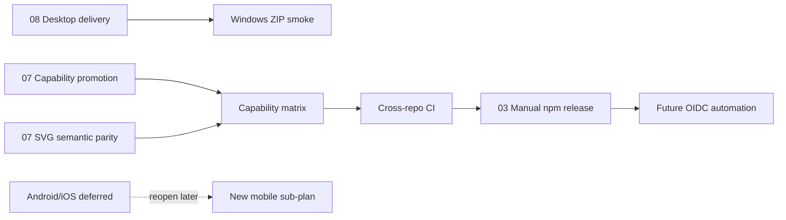

# Sub-Rencana 09 — Approved Decisions Execution Map

**Status:** Accepted sebagai peta orkestrasi  
**Tanggal:** 2026-09-23  
**Owner:** `relgeo/workspace`  
**Parent:** [MATURATION-MASTER-PLAN.md](../MATURATION-MASTER-PLAN.md)  
**Decision record:** [09-open-work-recommendations.md](../decisions/09-open-work-recommendations.md)

## 1. Tujuan

Dokumen ini memetakan keputusan maintainer yang sudah diterima ke sub-rencana
implementasi yang benar. Ia mencegah pekerjaan diduplikasi dan memastikan
keputusan yang hanya berupa penundaan tidak berubah menjadi backlog palsu.

## 2. Peta keputusan ke rencana

| Keputusan | Sub-rencana pemilik | Status | Tindakan berikutnya |
| --- | --- | --- | --- |
| Promosi capability satu per satu | [07-flutter-capability-promotion-and-svg-parity](07-flutter-capability-promotion-and-svg-parity.md) | Berjalan | review dan promosi `boolean/intersection` |
| SVG semantic parity berlapis | [07-flutter-capability-promotion-and-svg-parity](07-flutter-capability-promotion-and-svg-parity.md) | Berjalan | pertahankan semantic core; jangan tambah presentation tanpa consumer |
| Flutter non-publishable, stable `3.41.9` | [08-desktop-platform-delivery](08-desktop-platform-delivery.md) | Diterima | gunakan baseline pada seluruh desktop runner |
| Web/PWA, macOS, Linux, Windows, CLI sebagai scope utama | [08-desktop-platform-delivery](08-desktop-platform-delivery.md) | Diterima | mulai dari workflow Windows artifact |
| Android/iOS ditunda tanpa tanggal | decision record 09 | Diterima | tidak ada implementasi mobile sampai scope dibuka kembali |
| npm manual untuk dua release berikutnya | [03-npm-release-guard](03-npm-release-guard.md) | Diterima | lanjutkan preflight dan publish manual |
| OIDC + protected environment setelah jalur manual stabil | [03-npm-release-guard](03-npm-release-guard.md) | Diterima sebagai target | buat sub-plan automation setelah dua release |
| Forward-fix untuk partial release | [03-npm-release-guard](03-npm-release-guard.md) | Diterima | pertahankan planner/validator read-only |

## 3. Urutan orkestrasi

Urutan ini berarti:

1. Desktop delivery bergerak paralel dengan review capability.
2. Capability tidak dipromosikan hanya karena desktop artifact selesai.
3. Matrix dan CI harus diperbarui setelah promosi capability.
4. Release npm tetap manual sampai dua release tambahan berjalan stabil.
5. Mobile tidak menghalangi pekerjaan lain dan tidak dibuatkan sub-plan aktif
   sebelum scope mobile dibuka kembali.

## 4. Batas keputusan yang sudah diterima

### 4.1 Platform

- [x] web/PWA tetap surface utama;
- [x] macOS Flutter tetap target desktop;
- [x] Linux Flutter, minimal Ubuntu, menjadi target desktop;
- [x] Windows 11 menjadi target desktop;
- [x] CLI tetap surface utama;
- [x] Android/iOS ditunda tanpa tanggal.

### 4.2 Capability dan parity

- [x] capability dipromosikan satu per satu;
- [x] `boolean/intersection` ditinjau lebih dahulu;
- [x] `evaluator/unit` menunggu hasil capability pertama;
- [x] semantic SVG parity menjadi contract inti;
- [x] raw SVG byte equality bukan contract.

### 4.3 Release

- [x] publish npm tetap manual untuk minimal dua release berikutnya;
- [x] registry verification dan public integration tetap wajib;
- [x] partial release diselesaikan dengan forward-fix;
- [x] target automation masa depan adalah OIDC + protected environment;
- [x] rollback atau republish versi npm yang sama dilarang.

## 5. Apa yang tidak perlu dibuat sekarang

- sub-plan Android/iOS;
- package pub.dev untuk Flutter;
- desktop signing dan Microsoft Store distribution;
- raw SVG comparator;
- fully automatic npm transaction;
- mobile device lab budget atau tanggal QA mobile.

Masing-masing hanya dibuat jika keputusan scope berubah atau kebutuhan pengguna
menjadi nyata.

## 6. Exit gate peta orkestrasi

- [ ] Sub-plan 08 menghasilkan dan menguji Windows ZIP artifact;
- [ ] Sub-plan 07 mempromosikan minimal satu capability atau mencatat alasan
  penundaan eksplisit;
- [ ] compatibility matrix dan master plan sinkron;
- [ ] dua release npm manual berikutnya selesai tanpa recovery failure;
- [ ] sub-plan automation npm dibuat hanya setelah exit gate manual tercapai.

## 7. Referensi

- [Open Work Recommendation Record](../decisions/09-open-work-recommendations.md)
- [Flutter Capability Promotion dan SVG Parity](07-flutter-capability-promotion-and-svg-parity.md)
- [Desktop Platform Delivery](08-desktop-platform-delivery.md)
- [npm Release Guard](03-npm-release-guard.md)
