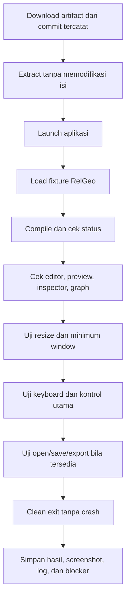

# Sub-Rencana 10 — Desktop Runtime Smoke Checklist

**Status:** Checklist siap; eksekusi target OS masih terbuka  
**Repository pemilik:** `relgeo/workspace`  
**Implementasi:** `relgeo/flutter`  
**Parent:** [08-desktop-platform-delivery.md](08-desktop-platform-delivery.md)  
**Scope:** macOS, Ubuntu/Linux, Windows 11

Dokumen ini memisahkan kesiapan prosedur dari hasil eksekusi. Checklist boleh
ditandai selesai hanya setelah artifact yang berasal dari commit yang dicatat
benar-benar dijalankan pada OS target.

## 1. Provenance wajib

Catat data berikut untuk setiap eksekusi:

| Field | Nilai |
| --- | --- |
| Workspace commit | `...` |
| Flutter submodule commit | `...` |
| Flutter version | `3.41.9` |
| Dart version | `3.11.5` |
| Artifact URL/run | `...` |
| OS dan version | `...` |
| Arsitektur | `arm64` / `x64` |
| Display/session | Retina, scaling, Wayland/X11, atau DPI |
| Tester/date | `...` |

## 2. Alur smoke test



## 3. Preflight umum

- [ ] artifact berasal dari commit workspace dan submodule yang dicatat;
- [ ] tidak ada dependency instalasi tambahan yang tidak terdokumentasi;
- [ ] nama executable dan versi aplikasi sesuai metadata release;
- [ ] fixture contoh tersedia dan tidak memakai path lokal maintainer;
- [ ] tidak ada credential atau file pribadi yang ikut dalam artifact;
- [ ] aplikasi dijalankan dari lokasi extract yang bersih;
- [ ] output log dan screenshot diberi nama berdasarkan OS, arch, commit, dan tanggal.

## 4. macOS

### Launch dan rendering

- [ ] `.app` terbuka tanpa crash atau dialog dependency;
- [ ] workbench menampilkan editor, preview, inspector, dan graph;
- [ ] fixture aktif menghasilkan status `COMPILED OK`;
- [ ] diagnostic fixture menampilkan error yang diharapkan tanpa merusak preview;
- [ ] export SVG menghasilkan file pada lokasi yang dipilih;
- [ ] aplikasi dapat ditutup bersih.

### Window dan input

- [ ] ukuran awal mendekati `1440×900`;
- [ ] window tidak dapat diperkecil di bawah `1024×640`;
- [ ] resize ke ukuran sempit tidak menghasilkan overflow atau panel hilang;
- [ ] Tab berpindah melalui kontrol utama dengan urutan masuk akal;
- [ ] Enter/Space mengaktifkan kontrol custom;
- [ ] theme `System`, `Light`, dan `Dark` dapat dipilih tanpa restart.

## 5. Ubuntu/Linux

### Environment

- [ ] distro dan version dicatat;
- [ ] arsitektur dicatat;
- [ ] session Wayland atau X11 dicatat;
- [ ] dependency GTK yang dibutuhkan artifact tersedia.

### Launch dan rendering

- [ ] archive `.tar.gz` dapat diekstrak tanpa error;
- [ ] binary executable dapat dijalankan;
- [ ] tidak ada library GTK/runtime yang hilang;
- [ ] fixture aktif menghasilkan status `COMPILED OK`;
- [ ] preview, inspector, graph, dan diagnostic dapat digunakan;
- [ ] file picker dan export SVG bekerja;
- [ ] aplikasi dapat ditutup bersih.

### Window dan input

- [ ] ukuran awal dan minimum window sesuai policy;
- [ ] resize sempit tidak menghasilkan overflow;
- [ ] keyboard traversal dan aktivasi kontrol berjalan;
- [ ] theme mode berjalan pada session desktop yang digunakan.

## 6. Windows 11

### Artifact dan launch

- [ ] ZIP dapat diunduh dan diekstrak pada Windows 11;
- [ ] executable `.exe` ditemukan;
- [ ] `flutter_windows.dll`, folder `data`, dan DLL dependency tersedia;
- [ ] aplikasi terbuka tanpa missing-DLL dialog;
- [ ] Windows Security/SmartScreen behavior dicatat, bukan dilewati diam-diam;
- [ ] fixture aktif menghasilkan status `COMPILED OK`;
- [ ] aplikasi dapat ditutup bersih.

### Window, file, dan input

- [ ] ukuran awal dan minimum window sesuai policy;
- [ ] resize sempit tidak menghasilkan overflow atau panel terpotong;
- [ ] open/import file bekerja;
- [ ] save/export SVG bekerja;
- [ ] Tab, Enter, Space, dan shortcut utama bekerja;
- [ ] theme `System`, `Light`, dan `Dark` dapat dipilih;
- [ ] font, encoding, dan karakter YAML tidak rusak.

## 7. Accessibility dan reduced motion

- [ ] fokus keyboard terlihat pada seluruh kontrol custom;
- [ ] urutan Tab tidak masuk ke area dekoratif yang tidak interaktif;
- [ ] label/value/state theme selector terbaca accessibility tree;
- [ ] role filter dan overlay controls mengumumkan status toggle;
- [ ] reduced-motion preference tidak memicu animasi transisi yang tidak perlu;
- [ ] screen reader smoke dicoba bila tersedia, dengan tool dan version dicatat;
- [ ] limitation screen reader dipisahkan dari failure fungsional.

## 8. Evidence record

Salin template ini untuk setiap eksekusi:

```text
Platform:
OS/version:
Architecture:
Display/session:
Workspace commit:
Flutter commit:
Flutter/Dart:
Artifact/run URL:
Date/tester:

PASS:
-

FAIL/BLOCKED:
-

Screenshots/logs:
-

Follow-up issue:
-
```

## 9. Exit criteria

Satu platform boleh ditandai selesai bila:

1. semua preflight dan launch checks lulus;
2. fixture valid dan diagnostic fixture dapat dibedakan;
3. resize, keyboard, file path, dan clean exit lulus;
4. evidence provenance lengkap;
5. setiap limitation nyata dicatat sebagai blocker atau non-goal.

Status awal: prosedur sudah siap, tetapi belum ada hasil baru untuk Ubuntu atau
Windows 11. macOS memiliki evidence launch historis, namun smoke ulang setelah
bridge window terbaru masih perlu dicatat dengan template ini.
