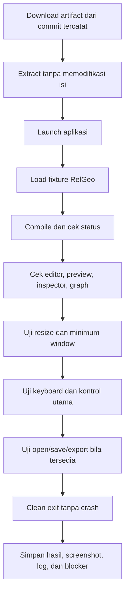

# Sub-Rencana 10 — Desktop Runtime Smoke Checklist

**Status:** Checklist siap; artifact CI macOS/Ubuntu/Linux/Windows tersedia secara historis. Berdasarkan keputusan manusia 2026-10-08, host smoke Ubuntu/Linux dan Windows 11 di-defer tanpa klaim usable. macOS keyboard/VoiceOver juga belum terbukti. Android/iOS berada di luar scope yang disetujui dan tidak menjadi item tertunda checklist ini.
**Repository pemilik:** `relgeo/workspace`  
**Implementasi:** `relgeo/flutter`  
**Parent:** [08-desktop-platform-delivery.md](08-desktop-platform-delivery.md)  
**Scope:** macOS, Ubuntu/Linux, Windows 11

Dokumen ini memisahkan kesiapan prosedur dari hasil eksekusi. Checklist boleh
ditandai selesai hanya setelah artifact yang berasal dari commit yang dicatat
benar-benar dijalankan pada OS target.

## 1. Provenance wajib

Catat data berikut untuk setiap eksekusi:

| Field | Nilai |
| --- | --- |
| Workspace commit | `...` |
| Flutter submodule commit | `...` |
| Flutter version | `3.41.9` |
| Dart version | `3.11.5` |
| Artifact URL/run | `...` |
| OS dan version | `...` |
| Arsitektur | `arm64` / `x64` |
| Display/session | Retina, scaling, Wayland/X11, atau DPI |
| Tester/date | `...` |

### 1.2 Desktop artifact provenance matrix

| Target | CI source and commits | Archive / contents assertion | Runtime status |
| --- | --- | --- | --- |
| macOS | `Integration #147`; workspace `791ae33adffabaa509223a4f271b6d7babc740bd8`; Flutter `e46f1ad7eb8c8df85bada582e3c5066dc73f62a1` | `relgeo-flutter-macos-${runner.arch}-791ae33adffabaa509223a4f271b6d7babc740bd8.zip`; `.app` and executable asserted | Historical launch evidence; current interactive/accessibility limitation recorded in §4.1 |
| Ubuntu/Linux x64 | `Integration #147`; workspace `791ae33adffabaa509223a4f271b6d7babc740bd8`; Flutter `e46f1ad7eb8c8df85bada582e3c5066dc73f62a1` | `relgeo-flutter-linux-x64-791ae33adffabaa509223a4f271b6d7babc740bd8.tar.gz`; executable, `data`, `lib` asserted | Deferred; archive is not usable without target smoke |
| Windows x64 | `Integration #147`; workspace `791ae33adffabaa509223a4f271b6d7babc740bd8`; Flutter `e46f1ad7eb8c8df85bada582e3c5066dc73f62a1` | `relgeo-flutter-windows-x64-791ae33adffabaa509223a4f271b6d7babc740bd8.zip`; `.exe`, `flutter_windows.dll`, `data` asserted | Deferred; ZIP is not usable without Windows 11 smoke |

The current workspace pointer is `d3ec2b0430f12bd95f2be312fa7438b6d97757d6`
with Flutter `edc9488952db7edc74dd2caa7fc2064f03ff62f9`. It is recorded
separately from the historical CI artifacts and must not inherit their status.

### 1.1 Evidence checkpoint workspace — 2026-10-08

Browser evidence yang dijalankan pada task ini memakai workspace
`d3ec2b0430f12bd95f2be312fa7438b6d97757d6`, Playground
`ecc1407a8ba0da3929042137ff43b8e69f50b556`, dan Flutter
`edc9488952db7edc74dd2caa7fc2064f03ff62f9`. Host adalah macOS `14.5`
arm64; toolchain Node `22.23.2` (di bawah requirement root `>=24`), pnpm
`10.33.3`, dan Playwright `1.63.0`.

Build/lint/unit/audit Playground lulus (`93/93` unit). Task ini tidak mengubah
status desktop artifact: macOS, Ubuntu/Linux, dan Windows tetap memiliki build /
archive evidence CI historis pada `Integration #151`, tetapi smoke target nyata
belum boleh ditandai selesai. Windows dimulai dari ZIP CI dan tetap **tidak
usable** sampai diekstrak serta dijalankan pada Windows 11 nyata/VM. Signing,
installer publik, Android/iOS, dan mobile assistive technology tetap di luar
exit gate ini.

## 2. Alur smoke test



## 3. Preflight umum

- [ ] artifact berasal dari commit workspace dan submodule yang dicatat;
- [ ] tidak ada dependency instalasi tambahan yang tidak terdokumentasi;
- [ ] nama executable dan versi aplikasi sesuai metadata release;
- [ ] fixture contoh tersedia dan tidak memakai path lokal maintainer;
- [ ] tidak ada credential atau file pribadi yang ikut dalam artifact;
- [ ] aplikasi dijalankan dari lokasi extract yang bersih;
- [ ] output log dan screenshot diberi nama berdasarkan OS, arch, commit, dan tanggal.

## 4. macOS

### Launch dan rendering

- [ ] `.app` terbuka tanpa crash atau dialog dependency;
- [ ] workbench menampilkan editor, preview, inspector, dan graph;
- [ ] fixture aktif menghasilkan status `COMPILED OK`;
- [ ] diagnostic fixture menampilkan error yang diharapkan tanpa merusak preview;
- [ ] export SVG menghasilkan file pada lokasi yang dipilih;
- [ ] aplikasi dapat ditutup bersih.

### Window dan input

- [ ] ukuran awal mendekati `1440×900`;
- [ ] window tidak dapat diperkecil di bawah `1024×640`;
- [ ] resize ke ukuran sempit tidak menghasilkan overflow atau panel hilang;
- [ ] Tab berpindah melalui kontrol utama dengan urutan masuk akal;
- [ ] Enter/Space mengaktifkan kontrol custom;
- [ ] light/dark toggle berpindah tanpa restart; sebelum pilihan eksplisit, default mengikuti system; reset pilihan kembali ke system.

### 4.1 macOS smoke evidence checkpoint — 2026-10-08

| Field | Nilai |
| --- | --- |
| Workspace / Flutter | `d3ec2b0430f12bd95f2be312fa7438b6d97757d6` / `edc9488952db7edc74dd2caa7fc2064f03ff62f9` |
| Artifact | `flutter/build/macos/Build/Products/Release/RelGeo.app`; bundle `com.relgeo.relgeoFlutter`, version `1.0.0 (1)` |
| Toolchain | Flutter stable baseline `3.41.9`, Dart `3.11.5`; release executable is universal `arm64 + x86_64`; SHA-256 `6aa9fc1aee08a7fbe5f514ec14078c7b2e5ee350af7aea0c5f8b3acd0e00c1e0` |
| Host / date | MacBook Air, macOS `14.5` (`23F79`), arm64; `2026-10-08` |
| Launch | Partial: native launch was requested and the CUA state reported RelGeo running, but CUA refused to bind the RelGeo app (`Computer Use was not approved to use RelGeo`). No crash/dialog result can be claimed. |
| Window / AX | Blocked by the same app-approval boundary; no current window AX tree or screenshot was obtained. |
| Fixture/render/diagnostic/export | Not re-run on the current Release window because the window could not be bound. Historical local evidence in `docs/plans/08-desktop-platform-delivery.md` records `COMPILED OK`, zero constraint violations, values, SVG export, and clean exit on a prior macOS smoke. |
| Resize / keyboard | Not passed in this checkpoint. Historical Flutter child evidence records Debug native menu/zoom and splitter pointer smoke, but not full keyboard traversal. |
| VoiceOver | Not run; no VoiceOver announcement or AX traversal is claimed. |
| Clean exit | Not verified in this checkpoint because the native window was not controllable. |

Conclusion: the current Release artifact is provenance-valid and universal, but
this checkpoint is launch/process-only. The app-approval limitation prevents a
full window, fixture, resize, keyboard, export, clean-exit, or VoiceOver pass.
The remaining boxes in §4 and §7 must stay open until an approved native-app
session is available.

## 5. Ubuntu/Linux

### Environment

- [ ] distro dan version dicatat;
- [ ] arsitektur dicatat;
- [ ] session Wayland atau X11 dicatat;
- [ ] dependency GTK yang dibutuhkan artifact tersedia.

### Launch dan rendering

- [ ] archive `.tar.gz` dapat diekstrak tanpa error;
- [ ] binary executable dapat dijalankan;
- [ ] tidak ada library GTK/runtime yang hilang;
- [ ] fixture aktif menghasilkan status `COMPILED OK`;
- [ ] preview, inspector, graph, dan diagnostic dapat digunakan;
- [ ] file picker dan export SVG bekerja;
- [ ] aplikasi dapat ditutup bersih.

### Window dan input

- [ ] ukuran awal dan minimum window sesuai policy;
- [ ] resize sempit tidak menghasilkan overflow;
- [ ] keyboard traversal dan aktivasi kontrol berjalan;
- [ ] theme mode berjalan pada session desktop yang digunakan.

## 6. Windows 11

### Artifact dan launch

- [ ] ZIP dapat diunduh dan diekstrak pada Windows 11;
- [ ] executable `.exe` ditemukan;
- [ ] `flutter_windows.dll`, folder `data`, dan DLL dependency tersedia;
- [ ] aplikasi terbuka tanpa missing-DLL dialog;
- [ ] Windows Security/SmartScreen behavior dicatat, bukan dilewati diam-diam;
- [ ] fixture aktif menghasilkan status `COMPILED OK`;
- [ ] aplikasi dapat ditutup bersih.

### Window, file, dan input

- [ ] ukuran awal dan minimum window sesuai policy;
- [ ] resize sempit tidak menghasilkan overflow atau panel terpotong;
- [ ] open/import file bekerja;
- [ ] save/export SVG bekerja;
- [ ] Tab, Enter, Space, dan shortcut utama bekerja;
- [ ] light/dark toggle tersedia; default mengikuti system sebelum pilihan eksplisit dan reset mengembalikan system default.
- [ ] font, encoding, dan karakter YAML tidak rusak.

## 7. Accessibility dan reduced motion

- [ ] fokus keyboard terlihat pada seluruh kontrol custom;
- [ ] urutan Tab tidak masuk ke area dekoratif yang tidak interaktif;
- [ ] label/value/state theme selector terbaca accessibility tree;
- [ ] role filter dan overlay controls mengumumkan status toggle;
- [ ] reduced-motion preference tidak memicu animasi transisi yang tidak perlu;
- [ ] screen reader smoke dicoba bila tersedia, dengan tool dan version dicatat;
- [ ] limitation screen reader dipisahkan dari failure fungsional.

## 8. Evidence record

Salin template ini untuk setiap eksekusi:

```text
Platform:
OS/version:
Architecture:
Display/session:
Workspace commit:
Flutter commit:
Flutter/Dart:
Artifact/run URL:
Date/tester:

PASS:
-

FAIL/BLOCKED:
-

Screenshots/logs:
-

Follow-up issue:
-
```

## 9. Exit criteria

Satu platform boleh ditandai selesai bila:

1. semua preflight dan launch checks lulus;
2. fixture valid dan diagnostic fixture dapat dibedakan;
3. resize, keyboard, file path, dan clean exit lulus;
4. evidence provenance lengkap;
5. setiap limitation nyata dicatat sebagai blocker atau non-goal.

Status awal: prosedur sudah siap, tetapi belum ada hasil baru untuk Ubuntu atau
Windows 11. macOS memiliki evidence launch historis, namun smoke ulang setelah
bridge window terbaru masih perlu dicatat dengan template ini.
