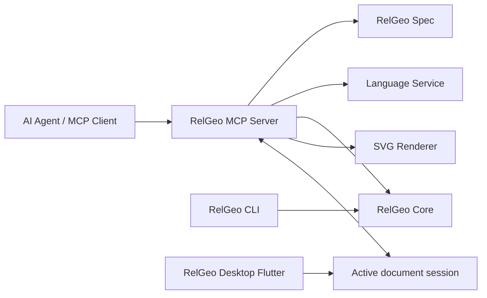
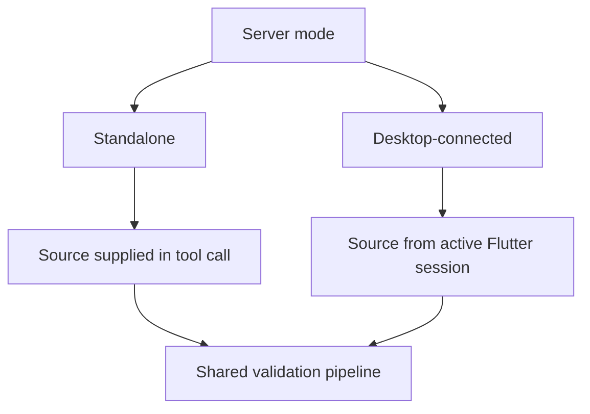
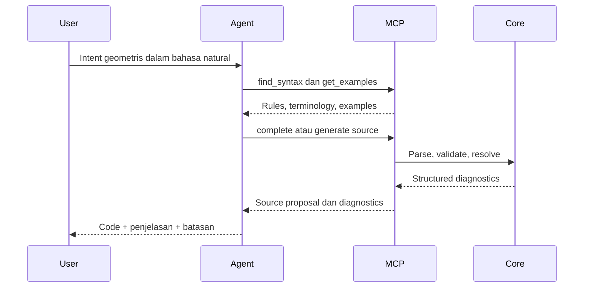
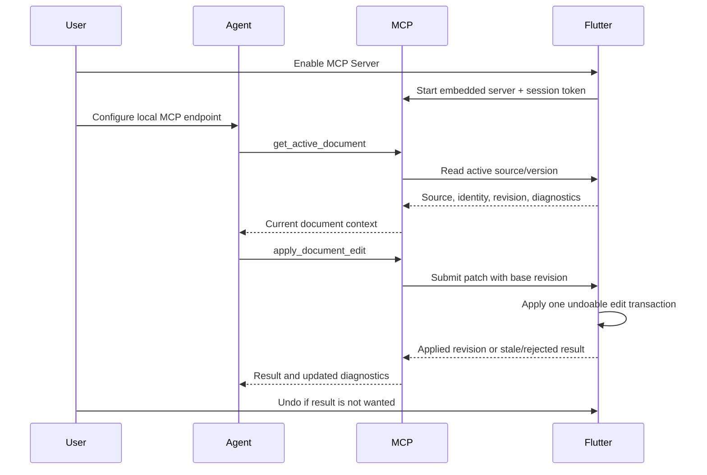
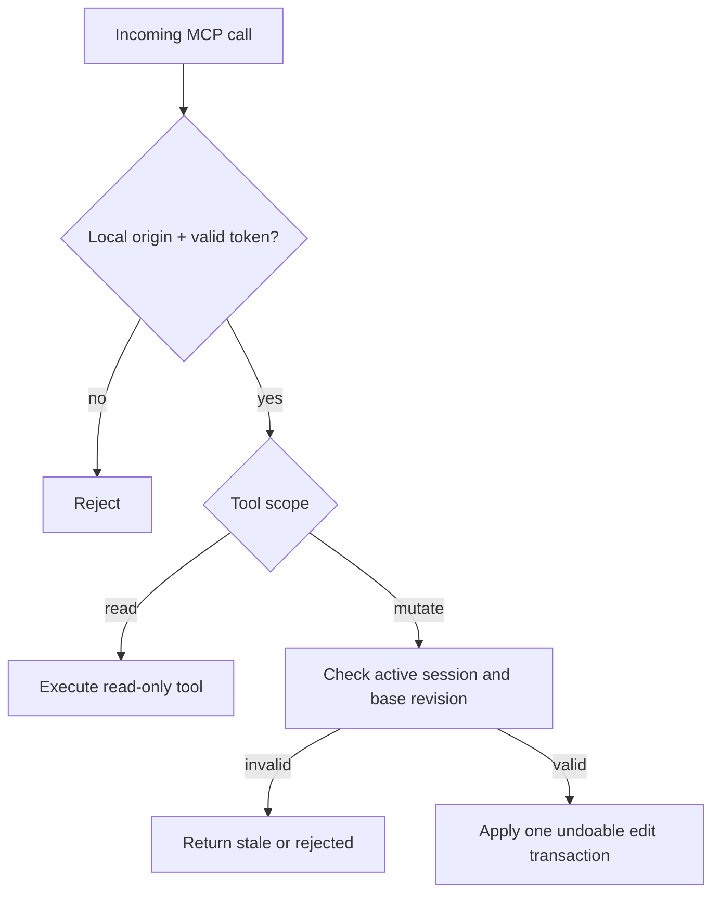

# Sub-Rencana 11 — MCP Server dan Agent-Assisted RelGeo Authoring

**Status keputusan:** arah arsitektur awal telah disetujui maintainer. **Status implementasi:** contract session/security dan typed MVP tool/resource schema tersedia; adapter SDK/transport serta delivery integration masih perlu diturunkan sebelum implementasi penuh.
**Repository pemilik:** `relgeo/workspace` sebagai orkestrator; package MCP berada sebagai submodule resmi pada repository `relgeo/mcp` dengan nama `relgeo_mcp`
**Pemilik keputusan:** Agus Made
**Compatibility line:** RelGeo DSL 0.5.x
**Prasyarat:** `spec`, `core`, `language-service`, `cli`, dan RelGeo Desktop Flutter

## 1. Tujuan

Menyediakan MCP Server agar AI Agent dapat membantu pengguna menulis RelGeo
berdasarkan intent, terutama ketika pengguna belum hafal syntax.

Masalah utama yang hendak diselesaikan bukan sekadar:

> “Buatkan sebuah gambar.”

Melainkan pertanyaan syntax dan authoring seperti:

> “Apa syntax RelGeo untuk membuat garis lengkung yang menghubungkan titik A,
> B, dan C?”

MCP menjadi jembatan dari bahasa intent ke syntax RelGeo yang valid, dapat
divalidasi, dapat diperbaiki, dan pada mode desktop dapat diterapkan langsung
ke dokumen aktif sebagai transaksi yang dapat di-Undo.

## 2. Keputusan arsitektur

### 2.1 MCP adalah capability lintas-RelGeo

MCP bukan fitur yang hanya dimiliki Flutter. Server harus dapat digunakan oleh:

- AI Agent yang menjalankan server lokal;
- RelGeo CLI;
- RelGeo Desktop Flutter;
- editor atau host lain yang mendukung MCP.

Flutter berperan sebagai host desktop, lifecycle supervisor, dan bridge ke
dokumen aktif. Protocol adapter dan logic MCP tetap berada di package Dart
terpisah agar tidak tercampur dengan widget/UI, tetapi package tersebut
di-embed langsung ke RelGeo Desktop.



### 2.2 Dua mode operasi

#### Mode A — Standalone syntax assistant

Server berjalan mandiri dan tidak bergantung pada aplikasi Flutter. Mode ini
menyediakan pencarian syntax, examples, completion, validation, diagnostics,
dan rendering opsional terhadap source yang dikirim sebagai input.

#### Mode B — Desktop-connected assistant

RelGeo Desktop menjalankan server lokal yang tertanam di proses aplikasi,
kemudian menyediakan bridge ke dokumen aktif. Agent dapat membaca source,
diagnostics, dan context workbench serta langsung menerapkan edit ke dokumen
aktif. Flutter tetap
mengontrol dirty state, undo/redo, dan save; edit dari Agent menjadi satu
transaksi undoable agar pengguna dapat segera melihat hasilnya dan membatalkan
perubahan jika tidak sesuai.



## 3. Transport dan packaging

### 3.1 Transport

Rekomendasi transport:

- `stdio` untuk executable Dart standalone yang diluncurkan langsung oleh AI
  Agent, jika mode standalone benar-benar dibutuhkan;
- Streamable HTTP pada `127.0.0.1` untuk server yang dihidupkan dan dimatikan
  melalui UI RelGeo Desktop;
- remote HTTP bukan target MVP dan membutuhkan keputusan keamanan/deployment
  tersendiri.

MCP mendokumentasikan `stdio` untuk local child process dan Streamable HTTP
untuk endpoint yang diakses client melalui jaringan. [MCP server guide](https://github.com/modelcontextprotocol/typescript-sdk/blob/main/docs/server.md)

### 3.2 Package dan executable

Rencana package dan executable:

```text
relgeo/mcp                 target repository; package name: relgeo_mcp
relgeo_mcp                 pure Dart package: contract, protocol adapters, tools, resources, prompts
RelGeo Desktop              embed relgeo_mcp dan menjalankan Streamable HTTP lokal
bin/relgeo_mcp.dart         executable Dart standalone bila kelak diperlukan
```

Session/security contract evidence sekarang berada di `mcp/` dan
`docs/mcp/01-session-bridge-security-contract.md`. Package tersebut tetap
pure-Dart; adapter desktop berada di `flutter/lib/src/mcp/` dan hanya
menjembatani session/editor host.

Implementasi awal menggunakan Dart karena RelGeo Desktop sudah memakai Flutter
dan Dart. MCP dapat berjalan di dalam proses aplikasi yang sama, sehingga tidak
ada Node.js, npm, atau runtime kedua yang harus dipasang pengguna.

Package MCP tetap murni Dart dan tidak boleh bergantung pada `BuildContext`,
widget, atau lifecycle halaman. Flutter hanya memasang implementasi bridge dan
mengendalikan start/stop endpoint lokal.

Ekosistem Dart sudah memiliki opsi MCP, tetapi maturity-nya perlu diuji melalui
spike. `dart_mcp` dipublikasikan oleh `labs.dart.dev` namun masih experimental;
`mcp_dart` memiliki cakupan transport dan server yang lebih luas tetapi berasal
dari publisher pihak ketiga. Dependency final belum dikunci sebelum conformance
test dan smoke test desktop lulus. [`dart_mcp`](https://pub.dev/packages/dart_mcp)
dan [`mcp_dart`](https://pub.dev/packages/mcp_dart)

Evidence spike kandidat, fixture protocol bersama, hasil stdio, batasan
Streamable HTTP pada managed runner, Inspector validation, dan baseline Flutter
dicatat di `docs/mcp/02-sdk-transport-spike.md`. Tidak ada kandidat SDK yang
dikunci pada package sebelum conformance lintas transport lulus.

### 3.3 Agent bridge boundary

MCP package berkomunikasi dengan aplikasi melalui kontrak murni Dart:

```text
RelGeoAgentBridge
  getActiveDocument()
  getDiagnostics()
  findSyntax(query)
  getExamples(query)
  applyDocumentEdit(patch, baseRevision)
```

Implementasi bridge berada pada Flutter dan dapat mengakses document session,
language service, compiler, diagnostics, serta undo/redo tanpa membuat MCP
package mengetahui detail widget.

## 4. Capability MCP MVP

### 4.1 Tools

Tool awal harus fokus pada syntax authoring, bukan image generation:

```text
relgeo_find_syntax
relgeo_get_syntax_rule
relgeo_get_examples
relgeo_complete_source
relgeo_validate_source
relgeo_explain_diagnostic
relgeo_render_source
```

Kontrak umum:

- input tervalidasi dengan schema typed;
- hasil memiliki output terstruktur dan ringkasan text;
- diagnostics menyertakan severity, message, source range, dan code;
- source yang dikembalikan selalu dapat dibedakan antara input, proposal, dan
  hasil validasi;
- tool tidak menulis filesystem pada MVP.

### 4.2 Resources

Resources menyediakan materi yang dapat dibaca agent:

```text
relgeo://spec/index
relgeo://spec/rules/{ruleId}
relgeo://examples/index
relgeo://examples/{exampleId}
relgeo://diagnostics/catalog
relgeo://document/active
relgeo://document/active/diagnostics
```

Resource spec harus mengambil makna normatif dari `relgeo/spec`, bukan menyalin
versi yang diedit manual ke MCP Server. Resource active document hanya tersedia
dalam desktop-connected mode.

Typed provenance support is now present in the pure-Dart contract package:
`DocumentationResult` carries `source`, `sourceUrl`, `specVersion`, and
`revision`; only `spec` is normative, while website material remains
explanatory. The typed tool/resource catalog and canonical URI parser are now
in `mcp/lib/src/contract/mcp_schema.dart`; the adapter/resource resolver and
full tool execution still belong to the next MCP package task. See
`docs/mcp/04-mvp-tool-resource-contract.md` for the contract and evidence map.

### 4.3 Dokumentasi GitHub dan website

MCP juga harus dapat mengakses dokumentasi publik RelGeo dari dua surface:

```text
https://github.com/relgeo/spec
https://relgeo.github.io/docs
https://relgeo.github.io/docs/language-spec
```

Kedua sumber memiliki peran berbeda:

1. `relgeo/spec` adalah sumber normatif dan harus diprioritaskan untuk rule,
   grammar, semantic contract, dan version target;
2. `relgeo.github.io/docs` adalah presentation layer untuk onboarding, usage
   guide, workflow, dan penjelasan yang lebih mudah dibaca;
3. GitHub dapat menjadi fallback atau sumber revision metadata ketika website
   sedang tidak tersedia;
4. website tidak boleh mengubah atau mengalahkan makna normatif spec.

Pengguna akhir tidak perlu melakukan clone repository `spec`, menginstal source
documentation, atau memahami struktur GitHub. `relgeo/spec` adalah sumber
pemeliharaan untuk maintainer dan sumber build untuk membuat snapshot
versioned; snapshot tersebut dibundel ke MCP Server/RelGeo Desktop saat release.

Dengan demikian, “dokumentasi lokal” pada rencana ini berarti resource snapshot
internal yang ikut terpasang bersama aplikasi atau cache internal server, bukan
folder repository yang harus disiapkan pengguna.

MCP harus mengembalikan provenance pada setiap hasil dokumentasi:

```text
DocumentationResult
  title
  content
  source: spec | website | example
  sourceUrl
  specVersion
  revisionOrTag?
  fetchedAt?
```

Server tidak boleh mencampur rule dari versi spec berbeda. Mode offline harus
langsung bekerja memakai snapshot versioned yang dibundel bersama aplikasi.
Mode online boleh memperbarui resource penjelasan dari GitHub/website setelah
versi dan revision diperiksa, tetapi remote fetch tidak boleh menjadi syarat
agar syntax assistant dapat digunakan. Cache internal perlu memiliki TTL,
revision identity, dan fallback yang dapat diprediksi.

### 4.4 Prompts

Prompts boleh ditambahkan setelah tools/resources stabil:

```text
relgeo_author_from_intent
relgeo_debug_document
relgeo_explain_syntax
relgeo_review_proposed_patch
```

Prompt membantu workflow, tetapi tidak boleh menjadi satu-satunya tempat aturan
syntax disimpan.

## 5. Agent authoring workflow



Agent sebaiknya tidak menebak syntax dari ingatan jika tool dapat memberi rule
dan example yang relevan. Validation harus menjadi bagian dari loop, bukan tahap
opsional setelah jawaban selesai.

## 6. Desktop-connected session bridge

Flutter mengaktifkan server melalui UI, tetapi perubahan dokumen tetap melewati
session controller:



Session contract minimal:

```text
ActiveDocumentSnapshot
  documentId
  name
  path?               // nullable for unsaved/web-like host
  source
  revision
  dirty
  diagnostics

DocumentEditProposal
  baseDocumentId
  baseRevision
  edits[]             // bounded source ranges and replacement text
  summary
  rationale

DocumentEditResult
  applied | stale | rejected | failed
  newRevision?
  diagnostics
```

Contract ini telah dispike sebagai tipe pure-Dart. `ActiveDocumentSnapshot`
memiliki document identity, source, dirty state, diagnostics, dan monotonic
revision. `DocumentEditProposal` hanya menerima bounded non-overlapping source
ranges; adapter desktop melakukan revision/document guard sebelum satu setter
editor, sehingga satu proposal menjadi satu undoable transaction. Implementasi
tidak memanggil Save, Save As, export, atau filesystem. Evidence selengkapnya
ada pada `docs/mcp/01-session-bridge-security-contract.md`.

Patch dengan `baseRevision` yang sudah kedaluwarsa harus ditolak sebagai
`stale`, bukan diterapkan secara diam-diam. Patch yang lolos validasi diterapkan
langsung ke source aktif sebagai satu transaksi undoable. Penerapan ini tidak
menyimpan file otomatis; Save tetap merupakan aksi dokumen terpisah.

## 7. Direct-apply dan security boundary

MCP Server desktop-connected harus aman secara default:

- server disabled secara default;
- bind hanya ke `127.0.0.1`;
- token acak untuk setiap sesi;
- token dibatalkan saat server berhenti;
- scope read-only dan read-write terpisah;
- edit hanya boleh diterapkan ke active document session;
- patch harus bounded, memiliki base revision, dan menjadi satu undoable transaction;
- Save, Save As, export, dan arbitrary filesystem access bukan bagian dari direct
  apply;
- koneksi dan tool call tercatat pada panel status lokal;
- user dapat mematikan server kapan saja.



## 8. Flutter UI surface

UI minimum:

```text
Settings / Tools / MCP Server
  [ ] Enable MCP Server
  Status: stopped | starting | running | error
  Endpoint: http://127.0.0.1:<port>/mcp
  [Copy agent configuration]
  Connected clients
  Permission: Read only | Ask before changes
  [Stop server]
```

Status UI harus menjelaskan bahwa server lokal hanya dapat diakses oleh agent
yang telah diberi endpoint/token. Jangan menampilkan token secara permanen di
log atau source code.

## 9. Tahapan implementasi

### Tahap 0 — Contract dan repository boundary

- [x] menetapkan MCP sebagai capability lintas-RelGeo;
- [x] menetapkan Flutter sebagai host/bridge, bukan pemilik seluruh protocol;
- [x] menetapkan fokus MVP pada syntax discovery dan validation;
- [x] menetapkan panel mandiri desktop tetap menjadi source editing surface;
- [x] menetapkan target repository `relgeo/mcp` dan package name `relgeo_mcp`;
- [x] menambahkan boundary, dependency relation, dan compatibility/release matrix.

### Tahap 1 — Dart MCP package spike

- [x] buat package `relgeo_mcp` pure Dart;
- [~] evaluasi `dart_mcp` dan `mcp_dart` dengan protocol fixture yang sama;
- [~] implementasikan transport Streamable HTTP untuk desktop;
- [x] implementasikan transport stdio untuk executable/host lokal;
- [x] define typed `find_syntax`, `get_syntax_rule`, `get_examples`,
  `complete_source`, `validate_source`, `explain_diagnostic`, dan
  `render_source` contracts;
- [x] define canonical resource URI templates untuk spec, examples,
  diagnostics, dan active document;
- [x] map contract ownership ke language-service, core, renderer, dan
  active-session bridge;
- [ ] expose tools melalui adapter MCP dan hubungkan resources ke snapshot
  spec/examples yang versioned;
- [ ] gunakan language-service untuk completion/diagnostics;
- [ ] gunakan core untuk parse/resolve/validation;
- [ ] expose resource spec dan dokumentasi website/GitHub dengan provenance;
- [ ] bundle snapshot spec/docs versioned agar pengguna tidak perlu clone repo;
- [ ] dukung cache internal dan fallback offline;
- [ ] uji melalui MCP Inspector dan fixture conformance;
- [ ] pastikan desktop tidak membutuhkan Node.js/npm.

Catatan spike: fixture wire contract dan stdio round-trip lulus; loopback
Streamable HTTP sudah memiliki server/harness dan remote host ditolak, tetapi
binding socket tidak dapat dijalankan pada managed sandbox. Kandidat SDK belum
dikunci; evidence dan command validation ada di
`docs/mcp/02-sdk-transport-spike.md`.

### Tahap 2 — Authoring quality

- [ ] tambah `get_syntax_rule`, `complete_source`, dan diagnostic explanation;
- [ ] hasil tool memiliki source range dan structured diagnostics;
- [ ] buat prompt author/debug/explain sebagai layer workflow;
- [ ] tambahkan test intent-to-syntax fixtures;
- [ ] pastikan agent menerima minimal valid examples, bukan dump spec besar.

### Tahap 3 — Flutter embedded server

- [ ] embed package `relgeo_mcp` ke RelGeo Desktop;
- [ ] buat UI Enable/Disable MCP Server;
- [ ] jalankan Streamable HTTP pada `127.0.0.1`;
- [ ] buat token/session lifecycle;
- [ ] tampilkan endpoint, status, dan copy configuration;
- [ ] pastikan server berhenti saat aplikasi ditutup.

### Tahap 4 — Active document bridge dan direct edit

- [ ] expose active source, identity, revision, dirty state, dan diagnostics;
- [ ] pastikan agent dapat membaca code yang sedang dibuka;
- [ ] cegah pembacaan dokumen yang bukan active session;
- [ ] tambahkan test perubahan source saat agent sedang membaca.
- [ ] expose `apply_document_edit` sebagai bounded patch, bukan overwrite bebas;
- [ ] terapkan edit langsung ke active document;
- [ ] jadikan setiap tool call edit satu undoable transaction;
- [ ] gunakan base revision guard;
- [ ] hubungkan apply dengan undo/redo dan dirty state;
- [ ] tampilkan status perubahan dan affordance Undo pada Flutter;
- [ ] pastikan apply tidak melakukan autosave;
- [ ] pertahankan Save/Save As sebagai aksi eksplisit yang terpisah.

### Tahap 5 — Standalone Dart executable dan CLI bridge

- [ ] buat `bin/relgeo_mcp.dart` hanya jika mode standalone memang diperlukan;
- [ ] sediakan stdio untuk agent yang meluncurkan executable;
- [ ] dokumentasikan konfigurasi tanpa mewajibkan pengguna desktop memasang Dart;
- [ ] pertimbangkan integrasi command `relgeo mcp serve` setelah executable
  standalone stabil;
- [ ] pastikan stdout hanya digunakan untuk protocol dan log dikirim ke stderr.

### Tahap 6 — Export, render, dan hardening

- [ ] tambahkan render source menjadi SVG sebagai tool opsional;
- [ ] expose export melalui command dan filesystem boundary yang eksplisit;
- [ ] lakukan security review local endpoint;
- [ ] uji seluruh platform desktop yang tersedia;
- [ ] dokumentasikan MCP setup pada website dan README package.

## 10. Acceptance criteria

- [ ] agent dapat menemukan syntax RelGeo berdasarkan pertanyaan intent;
- [ ] agent dapat mengambil examples dan rules dari source spec versioned;
- [ ] agent dapat membaca dokumentasi spec dari GitHub atau website RelGeo;
- [ ] setiap hasil dokumentasi menyertakan source URL dan revision/version;
- [ ] website tidak pernah mengalahkan rule normatif dari spec;
- [ ] source proposal selalu dapat divalidasi oleh core;
- [ ] diagnostics dikembalikan terstruktur dengan source range;
- [ ] Flutter dapat menghidupkan server lokal melalui UI;
- [ ] desktop tidak membutuhkan Node.js, npm, atau runtime kedua;
- [ ] agent dapat membaca dokumen aktif;
- [ ] agent dapat menerapkan edit langsung ke dokumen aktif;
- [ ] setiap edit Agent menjadi satu transaksi undoable;
- [ ] pengguna langsung melihat perubahan dan dapat membatalkannya dengan Undo;
- [ ] patch stale ditolak dengan aman;
- [ ] direct apply tidak melakukan autosave atau menulis arbitrary filesystem;
- [ ] Save dan export tetap mengikuti document lifecycle sebagai aksi terpisah;
- [ ] localhost server tidak membuka arbitrary remote access;
- [ ] executable standalone Dart, jika dibuat, dapat dijalankan melalui stdio;
- [ ] CLI, MCP Server, core, language-service, dan Flutter memiliki evidence
  compatibility yang dapat ditelusuri.

## 11. Risiko dan keputusan yang ditunda

| Risiko/keputusan | Rekomendasi |
| --- | --- |
| MCP tercampur dengan widget Flutter | Hindari; gunakan pure Dart package dan Flutter bridge |
| Agent menulis file bebas | Jangan izinkan; direct apply hanya ke active document, Save tetap terpisah |
| Persetujuan setiap edit | Tidak diperlukan; gunakan atomic undoable transaction dan revision guard |
| Transport desktop | Streamable HTTP localhost |
| Transport CLI | stdio |
| Runtime desktop | Embed Dart MCP ke aplikasi Flutter; jangan minta Node/npm |
| Maturity SDK Dart | Buat adapter internal tipis dan jalankan conformance test sebelum dependency dikunci |
| Remote MCP | Tunda sampai auth, deployment, dan threat model siap |
| Menyalin seluruh spec ke prompt | Gunakan resource/rule/example retrieval yang terarah |
| Dokumentasi remote berubah | Pin revision/version, bundle snapshot, cache internal, dan sediakan offline fallback |
| Konflik spec vs website | `relgeo/spec` selalu menjadi sumber normatif |
| Package/repository MCP | `relgeo_mcp` pada submodule resmi `relgeo/mcp`; tetap private/non-publishable selama SDK dan transport conformance belum selesai |
| Standalone executable | Tunda sampai kebutuhan non-Flutter nyata; gunakan package yang sama |

## 12. Definition of done

MVP selesai jika AI Agent dapat menjawab pertanyaan syntax RelGeo dengan
referensi rule/example yang tepat, menghasilkan source yang lulus validation,
dan—ketika terhubung ke RelGeo Desktop—membaca dokumen aktif serta menerapkan
patch langsung sebagai transaksi undoable tanpa akses filesystem bebas atau
autosave. Pengguna desktop tidak memasang Node.js/npm atau runtime tambahan.
